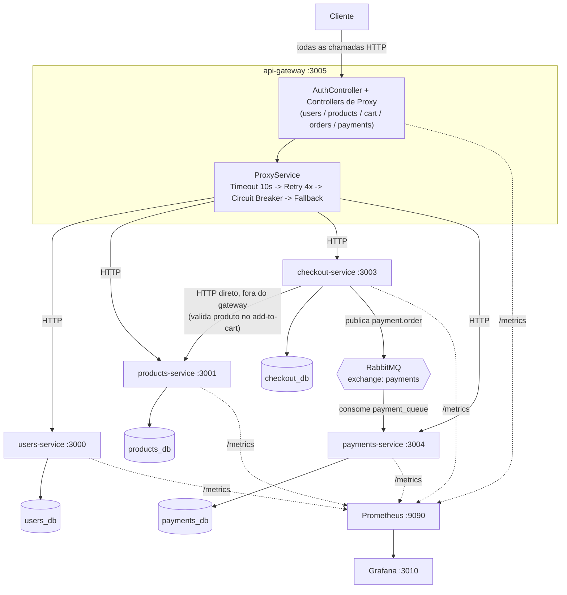
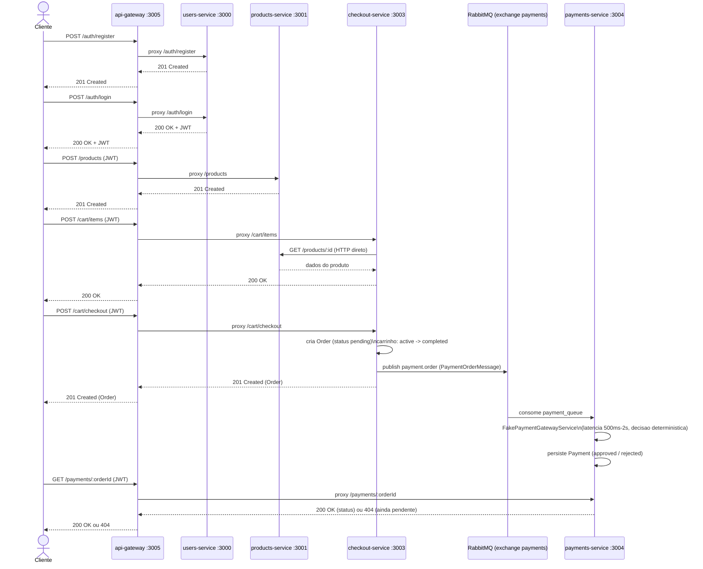
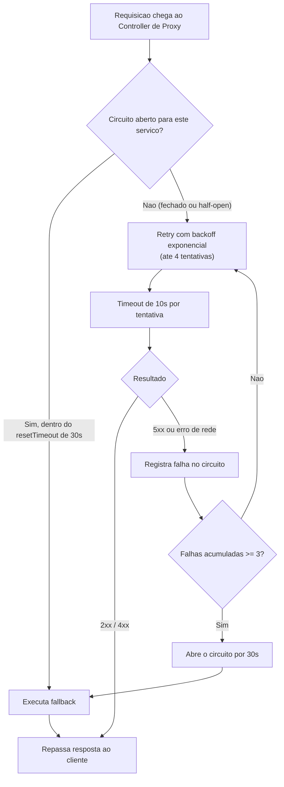
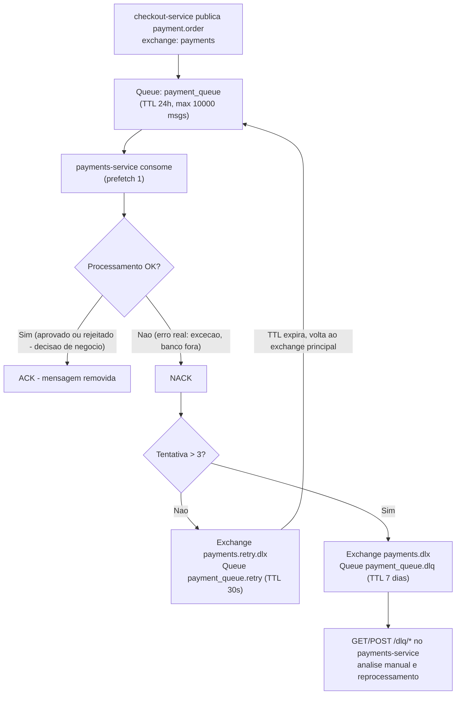

# marketplace-microservicos

Projeto de  um marketplace implementado como microsserviços independentes em NestJS, cada um com seu próprio banco PostgreSQL, comunicando-se via HTTP (síncrono) e RabbitMQ (assíncrono). O objetivo é aplicar na prática padrões reais de sistemas distribuídos — API Gateway, Database per Service, Circuit Breaker, Retry com backoff, Timeout, Fallback, mensageria com retry/DLQ — descritos em `desenho-arquitetura.png` (quadro de estudo que guiou as decisões do projeto) e no material de referência ao final deste documento.

## Serviços

| Serviço | Porta | Banco (host) | Responsabilidade |
|---|---|---|---|
| `api-gateway` | 3005 | — (sem banco) | Ponto único de entrada: autenticação, roteamento e resiliência |
| `users-service` | 3000 | `users_db` (5433) | Cadastro, login e emissão de JWT |
| `products-service` | 3001 | `products_db` (5434) | Catálogo de produtos |
| `checkout-service` | 3003 | `checkout_db` (5436) | Carrinho e pedidos |
| `payments-service` | 3004 | `payments_db` (5435) | Processamento assíncrono de pagamento |
| `messaging-service` | 5672 / 15672 | — | Broker RabbitMQ (infraestrutura, não é um serviço NestJS) |
| `observability-stack` | Prometheus `9090`, Grafana `3010` | — | Coleta e visualização de métricas dos 5 serviços |

Cada serviço de aplicação segue o mesmo padrão: NestJS + TypeORM (`synchronize` em dev, sem migrations), `JwtAuthGuard` validando o mesmo `JWT_SECRET` compartilhado, módulo de `health` (Terminus) e módulo de `metrics` (`/metrics`, Prometheus).

## Visão geral da arquitetura



## Fluxo completo de compra (ponta a ponta, via gateway)

Do cadastro até o resultado do pagamento — exatamente o caminho coberto pelo teste e2e do `api-gateway` (`docs/specs/01-integracao-payments-gateway-e2e-completo.md`):



O pagamento é assíncrono e desacoplado: `checkout-service` publica a mensagem e responde imediatamente, sem aguardar nem conhecer o resultado. O `FakePaymentGatewayService` decide de forma determinística: valor `> 10000` → rejeitado ("Limite excedido"); valor terminado em `.99` → rejeitado ("Cartão recusado pela operadora"); qualquer outro caso → aprovado.

## Resiliência no api-gateway

Toda chamada de proxy passa pela mesma pilha, na ordem: **Circuit Breaker → Retry → Timeout → Fallback**, implementada em `api-gateway/src/proxy/service/proxy.service.ts`.



- **Fallback de `products` (GET)**: retorna o último catálogo cacheado com sucesso (`CacheFallbackService`).
- **Fallback de `users`, `checkout`, `payments`**: erro explícito de serviço indisponível (`DefaultFallbackService`), sem dado simulado.
- Erros `4xx` do serviço de destino não contam como falha do circuito — só `5xx`/erro de rede abrem o circuito.

## Mensageria assíncrona (RabbitMQ)

`checkout-service` é o único produtor; `payments-service` é o único consumidor. A topologia (exchange topic + retry + DLQ) é criada dinamicamente pelo próprio consumer (`payments-service/src/events/rabbitmq/rabbitmq.service.ts`):



Um pagamento **rejeitado** pelo gateway simulado é um desfecho de negócio, não uma falha — a mensagem é confirmada (ACK) normalmente. Só uma exceção real (ex.: banco fora do ar) aciona retry/DLQ. O `payments-service` expõe ainda `GET /dlq/stats`, `GET /dlq/messages`, `POST /dlq/reprocess/:orderId`, `POST /dlq/reprocess-all`, `DELETE /dlq/message/:orderId` e `DELETE /dlq/purge` para operar a DLQ.

## Observabilidade

`observability-stack/` sobe Prometheus (`9090`) e Grafana (`3010`, datasource já provisionado) via Docker Compose, fazendo *scrape* de `/metrics` dos 5 serviços de aplicação (rodando no host, fora do Docker) a cada 15s. Cada serviço expõe `/metrics` (contadores/latência HTTP) e `/health` (liveness, via Terminus) — o `api-gateway`, além do próprio `/health`, agrega o `pingCheck` do `/health` dos 4 serviços downstream.

Já provisionados junto com a stack:
- **Dashboards Grafana**: `marketplace-overview.json` (visão geral) e `service-details.json` (detalhe por serviço).
- **Alertas Prometheus** (`alert.rules.yml`): `ServiceDown` (alvo fora do ar por 30s), `HighErrorRate` (>10% de respostas 5xx em 5min), `HighLatencyP95` (>2s), `HighMemoryUsage` (>512MB residente), `NoPaymentsProcessed` (nenhum pagamento processado em 5min) e `HighPaymentRejectionRate` (>50% de rejeição em 5min).

## Como rodar

Cada serviço é independente e sobe seu próprio banco. Ordem sugerida:

```bash
# 1. Broker de mensageria
cd messaging-service && docker compose up -d

# 2. Banco + serviço, repetido para cada um
cd users-service && docker compose up -d && npm install && npm run start:dev
cd products-service && docker compose up -d && npm install && npm run start:dev
cd checkout-service && docker compose up -d && npm install && npm run start:dev
cd payments-service && docker compose up -d && npm install && npm run start:dev
cd api-gateway && npm install && npm run start:dev

# 3. Observabilidade (opcional)
cd observability-stack && docker compose up -d
```

Todo o tráfego do cliente deve passar pelo `api-gateway` (`:3005`); os demais serviços ficam expostos individualmente apenas para desenvolvimento/depuração.

### Imagens Docker

Cada serviço tem um `Dockerfile` multistage (`build` compila com `nest build`; `production` reinstala só as dependências de produção e copia o `dist/` compilado — imagem final ~330-380MB, baseada em `node:20-alpine`, rodando como usuário não-root e com `HEALTHCHECK` próprio):

```bash
docker build -t users-service ./users-service
docker run --rm -p 3000:3000 \
  -e DB_HOST=host.docker.internal -e DB_PORT=5433 -e DB_USERNAME=postgres -e DB_PASSWORD=postgres -e DB_DATABASE=users_db \
  -e JWT_SECRET=dev-secret-change-me \
  users-service
```

`users-service`, `products-service`, `checkout-service` e `payments-service` têm `better-sqlite3` (usado só nos testes) como dependência opcional do TypeORM — o estágio `build` instala o toolchain nativo (`python3 make g++`) só para compilá-lo; o estágio `production` usa `npm ci --omit=dev --omit=optional`, que pula esse pacote e não precisa do toolchain. O `api-gateway` não tem banco, então seu Dockerfile é mais simples e o `HEALTHCHECK` usa `/health/live` (liveness pura do processo) em vez de `/health` (que depende dos outros 4 serviços estarem no ar).

### Automatizando com `start-all.sh`

`./start-all.sh` faz os passos acima de uma vez: sobe RabbitMQ, os 4 bancos, espera cada um ficar pronto (`pg_isready`) e inicia os 5 serviços NestJS (`npm run start:dev`) em background, aguardando `/health` de cada um antes de seguir para o próximo. Logs ficam em `.run/logs/<serviço>.log`. Ao final, abre automaticamente no navegador o Swagger do `api-gateway` (`/api`) e, com `--with-observability`, também o dashboard do Grafana.

```bash
./start-all.sh                        # sobe tudo
./start-all.sh start --with-observability  # + Prometheus/Grafana
./start-all.sh status                 # mostra o que está no ar
./start-all.sh logs api-gateway       # segue o log de um serviço
./start-all.sh stop                   # derruba processos e containers
```

### Gerando tráfego e validando o fluxo com `e2e-flow.sh`

`./e2e-flow.sh` exercita a compra completa (registro → login → produto → carrinho → checkout → espera do pagamento) inteiramente via `api-gateway`, cobrindo os dois desfechos do gateway simulado (aprovado e rejeitado por `.99`). Requer `curl` e `jq`.

```bash
./e2e-flow.sh once                       # roda um ciclo e sai (smoke test; exit code != 0 se algo falhar)
./e2e-flow.sh loop                       # roda em loop (Ctrl+C para parar), gerando tráfego contínuo
./e2e-flow.sh loop --interval 10 --cycles 50   # loop limitado, com 10s entre ciclos
```

Um pool de usuários (`POOL_SIZE=3` por padrão) é registrado uma vez e reaproveitado entre execuções (login cacheado, evitando o rate limit de `/auth/login`); cada ciclo cria produtos e pedidos novos. Use em conjunto com `observability-stack` (`http://localhost:3010`) para ver as métricas de latência, taxa de erro e aprovação/rejeição de pagamento variando em tempo real.

## Fluxo de trabalho e specs

Cada funcionalidade é documentada antes de implementada, em `<serviço>/docs/specs/NN-nome.md` (spec → PR de escopo → plano → testes, sempre na mesma branch). Ver `CLAUDE.md` para o processo completo. As specs existentes documentam, serviço a serviço, exatamente o que está implementado hoje — este README é o resumo consolidado da arquitetura resultante.

---

## Material de estudo — Resiliência em Microsserviços (AWS)

Material usado como base para os padrões de resiliência do `api-gateway` (timeout, retry, circuit breaker, fallback).

1. **[Timeouts, Retries, and Backoff with Jitter](https://aws.amazon.com/builders-library/timeouts-retries-and-backoff-with-jitter/)** — como lidar com falhas temporárias usando timeouts, retries, backoff exponencial e jitter.
2. **[Circuit Breaker Pattern](https://docs.aws.amazon.com/prescriptive-guidance/latest/cloud-design-patterns/circuit-breaker.html)** — estados (Closed/Open/Half-Open), failure threshold, recovery timeout e fallback.
3. **[Building Resilient Applications](https://builder.aws.com/content/39oicPbAkQAZkQu2dn8nrrGsBGG/resilience-essentials)** — fault tolerance, alta disponibilidade, disaster recovery e observabilidade.

O quadro `desenho-arquitetura.png`, na raiz do repositório, é o material de estudo (mensageria, CQRS, SAGA, DLQ) que orientou as decisões de arquitetura deste projeto.
