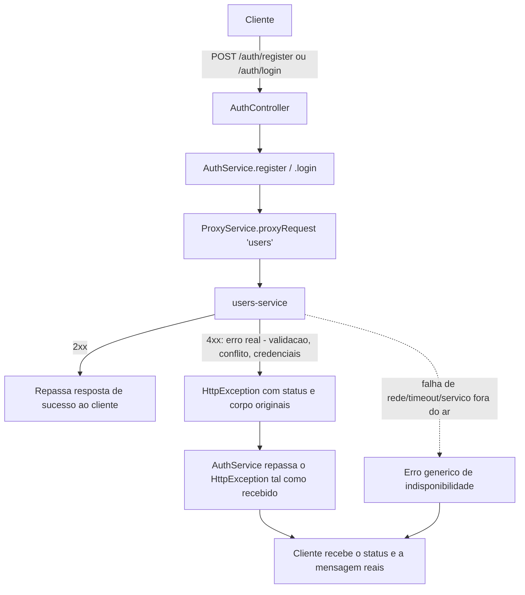

# Spec: Repasse de Erros Reais no Fluxo de Autenticação do Gateway

## Contexto

Uma spec anterior (`products-service/docs/specs/04-catalogo-e-integracao-gateway.md`, RF10–RF13) corrigiu um bug em que o `CircuitBreakerService`/`RetryService` do `api-gateway` mascaravam respostas de erro HTTP legítimas (`4xx`) do `products-service` com uma resposta de fallback genérica. O `ProxyService.proxyRequest` (`api-gateway/src/proxy/service/proxy.service.ts`) agora converte esses erros num `HttpException` com o status e o corpo originais do serviço downstream.

Verificando o fluxo de autenticação (`POST /auth/register`, `POST /auth/login`), foi encontrado um bug análogo, num lugar diferente: `AuthController` (`api-gateway/src/auth/controllers/auth.controller.ts`) delega para `AuthService.login`/`AuthService.register` (`api-gateway/src/auth/service/auth.service.ts:43-67`), que já chamam `proxyService.proxyRequest('users', ...)` — ou seja, já se beneficiam da correção anterior e recebem o `HttpException` correto vindo do `users-service`. Só que cada um desses dois métodos envolve a chamada num `try/catch` que **descarta qualquer erro recebido** e sempre lança um `UnauthorizedException` fixo e genérico:

- `login`: qualquer erro vira `401 "Invalid login credentials"`
- `register`: qualquer erro vira `401 "Registration failed"`

Isso mascara respostas reais do `users-service`, como:
- `400 Bad Request` com mensagens de validação específicas (ex.: `"role deve ser seller ou buyer"`, e-mail inválido, senha curta)
- `409 Conflict` quando o e-mail já está cadastrado (`"Email já cadastrado"`)
- `401` com mensagens específicas do `users-service` (`"Credenciais inválidas"`, `"Conta inativa"`)

Adicionalmente, existe uma inconsistência de contrato: `RegisterDto` do gateway (`api-gateway/src/auth/dtos/register.dto.ts`) aceita `role` com os valores `"user"`, `"admin"` ou `"seller"` (`@IsOptional() @IsString()`, sem validação de enum), mas o `users-service` só aceita `"seller"` ou `"buyer"` (`users-service/src/auth/dto/register.dto.ts`, `@IsEnum(UserRole, { message: 'role deve ser seller ou buyer' })`). Um cliente que envie `role: "user"` (o valor default do DTO do gateway) passa pela validação do gateway, é rejeitado pelo `users-service` com `400`, e — por causa do bug acima — chega ao cliente como um `401` genérico, sem indicar que o problema é o valor de `role`.

## Objetivo

Fazer o gateway repassar ao cliente o erro real do `users-service` em `POST /auth/login` e `POST /auth/register` (status e mensagem), e alinhar o contrato de `role` do `RegisterDto` do gateway com os valores realmente aceitos pelo `users-service`.

## Requisitos Funcionais

### RF01 — Repasse do erro real em `POST /auth/login`
Quando `users-service` responder com um erro HTTP (qualquer `4xx` — credenciais inválidas, conta inativa, dados inválidos), o gateway deve repassar ao cliente o mesmo status code e a mesma mensagem recebidos, em vez de substituí-los por um `401 "Invalid login credentials"` fixo.

### RF02 — Repasse do erro real em `POST /auth/register`
Quando `users-service` responder com um erro HTTP (`400` de validação, `409` de e-mail duplicado), o gateway deve repassar ao cliente o mesmo status code e a mesma mensagem recebidos, em vez de substituí-los por um `401 "Registration failed"` fixo.

### RF03 — Erro de infraestrutura continua com mensagem clara
Se a falha não for uma resposta HTTP do `users-service` (rede indisponível, timeout, serviço fora do ar), o gateway deve continuar respondendo com um erro claro indicando indisponibilidade do serviço de autenticação — sem travar nem vazar detalhes internos (stack trace, etc.).

### RF04 — Contrato de `role` alinhado entre gateway e `users-service`
O `RegisterDto` do gateway deve aceitar como `role` apenas os valores que o `users-service` de fato reconhece (`"seller"` ou `"buyer"`). Um valor de `role` fora desse conjunto deve ser rejeitado pelo próprio gateway com `400 Bad Request` e mensagem clara, antes mesmo de a requisição chegar ao `users-service`.

## Estrutura de Dados

### `RegisterDto` (api-gateway) — campo `role`

| Campo | Tipo hoje | Tipo corrigido |
|---|---|---|
| `role` | `string` opcional, sem validação de enum, aceita `"user"`\|`"admin"`\|`"seller"`, default `"user"` | enum obrigatório, aceita apenas `"seller"`\|`"buyer"` (mesmo conjunto do `users-service`) |

Nenhum outro campo de `RegisterDto`/`LoginDto` muda. O corpo de resposta de sucesso (`200`/`201`) de login e registro não muda.

## Fluxo da Implementação

## Respostas Esperadas

| Situação | Status |
|---|---|
| `POST /auth/register` com dados válidos | `201 Created` |
| `POST /auth/register` com `role` fora de `seller`/`buyer` | `400 Bad Request` (rejeitado pelo próprio gateway) |
| `POST /auth/register` com e-mail já cadastrado | `409 Conflict` |
| `POST /auth/register` com dados inválidos (e-mail, senha, nome) | `400 Bad Request` |
| `POST /auth/login` com credenciais válidas | `200 OK` |
| `POST /auth/login` com credenciais inválidas | `401 Unauthorized` (mensagem real do `users-service`) |
| `POST /auth/login`/`register` com `users-service` fora do ar | Erro claro de indisponibilidade (não `500` opaco nem timeout sem resposta) |

## Fora de Escopo

- Qualquer alteração no `users-service` (seus DTOs, validações e mensagens já estão corretos e servem de referência)
- Qualquer alteração no `ProxyService`, `CircuitBreakerService` ou `RetryService` além do que já foi feito na correção anterior — esta spec só ajusta como `AuthService` usa o resultado
- Novas regras de negócio de autenticação (recuperação de senha, refresh token, etc.)
- Alteração de `LoginDto` ou dos demais campos de `RegisterDto`

## Critérios de Aceite

- `POST /auth/register` com `role: "user"` ou `"admin"` retorna `400` do próprio gateway, com mensagem indicando que o valor de `role` é inválido — não chega a chamar o `users-service`
- `POST /auth/register` com e-mail já cadastrado retorna `409`, com a mensagem `"Email já cadastrado"` (a mesma que o `users-service` retorna)
- `POST /auth/register` com dados válidos (`role: "seller"` ou `"buyer"`) continua retornando `201` com os dados do usuário criado
- `POST /auth/login` com senha errada retorna `401` com a mensagem `"Credenciais inválidas"` (a mesma que o `users-service` retorna), não `"Invalid login credentials"`
- `POST /auth/login` com credenciais válidas continua retornando `200` com o token
- Nenhum teste existente de `auth.controller.spec.ts`/`auth.service.spec.ts` quebra

## Referências

- `products-service/docs/specs/04-catalogo-e-integracao-gateway.md` (RF10–RF13) — correção equivalente já aplicada ao `ProxyService`/`CircuitBreakerService`/`RetryService`, da qual este fix depende
- `api-gateway/src/auth/service/auth.service.ts` — onde o erro é hoje descartado
- `api-gateway/src/auth/dtos/register.dto.ts` — contrato de `role` a ser alinhado
- `users-service/src/auth/dto/register.dto.ts`, `users-service/src/auth/auth.service.ts` — comportamento e mensagens de referência
