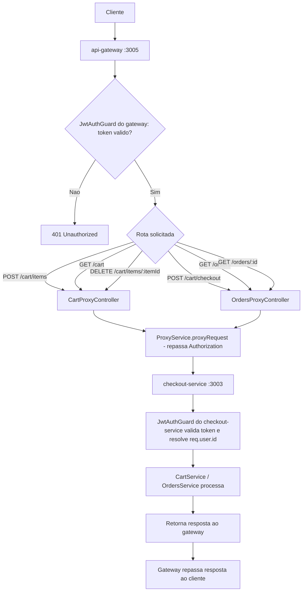

# Spec: Integração do Checkout Service com o API Gateway

## Contexto

O `checkout-service` (porta 3003) já possui, implementados e protegidos por um `JwtAuthGuard` global (sem rotas públicas), os endpoints de carrinho (`03-gerenciamento-carrinho.md`) e de finalização de pedido (`04-finalizacao-do-pedido.md`):

- `POST /cart/items` — adiciona um item ao carrinho ativo do usuário autenticado
- `GET /cart` — consulta o carrinho ativo do usuário autenticado
- `DELETE /cart/items/:itemId` — remove um item do carrinho ativo do usuário autenticado
- `POST /cart/checkout` — finaliza o carrinho ativo, criando um `Order`
- `GET /orders` — lista os pedidos do usuário autenticado
- `GET /orders/:id` — detalha um pedido do usuário autenticado

Em todos esses endpoints, a identidade do usuário vem exclusivamente do token JWT (`req.user.id`), nunca de um parâmetro da requisição.

O `api-gateway` (porta 3005) já possui a infraestrutura genérica de proxy (`ProxyService`, com circuit breaker, retry, timeout e fallback), o `JwtAuthGuard` local (validação do token via Passport), e o padrão de controller-proxy já replicado duas vezes — `UsersController` (`api-gateway/src/users/users.controller.ts`) e `ProductsController` (`api-gateway/src/products/products.controller.ts`). `serviceConfig.checkout` (`api-gateway/src/config/gateway.config.ts`) já aponta para `http://localhost:3003` via `CHECKOUT_SERVICE_URL`, já definida em `api-gateway/.env`, e o `ProxyService` já tem um fallback genérico configurado para `checkout` (`createServiceFallback`). Nenhum controller do gateway, porém, expõe hoje rotas `/cart/*` ou `/orders/*` — o `checkout-service` só é alcançável diretamente pela porta 3003.

Esta spec define o que falta para que o fluxo completo de carrinho e checkout funcione de ponta a ponta passando pelo gateway (porta 3005), seguindo o mesmo padrão já usado para `users` e `products`.

## Objetivo

Expor no `api-gateway`, por meio de dois novos controllers de proxy reunidos em um `CheckoutModule`, todas as rotas já existentes no `checkout-service` (carrinho e pedidos), protegidas por `JwtAuthGuard` e repassando o header `Authorization`, de forma que todo o fluxo — login, montagem do carrinho, checkout e consulta de pedidos — seja executável apenas pela porta do gateway.

## Requisitos Funcionais

### RF01 — `CheckoutModule` no gateway

Deve existir um módulo `CheckoutModule` no `api-gateway`, importando o `ProxyModule` (mesmo padrão de `UsersModule`/`ProductsModule`), que registra dois controllers: um para as rotas de carrinho e outro para as rotas de pedidos/checkout. O `CheckoutModule` deve ser registrado no `AppModule` do gateway.

### RF02 — Rotas de carrinho expostas pelo gateway (`CartProxyController`)

Deve existir, no `api-gateway`, um controller de carrinho, protegido por `JwtAuthGuard`, que expõe as mesmas operações já existentes no `checkout-service`, repassando cada requisição via `ProxyService`:

- `POST /cart/items` — adiciona um item ao carrinho do usuário autenticado
- `GET /cart` — consulta o carrinho do usuário autenticado
- `DELETE /cart/items/:itemId` — remove um item do carrinho do usuário autenticado

### RF03 — Rotas de pedidos/checkout expostas pelo gateway (`OrdersProxyController`)

Deve existir, no `api-gateway`, um controller de pedidos, protegido por `JwtAuthGuard`, que expõe as mesmas operações já existentes no `checkout-service`, repassando cada requisição via `ProxyService`:

- `POST /cart/checkout` — finaliza o carrinho ativo do usuário autenticado, criando um pedido
- `GET /orders` — lista os pedidos do usuário autenticado
- `GET /orders/:id` — detalha um pedido do usuário autenticado

### RF04 — Repasse do header Authorization

Toda requisição encaminhada pelo `CartProxyController` e pelo `OrdersProxyController` ao `checkout-service` deve repassar, sem modificação, o header `Authorization` recebido pelo gateway, para que o `checkout-service` valide o mesmo token JWT e identifique o usuário autor da requisição (`req.user.id`).

### RF05 — Uso da infraestrutura de proxy existente

O encaminhamento de todas as rotas definidas em RF02 e RF03 deve ser feito através do `ProxyService` já existente no gateway (circuit breaker, retry, timeout, fallback já configurado para `checkout`), sem chamadas HTTP diretas e paralelas a essa infraestrutura, e sem nenhuma alteração no mecanismo de proxy em si.

### RF06 — Configuração do endereço do checkout-service

`CHECKOUT_SERVICE_URL` e `serviceConfig.checkout` já existentes (`http://localhost:3003`) continuam sendo a única fonte da URL do `checkout-service` — nenhuma URL deve ser hardcoded nos novos controllers.

## Fluxo Esperado

1. Um cliente autenticado (token JWT obtido via `/auth/login`, já integrado ao gateway) faz uma requisição a uma rota `/cart/*` ou `/orders/*` na porta do gateway (3005).
2. O `JwtAuthGuard` do gateway valida o token presente no header `Authorization`; se inválido ou ausente, a requisição é rejeitada antes de chegar ao `checkout-service`.
3. Com a requisição autorizada, o gateway a encaminha ao `checkout-service` (porta 3003) via `ProxyService`, repassando o header `Authorization`.
4. O `checkout-service` processa a requisição normalmente (seu próprio `JwtAuthGuard` também valida o token e resolve `req.user.id`) e retorna a resposta.
5. O gateway repassa a resposta do `checkout-service` ao cliente original.

## Diagrama de Fluxo

## Respostas Esperadas

| Rota (via gateway :3005) | Situação | Status | Corpo |
|---|---|---|---|
| `POST /cart/items` | Sem token | `401 Unauthorized` | Erro de autenticação (bloqueado pelo gateway) |
| `POST /cart/items` | Token válido, produto existente e ativo | `201 Created`/`200 OK`* | Carrinho atualizado (resposta do checkout-service) |
| `GET /cart` | Token válido | `200 OK` | Carrinho ativo (ou vazio) do usuário autenticado |
| `DELETE /cart/items/:itemId` | Token válido, item do próprio usuário | `200 OK` | Carrinho atualizado |
| `POST /cart/checkout` | Token válido, carrinho ativo com itens | `201 Created` | Pedido criado |
| `POST /cart/checkout` | Carrinho ativo vazio ou inexistente | Erro repassado do checkout-service | Erro de negócio (não mascarado por fallback) |
| `GET /orders` | Token válido | `200 OK` | Lista de pedidos do usuário autenticado |
| `GET /orders/:id` | Token válido, pedido do próprio usuário | `200 OK` | Dados completos do pedido |
| `GET /orders/:id` | Pedido inexistente ou de outro usuário | `404 Not Found` | Erro repassado do checkout-service |

\* O status exato de `POST /cart/items` é o já definido em `03-gerenciamento-carrinho.md` (repassado integralmente do checkout-service).

## Fora de Escopo

- Qualquer alteração no mecanismo de proxy do gateway (circuit breaker, retry, timeout, fallback) — apenas seu uso para as rotas `/cart/*` e `/orders/*`.
- Qualquer alteração no `checkout-service` (controllers, services, entidades, regras de negócio já definidas em `03-gerenciamento-carrinho.md` e `04-finalizacao-do-pedido.md`).
- Rotas de `payments` — cobertas por uma spec futura.
- Qualquer alteração na arquitetura do `JwtAuthGuard` existente no gateway ou na forma como valida o token localmente.
- Novos endpoints além dos seis já existentes no `checkout-service` (ex.: alteração de quantidade de item, cancelamento de pedido).

## Critérios de Aceite

1. `POST http://localhost:3005/cart/items` sem token retorna `401 Unauthorized`.
2. `POST http://localhost:3005/cart/items` com token válido e `productId`/`quantity` válidos adiciona o item e retorna o carrinho atualizado, replicando o comportamento de `POST http://localhost:3003/cart/items`.
3. `GET http://localhost:3005/cart` com token válido retorna o carrinho ativo (ou vazio) do usuário autenticado.
4. `DELETE http://localhost:3005/cart/items/:itemId` com token válido remove o item e retorna o carrinho atualizado; com `itemId` de outro usuário, repassa o erro do checkout-service (não remove nada).
5. `POST http://localhost:3005/cart/checkout` com token válido e carrinho ativo com itens cria o pedido e retorna `201 Created`.
6. `GET http://localhost:3005/orders` com token válido retorna a lista de pedidos do usuário autenticado, ordenada do mais recente para o mais antigo.
7. `GET http://localhost:3005/orders/:id` com token válido e `id` do próprio usuário retorna os dados completos do pedido; com `id` inexistente ou de outro usuário, retorna `404 Not Found`.
8. Fluxo completo executável apenas via porta do gateway (3005): login → `POST /cart/items` → `GET /cart` → `POST /cart/checkout` → `GET /orders` → `GET /orders/:id`, sem necessidade de chamar o `checkout-service` (porta 3003) diretamente.
9. Toda requisição autenticada encaminhada ao `checkout-service` chega com o mesmo header `Authorization` recebido pelo gateway.
10. Existe um teste e2e no `api-gateway` cobrindo o fluxo do critério 8 de ponta a ponta.

## Referências

- `checkout-service/docs/specs/03-gerenciamento-carrinho.md` — `POST /cart/items`, `GET /cart`, `DELETE /cart/items/:itemId`.
- `checkout-service/docs/specs/04-finalizacao-do-pedido.md` — `POST /cart/checkout`, `GET /orders`, `GET /orders/:id`.
- `api-gateway/src/products/products.controller.ts` e `api-gateway/src/users/users.controller.ts` — padrão de controller proxy replicado para checkout.
- `api-gateway/src/config/gateway.config.ts` — `serviceConfig.checkout`, já configurado.
- `api-gateway/src/proxy/service/proxy.service.ts` — infraestrutura de proxy existente, incluindo fallback já configurado para `checkout`.
- `api-gateway/docs/specs/01-repasse-erros-autenticacao.md` — precedente de integração já validado no gateway.
