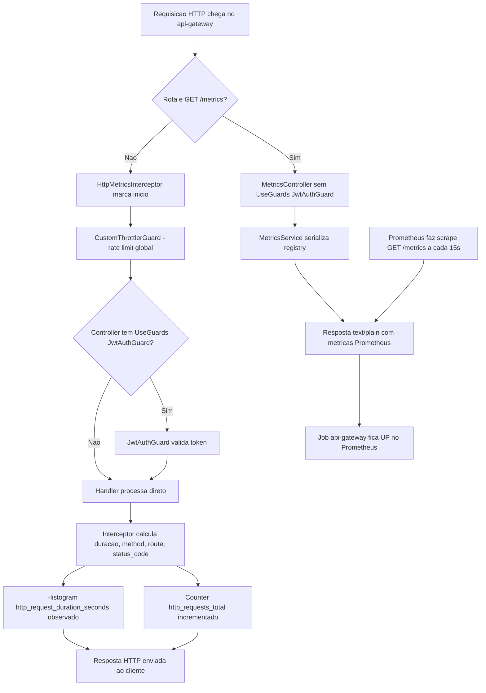

# Spec: Métricas HTTP com prom-client

## Contexto

A `observability-stack/` (ver `docs/specs/02-observability-stack-prometheus-grafana.md`, na raiz do repositório) já está no ar com Prometheus configurado para fazer scrape de `GET /metrics` em cada um dos 5 serviços a cada 15s, incluindo o job `api-gateway` apontando para `host.docker.internal:3005/metrics`. Como nenhum serviço expõe esse endpoint ainda, o target `api-gateway` aparece como `DOWN` no Prometheus.

O `api-gateway` (porta 3005) segue um padrão de guards diferente dos demais serviços do projeto: não existe um `JwtAuthGuard` global via `APP_GUARD` — o único guard global registrado é o `CustomThrottlerGuard` (rate limiting, ver `src/guards/throttler.guard.ts`). A validação de JWT (`JwtAuthGuard`, `src/guards/auth.guard.ts`) é aplicada rota a rota, com `@UseGuards(JwtAuthGuard)` no nível do controller (ex.: `CartProxyController`, `UsersController`, `PaymentsProxyController`), não havendo um decorator `@Public()` equivalente ao dos demais serviços. Isso significa que, por padrão, qualquer controller novo já nasce **sem** exigência de JWT — só passa a exigir se o `@UseGuards(JwtAuthGuard)` for explicitamente adicionado a ele.

Como consequência direta desse padrão: para o `MetricsController` desta spec ficar público, basta **não** aplicar `@UseGuards(JwtAuthGuard)` a ele — não há nenhum decorator adicional a adicionar, diferente dos outros 4 serviços do projeto.

O `CustomThrottlerGuard` continua ativo globalmente (inclusive sobre `/metrics`), mas os limites já configurados (mínimo de 10 req/s na janela mais curta) são muito superiores à cadência de scrape do Prometheus (1 requisição a cada 15s), então nenhum ajuste de rate limit é necessário para o Prometheus conseguir coletar as métricas.

Esta spec cobre exclusivamente a exposição de métricas técnicas de HTTP (contagem e duração de requisições) via `prom-client`, no formato que o Prometheus já está configurado para consumir. Métricas de negócio ou de infraestrutura de resiliência (circuit breaker, retry, fallback) ficam para uma spec futura.

## Objetivo

Fazer o `api-gateway` expor `GET /metrics` em formato Prometheus, contendo métricas HTTP (contagem e duração de requisições por método/rota/status) e as métricas padrão do Node.js, sem exigir autenticação, de forma que o job `api-gateway` no Prometheus passe a `UP`.

## Requisitos Funcionais

### RF01 — Dependência `prom-client`
Adicionar `prom-client` como dependência do `api-gateway`.

### RF02 — `MetricsModule` global
Criar um módulo `MetricsModule`, marcado com `@Global()` e importado no `AppModule`, agrupando o serviço, o interceptor e o controller descritos abaixo — para que o `MetricsService` possa ser injetado em qualquer módulo sem reimportação explícita.

### RF03 — `MetricsService`
Deve existir um `MetricsService` responsável por:
- Manter um `Registry` próprio do `prom-client`.
- Registrar um `Counter` `http_requests_total`, com labels `method`, `route` e `status_code`, incrementado a cada requisição HTTP finalizada.
- Registrar um `Histogram` `http_request_duration_seconds`, com os mesmos labels, observando a duração de cada requisição HTTP em segundos.
- Habilitar a coleta das métricas padrão do processo Node.js (`collectDefaultMetrics`) no mesmo registry.
- Expor um método que retorne, de forma assíncrona, o conteúdo do registry serializado no formato de texto do Prometheus, junto do `Content-Type` correspondente.

### RF04 — `HttpMetricsInterceptor`
Deve existir um interceptor, registrado globalmente via `APP_INTERCEPTOR`, que para cada requisição HTTP:
- Marque o instante de início antes de a requisição seguir para o handler.
- Ao finalizar a resposta (sucesso ou erro), calcule a duração, obtenha `method`, o padrão de rota (não a URL crua — ex.: `/users/:id`, não `/users/123`, para não gerar séries com cardinalidade alta) e `status_code`.
- Incremente o `Counter` e observe a duração no `Histogram` do `MetricsService` com esses labels.
- **Não** processe a própria requisição a `GET /metrics` (ver RN01).

### RF05 — `MetricsController`
Deve existir um controller com `GET /metrics` que:
- Retorne o conteúdo produzido pelo `MetricsService` (RF03) com o `Content-Type` apropriado (`text/plain; version=0.0.4` ou o que o `prom-client` definir).
- **Não** receba `@UseGuards(JwtAuthGuard)` — seguindo o padrão do `api-gateway`, isso já é suficiente para deixar a rota pública (ver Contexto).

### RF06 — Registro no `AppModule`
O `MetricsModule` deve ser importado em `src/app.module.ts`, junto dos demais módulos já existentes (`ProxyModule`, `AuthModule`, `UsersModule`, `ProductsModule`, `CheckoutModule`, `PaymentsModule`, `HealthModule` etc.).

## Regras de Negócio

- RN01 — A requisição a `GET /metrics` não deve ser contabilizada nas próprias métricas HTTP (nem no `Counter`, nem no `Histogram`), para evitar que o endpoint de scrape polua a série que ele mesmo expõe.
- RN02 — `/metrics` é público por ausência de `@UseGuards(JwtAuthGuard)`, não por um decorator `@Public()` — este serviço não possui esse decorator (diferente dos demais 4 serviços do projeto).
- RN03 — O `CustomThrottlerGuard` (global) permanece ativo sobre `/metrics`; nenhum ajuste de configuração de rate limit é necessário, pois os limites atuais comportam folgadamente a cadência de scrape do Prometheus (a cada 15s).
- RN04 — O label `route` deve refletir o padrão de rota declarado no controller, não a URL literal recebida, para não gerar uma série de métrica por identificador único (ex.: `orderId`, `serviceName`).

## Fora de Escopo

- Métricas de negócio ou de resiliência (circuit breaker aberto/fechado, tentativas de retry, fallback acionado) — spec futura.
- Dashboards no Grafana — spec futura.
- Qualquer alteração no Prometheus ou no Grafana (`observability-stack/`) — já configurados.
- Qualquer alteração no `CustomThrottlerGuard` ou nos limites de rate limiting já configurados.
- Tracing distribuído, logs estruturados ou correlação de request ID.
- Métricas específicas de proxy (latência por serviço downstream, taxa de erro por serviço) — spec futura.

## Fluxo da Implementação

## Tabela de Métricas Expostas

| Métrica | Tipo | Labels | Descrição |
|---|---|---|---|
| `http_requests_total` | Counter | `method`, `route`, `status_code` | Total de requisições HTTP processadas |
| `http_request_duration_seconds` | Histogram | `method`, `route`, `status_code` | Duração das requisições HTTP, em segundos |
| `process_cpu_*`, `process_resident_memory_bytes`, `nodejs_*`, etc. | Gauge/Counter (via `collectDefaultMetrics`) | — | Métricas padrão do processo Node.js (CPU, memória, event loop, GC) |

## Critérios de Aceite

- `curl http://localhost:3005/metrics` (sem header `Authorization`) retorna `200 OK`, com corpo em formato texto do Prometheus contendo, no mínimo, `http_requests_total`, `http_request_duration_seconds` e alguma métrica com prefixo `process_` ou `nodejs_`.
- Após algumas requisições a rotas existentes (ex.: `GET /health`, rotas de proxy), o `curl` acima mostra o `Counter` `http_requests_total` incrementado com os labels `method`, `route` e `status_code` corretos para essas rotas.
- Nenhuma série em `/metrics` referencia a rota `/metrics` (RN01) — o endpoint não se autocontabiliza.
- Uma requisição a uma rota protegida por `@UseGuards(JwtAuthGuard)` (ex.: `GET /cart`) sem token continua retornando `401 Unauthorized` (nenhuma regressão).
- Múltiplas requisições consecutivas a `GET /metrics` não são bloqueadas pelo `CustomThrottlerGuard` sob uso normal (cadência de scrape de 15s).
- No Prometheus (`http://localhost:9090/targets`), o job `api-gateway` aparece como `UP`.

## Referências

- `docs/specs/02-observability-stack-prometheus-grafana.md` — infraestrutura Prometheus/Grafana já configurada, jobs de scrape.
- `api-gateway/src/guards/auth.guard.ts`, `api-gateway/src/checkout/cart-proxy.controller.ts` — padrão atual de aplicação do `JwtAuthGuard` por controller, sem guard global nem `@Public()`.
- Documentação oficial: [prom-client](https://github.com/siimon/prom-client), [Prometheus - Histograms and summaries](https://prometheus.io/docs/practices/histograms/).
