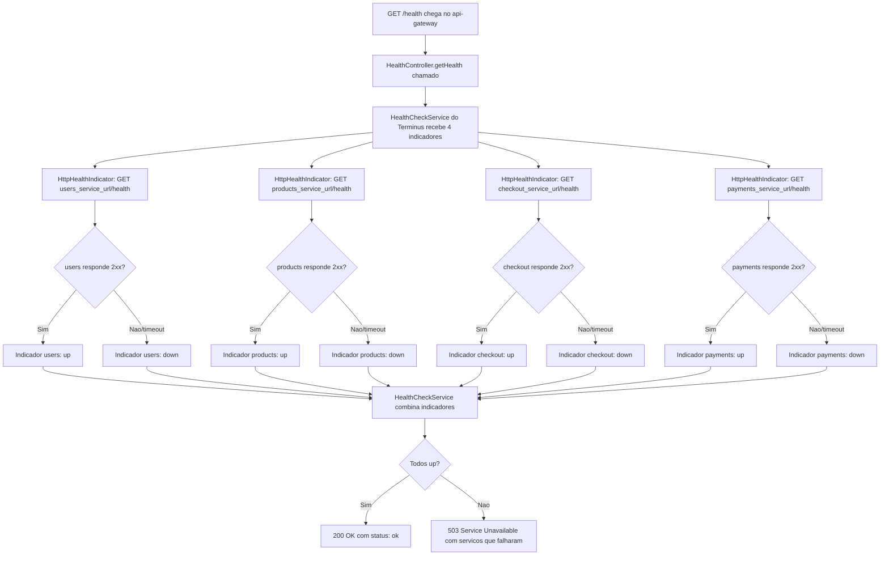

# Spec: Health Check com @nestjs/terminus (dependências downstream)

## Contexto

O `api-gateway` não tem banco de dados próprio — sua única dependência real é a disponibilidade dos 4 serviços downstream (`users`, `products`, `checkout`, `payments`). Hoje ele já tem uma solução própria para isso, bem mais completa do que os outros serviços:
- `GET /health` (`src/health/health.controller.ts` → `HealthService`) retorna uptime/memória do próprio gateway e um resumo agregado dos serviços, mas os dados vêm de um **cache** (`HealthCheckService.getCachedHealth`, `src/common/health/health-check.service.ts`) preenchido por checagens anteriores — não faz uma verificação síncrona no momento da chamada.
- `GET /health/services`, `GET /health/services/:serviceName`, `GET /health/ready` e `GET /health/live` — endpoints adicionais, construídos sobre a mesma `HealthCheckService`, que usa `CircuitBreakerService` (`src/common/circuit-breaker/`) para evitar chamadas repetidas a serviços já sabidos como fora do ar. Essa mesma `CircuitBreakerService` também é usada pelo `ProxyService` (`src/proxy/service/proxy.service.ts`) para as chamadas de proxy reais — não é exclusiva do health check.

Essa infraestrutura de circuit breaker/cache é útil para o proxy e continua existindo. O que falta é um `GET /health` que siga o mesmo padrão adotado nos outros 4 serviços (`@nestjs/terminus`, `HealthCheckService.check([...])`, resposta e status HTTP padronizados) e que faça uma checagem síncrona de verdade no momento da chamada, para ser consistente com o que o Prometheus/Grafana espera de um health check.

## Objetivo

Fazer `GET /health` no `api-gateway` checar, de forma síncrona, os 4 serviços downstream via HTTP (usando o indicador padrão do `@nestjs/terminus`), retornando `503 Service Unavailable` com o(s) serviço(s) fora do ar quando pelo menos um estiver inacessível, e `200 OK` quando os 4 responderem.

## Requisitos Funcionais

### RF01 — Dependência `@nestjs/terminus`
Adicionar `@nestjs/terminus` como dependência do `api-gateway` (`@nestjs/axios` já está instalado, é reaproveitado por `HttpHealthIndicator`).

### RF02 — `HealthModule` com `TerminusModule`
Atualizar `src/health/health.module.ts` para importar `TerminusModule` (de `@nestjs/terminus`), mantendo os módulos já importados (`HealthCheckModule`/equivalente para os outros endpoints, ver RF04).

### RF03 — `GET /health` reescrito com `HealthCheckService` do Terminus
Reescrever o método `getHealth()` de `HealthController` (`src/health/health.controller.ts`) para:
- Injetar `HealthCheckService` e `HttpHealthIndicator` (ambos de `@nestjs/terminus`, não confundir com o `HealthCheckService` já existente em `src/common/health/`).
- Decorar `GET /health` com `@HealthCheck()`.
- Delegar a checagem a `HealthCheckService.check([...])`, com um indicador `HttpHealthIndicator.pingCheck(...)` por serviço downstream, batendo em `GET <base_url>/health` de cada um, usando as mesmas URLs já definidas em `serviceConfig` (`src/config/gateway.config.ts`): `users` (`USERS_SERVICE_URL`), `products` (`PRODUCTS_SERVICE_URL`), `checkout` (`CHECKOUT_SERVICE_URL`), `payments` (`PAYMENTS_SERVICE_URL`).

### RF04 — Endpoints existentes preservados, sem alteração de comportamento
`GET /health/services`, `GET /health/services/:serviceName`, `GET /health/ready` e `GET /health/live` continuam existindo exatamente como hoje, usando `HealthService` e a `HealthCheckService`/`CircuitBreakerService` já existentes em `src/common/health/` e `src/common/circuit-breaker/` — nenhuma mudança nesses endpoints ou nessas classes.

### RF05 — Formato de resposta padrão do Terminus em `GET /health`
`GET /health` passa a responder no formato padrão do `@nestjs/terminus` (`status`, `info`, `error`, `details`, um indicador por serviço downstream: `users`, `products`, `checkout`, `payments`) — substituindo o formato atual (`{ status, timestamp, uptime, memory, version }`).

## Regras de Negócio

- RN01 — Uma falha em **qualquer um** dos 4 indicadores faz `GET /health` responder `503`, listando quais serviços falharam em `error`/`details`.
- RN02 — O timeout de cada checagem HTTP usa o mesmo valor já configurado em `serviceConfig[...].timeout` (10000ms) para manter consistência com o timeout já usado pelo proxy e pela `HealthCheckService` existente.
- RN03 — `GET /health` (RF03) não usa `CircuitBreakerService` — é uma checagem direta e síncrona a cada chamada, diferente de `GET /health/services` (RF04), que continua cacheada/protegida por circuit breaker.

## Fora de Escopo

- Qualquer alteração em `CircuitBreakerService`, `HealthCheckService` (`src/common/health/`), `ProxyService` ou nos endpoints `GET /health/services`, `GET /health/services/:serviceName`, `GET /health/ready`, `GET /health/live`.
- Readiness/liveness probes novos — conceito de Kubernetes, fora do escopo deste projeto (os endpoints `/health/ready` e `/health/live` já existiam antes desta spec e não são alterados).
- Alterações em `/metrics` ou no `MetricsModule` existente (`docs/specs/03-metricas-http-prometheus.md`).
- Alertas no Prometheus/Grafana sobre este serviço — cobertos pela spec `observability-stack/docs/specs/02-alerting-rules-prometheus.md`.

## Fluxo da Implementação

## Critérios de Aceite

- Com os 4 serviços downstream no ar, `curl -i http://localhost:3005/health` retorna `200 OK`, com `"users":{"status":"up"}`, `"products":{"status":"up"}`, `"checkout":{"status":"up"}` e `"payments":{"status":"up"}`.
- Com um dos serviços downstream (ex.: `payments-service`) parado, `curl -i http://localhost:3005/health` retorna `503`, com `"payments":{"status":"down"}` e os demais `"status":"up"`.
- `curl http://localhost:3005/health/ready` e `curl http://localhost:3005/health/live` continuam respondendo exatamente como antes (nenhuma regressão).
- `curl http://localhost:3005/health/services` continua respondendo com os dados vindos do cache/circuit breaker, sem alteração de formato.

## Referências

- `src/common/health/health-check.service.ts`, `src/common/circuit-breaker/circuit-breaker.service.ts` — infraestrutura existente de cache/circuit breaker, preservada e usada pelos demais endpoints de `/health`.
- `src/config/gateway.config.ts` — `serviceConfig` com URLs e timeouts dos 4 serviços downstream, reaproveitado pelo novo `HttpHealthIndicator`.
- `docs/specs/02-integracao-checkout-service.md` — padrão de integração HTTP com os serviços downstream.
- Documentação oficial: [@nestjs/terminus — HTTP health check](https://docs.nestjs.com/recipes/terminus#http-healthcheck).
