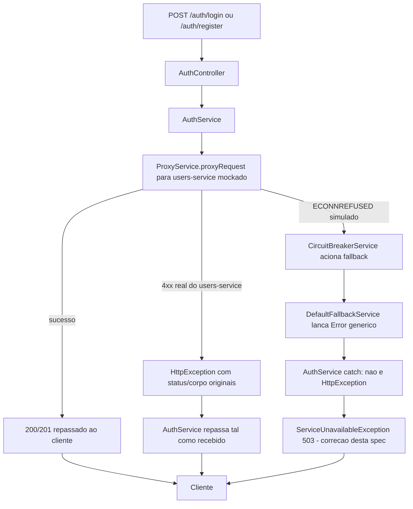

# Spec: Testes Automatizados e Correção do Erro de Indisponibilidade em Auth

## Contexto

O `api-gateway` já tem boa cobertura unitária: guards (`role`, `throttler`, `auth`, `session`), controllers de proxy (`products`, `checkout/cart-proxy`, `checkout/orders-proxy`, `users`), os 3 arquivos de `metrics/`, `health/health.controller`, `middleware/logging`, `common/circuit-breaker`, `common/retry`, `auth/service` e `auth/controllers`, `auth/strategies/jwt.strategy` e `proxy/service/proxy.service`. Faltam testes unitários de `payments-proxy.controller`, `common/timeout` (`TimeoutService`) e dos fallbacks (`cache.fallback`, `default.fallback`), e falta um `test/auth.e2e-spec.ts` dedicado (hoje só há e2e de `users`, `app`, `checkout`, `metrics`, `payments`).

Essa lacuna de e2e em auth escondeu um bug real de comportamento, encontrado ao testar o registro de usuário via Swagger com o `users-service` fora do ar: em vez de um erro claro de indisponibilidade, o gateway respondeu com `401 Unauthorized`. A causa está em `src/auth/service/auth.service.ts`, nos métodos `login()` (linhas 47–62) e `register()` (linhas 64–79):

```
catch (error) {
  if (error instanceof HttpException) { throw error; }
  throw new UnauthorizedException('Invalid login credentials' | 'Registration failed');
}
```

Isso viola o RF03 e o critério de aceite já definidos em `docs/specs/01-repasse-erros-autenticacao.md` ("Se a falha não for uma resposta HTTP do `users-service` [...] o gateway deve continuar respondendo com um erro claro indicando indisponibilidade do serviço"). O motivo: quando `users-service` está inacessível (`ECONNREFUSED`/timeout), o erro não tem `.response` do axios, então `ProxyService.proxyRequest` não o converte em `HttpException` — ele segue para o `CircuitBreakerService`, que aciona o fallback (`DefaultFallbackService.createErrorFallback`), lançando um `Error` genérico (não `HttpException`). Esse `Error` cai no `else` de `AuthService` e é mascarado como `401`, indistinguível de uma senha errada.

O padrão correto já existe no próprio projeto: `checkout-service/src/cart/products-client.service.ts` usa `ServiceUnavailableException` (503) para o mesmo tipo de falha (sem resposta do serviço downstream).

Além disso, `test/users.e2e-spec.ts`, `test/checkout.e2e-spec.ts` e `test/payments.e2e-spec.ts` (já existentes) sobem o `AppModule` sem mockar `HttpService`, exigindo `users-service`/`checkout-service`/`payments-service` reais rodando (documentado no próprio comentário desses arquivos). Isso contraria o requisito geral desta atividade de nenhum teste depender de serviço externo — corrigido pelo RF06.

## Objetivo

Fechar as lacunas de teste unitário/e2e listadas acima e corrigir `AuthService.login`/`register` para lançar `ServiceUnavailableException` (503) em vez de `UnauthorizedException` (401) quando a falha não vier de uma resposta HTTP real do `users-service` — fechando o gap do RF03 de `01-repasse-erros-autenticacao.md` — com teste de regressão que comprove o comportamento correto.

## Requisitos Funcionais

### RF01 — Correção de `AuthService.login`/`register`
Nos blocos `catch` de `login()` e `register()` (`src/auth/service/auth.service.ts`), trocar `throw new UnauthorizedException(...)` por `throw new ServiceUnavailableException(...)` no `else` (caso o erro não seja um `HttpException`). Mudança restrita a essas duas linhas — sem alterar `ProxyService`, `CircuitBreakerService`, `RetryService` ou `DefaultFallbackService`, conforme já delimitado em "Fora de Escopo" de `01-repasse-erros-autenticacao.md`.

### RF02 — `test/auth.e2e-spec.ts` novo, com teste de regressão do bug
Criar o arquivo, mockando `HttpService`/downstream `users-service`, cobrindo:
- Login/registro válidos → repassam a resposta de sucesso do `users-service` mockado.
- Login/registro quando `users-service` responde `4xx` (erro real) → gateway repassa o mesmo status/mensagem (RF01/RF02 de `01-repasse-erros-autenticacao.md`, já implementado).
- Login/registro quando `users-service` está inacessível (mock simula `ECONNREFUSED`) → gateway responde `503`, não `401` (regressão do bug desta spec).

### RF03 — Teste unitário de `payments-proxy.controller`
Criar `src/payments/payments-proxy.controller.spec.ts`, mockando `ProxyService`.

### RF04 — Teste unitário de `TimeoutService`
Criar `src/common/timeout/timeout.service.spec.ts`.

### RF05 — Teste unitário dos fallbacks
Criar `src/common/fallback/cache.fallback.spec.ts` e `src/common/fallback/default.fallback.spec.ts`.

### RF06 — Mockar `HttpService` nos e2e pré-existentes que hoje exigem serviços reais
Atualizar `test/users.e2e-spec.ts`, `test/checkout.e2e-spec.ts` e `test/payments.e2e-spec.ts` para sobrepor `HttpService` (mesmo padrão do RF02), removendo a dependência de `users-service`/`checkout-service`/`payments-service` reais rodando, sem mudar os cenários/asserções de negócio já cobertos por esses arquivos — só a fonte da resposta HTTP passa a ser mockada.

## Regras de Negócio

- RN01 — Nenhum teste depende de `users-service`, `products-service`, `checkout-service` ou `payments-service` reais em execução; toda chamada `HttpService`/axios é mockada.
- RN02 — O `api-gateway` não tem banco de dados; não há necessidade de SQLite em memória aqui.
- RN03 — A correção do RF01 não altera o contrato de resposta de sucesso nem o repasse de erros HTTP reais (`4xx`/`5xx` com corpo) já corrigido pela spec `01-repasse-erros-autenticacao.md` — afeta apenas o caso de falha de conectividade.

## Fluxo da Implementação



## Critérios de Aceite

- `npm test`, `npm run test:e2e` e `npm run test:cov` passam sem nenhum dos 4 serviços downstream real em execução.
- Com `users-service` mockado como indisponível, `POST /auth/login` e `POST /auth/register` respondem `503`, não `401`.
- Com `users-service` mockado respondendo `401`/`400`/`409` reais, o gateway continua repassando o status e a mensagem originais (sem regressão do que já foi corrigido em `01-repasse-erros-autenticacao.md`).
- `payments-proxy.controller.spec.ts`, `timeout.service.spec.ts`, `cache.fallback.spec.ts` e `default.fallback.spec.ts` existem e cobrem os cenários básicos de cada componente.
- `npm run test:e2e` passa com os 4 serviços downstream reais parados (`users.e2e-spec.ts`, `checkout.e2e-spec.ts` e `payments.e2e-spec.ts` incluídos).

## Fora de Escopo

- Qualquer alteração em `ProxyService`, `CircuitBreakerService`, `RetryService` ou `DefaultFallbackService` além do necessário para os testes (RF01 é só nos dois `catch` de `AuthService`).
- Novas regras de autenticação (refresh token, recuperação de senha, etc.).
- Testes de carga/performance.
- Novos testes e2e cross-service — RF06 só troca a fonte da resposta HTTP dos e2e já existentes por um mock, não adiciona cenários novos de negócio.

## Referências

- `docs/specs/01-repasse-erros-autenticacao.md` — spec original do repasse de erros de auth; RF03 e o critério de aceite de indisponibilidade ficam fechados por esta spec.
- `src/auth/service/auth.service.ts` — alvo da correção do RF01.
- `checkout-service/src/cart/products-client.service.ts` — padrão de `ServiceUnavailableException` já usado no projeto para o mesmo cenário.
