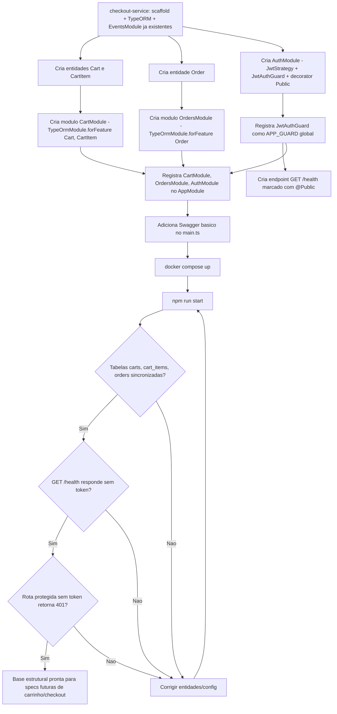

# Spec: Entidades de domínio e validação de JWT no checkout-service

## Contexto

O `checkout-service` (porta 3003) já possui scaffold NestJS, PostgreSQL 15 (porta 5436) com TypeORM configurado, e integração com RabbitMQ (`EventsModule` com `PaymentQueueService`). O serviço ainda **não possui nenhuma entidade de domínio** — o TypeORM está configurado mas não cria nenhuma tabela — e **não possui autenticação JWT**.

O `users-service` (porta 3000) já emite tokens JWT assinados com um `JWT_SECRET` compartilhado, contendo o payload `{ sub: UUID, email: string, role: "seller" | "buyer" }`. O `products-service` já implementou a validação local desse token (`AuthModule`, `JwtStrategy`, `JwtAuthGuard` global, decorator `@Public()`), sem depender de chamadas HTTP ao `users-service`. Essa mesma abordagem deve ser replicada aqui.

Esta spec cobre apenas a **estrutura de dados** (entidades `Cart`, `CartItem` e `Order`, sem nenhum endpoint que as manipule) e a **infraestrutura de autenticação** (validação de JWT, sem emissão de token). Endpoints de carrinho e checkout virão em specs futuras.

## Objetivo

Deixar o `checkout-service` com as tabelas de domínio (`carts`, `cart_items`, `orders`) sincronizadas via TypeORM e com o guard de autenticação JWT ativo globalmente, no mesmo padrão já usado no `products-service`, servindo de base estrutural para os endpoints de carrinho/checkout que serão adicionados nas próximas specs.

## Requisitos Funcionais

### RF01 — Entidade `Cart`
Deve existir a entidade `Cart` (ver Estrutura de Dados), representando o carrinho de um usuário, com relação um-para-muitos com `CartItem` carregada automaticamente junto com o carrinho e com propagação de escrita (criar/remover itens junto com o carrinho).

### RF02 — Entidade `CartItem`
Deve existir a entidade `CartItem`, representando um item dentro de um carrinho, vinculada a exatamente um `Cart`. A exclusão de um `Cart` deve excluir em cascata seus `CartItem`.

### RF03 — Entidade `Order`
Deve existir a entidade `Order`, representando um pedido gerado a partir de um carrinho, sem relacionamento TypeORM com `Cart` (apenas referência por id), já que representa um snapshot do momento da compra.

### RF04 — Módulo `CartModule`
Deve existir um módulo `cart` dentro de `src/`, registrando `Cart` e `CartItem` no `TypeOrmModule.forFeature`. Não deve conter controller nem endpoint nesta etapa — apenas a estrutura de módulo e as entidades (com um service vazio, se necessário para o módulo compilar).

### RF05 — Módulo `OrdersModule`
Deve existir um módulo `orders` dentro de `src/`, registrando `Order` no `TypeOrmModule.forFeature`. Mesma restrição do RF04: sem controller nem endpoint nesta etapa.

### RF06 — Estratégia de validação de JWT (`JwtStrategy`)
Deve existir uma estratégia Passport que:
- Extraia o token do header `Authorization: Bearer <token>` da requisição
- Valide a assinatura do token usando o mesmo `JWT_SECRET` configurado no `users-service` (via variável de ambiente, já presente em `.env.example`)
- Valide automaticamente a expiração do token, rejeitando tokens expirados
- A partir do payload validado (`sub`, `email`, `role`), disponibilize os dados do usuário autenticado em `req.user`, com os campos `id` (a partir de `sub`), `email` e `role`

### RF07 — Guard global de autenticação (`JwtAuthGuard`)
Deve existir um guard que:
- Utilize a `JwtStrategy` para validar o token em toda requisição
- Seja registrado como guard **global** da aplicação (via `APP_GUARD`), de forma que toda rota exija autenticação por padrão, sem necessidade de aplicar o guard manualmente em cada controller
- Reconheça rotas marcadas como públicas (ver RF08) e, nesse caso, permita a requisição sem exigir token

### RF08 — Decorator `@Public()`
Deve existir um decorator que permita marcar um handler ou controller inteiro como não protegido. O `JwtAuthGuard` deve respeitar essa marcação.

### RF09 — Módulo de autenticação (`AuthModule`)
Deve existir um módulo dedicado à autenticação, agrupando `JwtStrategy` e o registro global do `JwtAuthGuard`, importado no `AppModule`. Esse módulo:
- **Não** deve conter controller, endpoint, service de login/registro ou qualquer lógica de emissão de token
- Deve seguir a mesma organização de pastas usada no `products-service` (estratégia, guard e decorator em subpastas dedicadas dentro de `auth/`)

### RF10 — Health check público
Deve existir um endpoint `GET /health`, marcado com `@Public()`, retornando `{ status: "ok", service: "checkout-service" }`. Esse endpoint serve para validar que o guard global não bloqueia rotas explicitamente públicas.

### RF11 — Documentação Swagger básica
A aplicação deve expor documentação Swagger básica (título, versão e suporte a Bearer auth), seguindo o mesmo padrão já usado no `products-service` (`main.ts`).

### RF12 — Registro no `AppModule`
`CartModule`, `OrdersModule` e `AuthModule` devem estar todos importados no `AppModule`, junto com o `EventsModule` já existente (sem alterá-lo).

## Estrutura de Dados

### Entidade: Cart

| Campo | Tipo | Regras |
|---|---|---|
| `id` | UUID | Chave primária, gerado automaticamente |
| `userId` | UUID | Obrigatório — referência ao usuário no `users-service`; sem foreign key |
| `status` | enum (`active`, `completed`, `abandoned`) | Obrigatório, default `active` |
| `total` | decimal (10,2) | Obrigatório, default `0` |
| `items` | relação um-para-muitos com `CartItem` | Carregamento automático (eager) e propagação de escrita (cascade) |
| `createdAt` | timestamp | Gerado automaticamente na criação |
| `updatedAt` | timestamp | Atualizado automaticamente a cada alteração |

### Entidade: CartItem

| Campo | Tipo | Regras |
|---|---|---|
| `id` | UUID | Chave primária, gerado automaticamente |
| `cart` | relação muitos-para-um com `Cart` | Obrigatório; exclusão do `Cart` exclui o item em cascata |
| `cartId` | UUID | Coluna de referência ao carrinho (chave estrangeira da relação `cart`) |
| `productId` | UUID | Obrigatório — referência ao produto no `products-service`; sem foreign key |
| `productName` | string (255) | Obrigatório — snapshot do nome do produto no momento em que foi adicionado ao carrinho |
| `price` | decimal (10,2) | Obrigatório — snapshot do preço unitário no momento em que foi adicionado |
| `quantity` | int | Obrigatório, default `1` |
| `subtotal` | decimal (10,2) | Obrigatório — resultado de `price * quantity` |
| `createdAt` | timestamp | Gerado automaticamente na criação |

### Entidade: Order

| Campo | Tipo | Regras |
|---|---|---|
| `id` | UUID | Chave primária, gerado automaticamente |
| `userId` | UUID | Obrigatório — referência ao usuário no `users-service`; sem foreign key |
| `cartId` | UUID | Obrigatório — referência ao carrinho de origem; sem relação TypeORM, apenas o id |
| `total` | decimal (10,2) | Obrigatório |
| `status` | enum (`pending`, `paid`, `failed`, `cancelled`) | Obrigatório, default `pending` |
| `paymentMethod` | string (50) | Obrigatório |
| `createdAt` | timestamp | Gerado automaticamente na criação |
| `updatedAt` | timestamp | Atualizado automaticamente a cada alteração |

## Fora de Escopo

- Qualquer endpoint CRUD de carrinho, item de carrinho ou pedido (criar, listar, atualizar, remover) — ficam para specs futuras
- Emissão ou assinatura de tokens JWT pelo `checkout-service` (login, registro, refresh) — permanece exclusivamente no `users-service`
- `RoleGuard` ou qualquer verificação de autorização por `role`
- Migrations (usa-se `synchronize` em desenvolvimento, como nos demais serviços)
- Qualquer alteração no `EventsModule`/`PaymentQueueService` existente (RabbitMQ)
- Comunicação HTTP com `products-service` ou `users-service` para validar `productId`/`userId`
- Lógica de cálculo de `total`/`subtotal` (fica a cargo dos services que manipularão essas entidades, em specs futuras)

## Fluxo da Implementação

## Critérios de Aceite

- `npm run start` (com `docker compose up` ativo) conecta no banco `checkout_db` e sincroniza as tabelas `carts`, `cart_items` e `orders` a partir das entidades, sem alterar as tabelas geradas por outros módulos
- A tabela `carts` possui exatamente as colunas `id`, `userId`, `status`, `total`, `createdAt`, `updatedAt`
- A tabela `cart_items` possui exatamente as colunas `id`, `cartId`, `productId`, `productName`, `price`, `quantity`, `subtotal`, `createdAt`, com chave estrangeira de `cartId` para `carts.id` com exclusão em cascata
- A tabela `orders` possui exatamente as colunas `id`, `userId`, `cartId`, `total`, `status`, `paymentMethod`, `createdAt`, `updatedAt`, sem chave estrangeira para `carts`
- Carregar um `Cart` via TypeORM retorna seus `CartItem` automaticamente (eager), sem necessidade de `relations` explícito na query
- Excluir um `Cart` exclui em cascata seus `CartItem` associados
- `GET /health` responde `200` com `{ status: "ok", service: "checkout-service" }` sem exigir header `Authorization`
- Uma requisição a uma rota protegida (qualquer rota sem `@Public()`) sem header `Authorization` retorna `401 Unauthorized`
- Uma requisição a uma rota protegida com JWT inválido (assinatura incorreta) ou expirado retorna `401 Unauthorized`
- Uma requisição a uma rota protegida com um JWT válido, emitido pelo `users-service` e assinado com o `JWT_SECRET` compartilhado, é autorizada e o handler recebe `req.user` com `id`, `email` e `role`
- `CartModule`, `OrdersModule` e `AuthModule` estão importados no `AppModule`; `EventsModule` permanece funcional e sem alterações
- Nenhum endpoint CRUD de carrinho, item ou pedido é exposto nesta etapa, além do `GET /health`
- A documentação Swagger está acessível e reflete o suporte a Bearer auth

## Referências

- Padrão de referência para JWT: `products-service/src/auth` (`auth.module.ts`, `strategies/jwt.strategy.ts`, `guards/jwt-auth.guard.ts`, `decorators/public.decorator.ts`) e `products-service/docs/specs/02-validacao-jwt.md`
- Padrão de referência para estrutura de entidades/módulo: `products-service/docs/specs/01-scaffold.md`
- `checkout-service/src/events` — módulo existente de RabbitMQ, não deve ser alterado por esta spec
