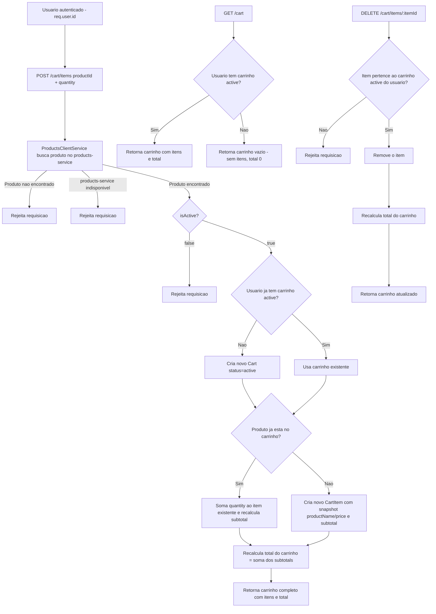

# Spec: Gerenciamento do carrinho

## Contexto

O `checkout-service` (porta 3003) já possui, desde a spec [02-entidades-e-jwt.md](./02-entidades-e-jwt.md): as entidades `Cart` e `CartItem` (sincronizadas no PostgreSQL, porta 5436), o `CartModule` (hoje registrando apenas `TypeOrmModule.forFeature`, sem controller/service de negócio), o guard JWT global (`JwtAuthGuard` + `@Public()`), com `req.user` contendo `id`, `email` e `role`, e integração com RabbitMQ (`EventsModule`, não afetada por esta spec).

O `products-service` (porta 3001) expõe publicamente `GET /products/:id`, retornando `id`, `name`, `price`, `stock`, `isActive` e `sellerId` do produto. O `checkout-service` já tem `PRODUCTS_SERVICE_URL` disponível em `.env`/`.env.example` e a dependência `@nestjs/axios` já instalada, mas ainda não há nenhuma comunicação HTTP entre os dois serviços.

Esta spec cobre a primeira operação de negócio do `checkout-service`: permitir que um usuário autenticado (seller ou buyer) monte seu carrinho de compras, validando os produtos contra o `products-service` no momento da adição. Checkout/finalização do pedido e alteração de quantidade de um item já existente ficam fora de escopo (ver "Fora de Escopo").

## Objetivo

Permitir que um usuário autenticado adicione produtos ao seu carrinho, consulte o carrinho atual com o total calculado, e remova itens — com o carrinho sempre refletindo dados de produto validados em tempo real contra o `products-service`.

## Requisitos Funcionais

### RF01 — `ProductsClientService`: comunicação com o `products-service`
Deve existir um serviço responsável por buscar dados de um produto no `products-service`, a partir do seu `id`, usando o endpoint público `GET /products/:id`. A URL base do `products-service` deve vir da variável de ambiente `PRODUCTS_SERVICE_URL`, sem valor fixo no código. O serviço deve tratar o caso em que o produto não é encontrado (produto inexistente) e o caso em que o `products-service` está indisponível ou retorna erro, de forma que o chamador (o fluxo de adicionar item ao carrinho) consiga distinguir "produto não existe" de "serviço indisponível" e responder adequadamente.

### RF02 — `POST /cart/items`: adicionar item ao carrinho (rota protegida)
Permite ao usuário autenticado adicionar um produto ao seu carrinho ativo.

Entrada:
- `productId` (UUID, obrigatório)
- `quantity` (inteiro, obrigatório, mínimo 1)

Comportamento:
- Busca o produto no `products-service` (via RF01) a partir do `productId` informado.
- Se o produto não existir no `products-service`, a requisição é rejeitada.
- Se o produto existir mas estiver com `isActive: false`, a requisição é rejeitada — apenas produtos ativos podem ser adicionados ao carrinho.
- Se o usuário autenticado ainda não tiver um carrinho com status `active`, um novo carrinho é criado automaticamente para ele nesse momento.
- Se o produto informado já estiver presente como item no carrinho ativo do usuário, a quantidade do item existente é somada à nova quantidade informada, e o `subtotal` desse item é recalculado — não é criado um item duplicado para o mesmo produto.
- Se o produto ainda não estiver no carrinho, um novo item é criado, salvando como snapshot o `productName` e o `price` retornados pelo `products-service` no momento da adição (alterações futuras de preço/nome no `products-service` não afetam itens já adicionados).
- O `subtotal` de um item é sempre `price snapshot × quantity`.
- Após a adição/atualização do item, o `total` do carrinho é recalculado como a soma dos `subtotal` de todos os itens do carrinho.
- Retorna o carrinho completo atualizado (dados do carrinho, todos os itens e o `total`).

### RF03 — `GET /cart`: consultar carrinho do usuário (rota protegida)
Retorna o carrinho ativo (status `active`) do usuário autenticado, com todos os seus itens e o `total`.

Se o usuário autenticado não possui nenhum carrinho com status `active`, retorna uma representação de carrinho vazio (sem itens e com `total` zero), sem criar um registro de carrinho no banco.

### RF04 — `DELETE /cart/items/:itemId`: remover item do carrinho (rota protegida)
Remove um item específico do carrinho ativo do usuário autenticado, identificado por `itemId`.

Comportamento:
- Se o `itemId` não existir, ou não pertencer a um item do carrinho ativo do usuário autenticado, a requisição é rejeitada — um usuário não pode remover item de um carrinho que não é seu.
- Após a remoção, o `total` do carrinho é recalculado como a soma dos `subtotal` dos itens restantes.
- Retorna o carrinho atualizado (dados do carrinho, itens restantes e o novo `total`).

## Regras de Negócio

- Cada usuário possui no máximo um carrinho com status `active` por vez; o carrinho é criado sob demanda, na primeira adição de item.
- O `productName` e o `price` de um item são um snapshot capturado no momento em que o item é adicionado ao carrinho — não são atualizados depois, mesmo que o produto mude no `products-service`.
- O `total` do carrinho é sempre igual à soma dos `subtotal` de todos os seus itens; nunca é definido manualmente.
- Um usuário só pode visualizar e manipular (adicionar/remover itens de) o seu próprio carrinho — a identidade do usuário vem exclusivamente de `req.user.id` (JWT), nunca de um parâmetro da requisição.
- Tanto usuários com role `seller` quanto `buyer` podem ter carrinho e usar esses endpoints, sem distinção de comportamento por role.

## Fora de Escopo

- Checkout/finalização do carrinho (criação de `Order`, mudança de status do carrinho para `completed`) — spec futura.
- Alteração de quantidade de um item já existente no carrinho (ex.: `PATCH /cart/items/:itemId`) — para reduzir/aumentar quantidade nesta etapa, o item deve ser removido e adicionado novamente.
- Validação de `stock` do produto ao adicionar ao carrinho (a validação nesta etapa se limita a existência e `isActive`).
- Expiração/abandono automático de carrinhos (status `abandoned`).
- Qualquer alteração no `EventsModule`/`PaymentQueueService` (RabbitMQ) existente.
- Cache ou retry de chamadas ao `products-service`.

## Fluxo da Implementação

## Critérios de Aceite

- `POST /cart/items` sem header `Authorization` retorna `401 Unauthorized`.
- `POST /cart/items` com `productId` que não existe no `products-service` rejeita a requisição (não cria item nem carrinho).
- `POST /cart/items` com `productId` de um produto com `isActive: false` rejeita a requisição.
- `POST /cart/items` com `quantity` menor que 1, ausente, ou não inteiro rejeita a requisição por validação de entrada.
- `POST /cart/items` com produto válido e usuário sem carrinho ativo cria um novo `Cart` (`status: active`) e um novo `CartItem`, com `productName`/`price` iguais aos retornados pelo `products-service` no momento da chamada, e `subtotal = price × quantity`.
- `POST /cart/items` chamado duas vezes para o mesmo `productId` no mesmo carrinho resulta em um único `CartItem` para aquele produto, com `quantity` somada e `subtotal` recalculado — não em dois itens.
- Após qualquer `POST /cart/items` bem-sucedido, o `total` retornado é igual à soma dos `subtotal` de todos os itens do carrinho.
- `GET /cart` sem header `Authorization` retorna `401 Unauthorized`.
- `GET /cart` para um usuário sem carrinho `active` retorna carrinho vazio (sem itens, `total` 0), sem criar registro no banco.
- `GET /cart` para um usuário com carrinho `active` retorna os itens e o `total` correspondentes ao estado atual do carrinho.
- `GET /cart` de um usuário nunca retorna o carrinho de outro usuário.
- `DELETE /cart/items/:itemId` sem header `Authorization` retorna `401 Unauthorized`.
- `DELETE /cart/items/:itemId` com um `itemId` que não existe, ou que pertence ao carrinho de outro usuário, rejeita a requisição e não altera nenhum carrinho.
- `DELETE /cart/items/:itemId` válido remove o item e retorna o carrinho atualizado com o `total` recalculado a partir dos itens restantes.
- Um usuário com role `seller` e um usuário com role `buyer` conseguem usar `POST /cart/items`, `GET /cart` e `DELETE /cart/items/:itemId` sem diferença de comportamento.

## Referências

- Spec anterior: [02-entidades-e-jwt.md](./02-entidades-e-jwt.md) — entidades `Cart`/`CartItem`, `AuthModule`, `JwtAuthGuard`, `@Public()`.
- `products-service`: endpoint público `GET /products/:id` — payload de referência: `id`, `name`, `price`, `stock`, `isActive`, `sellerId`.
- `checkout-service/.env.example` — variável `PRODUCTS_SERVICE_URL`.
