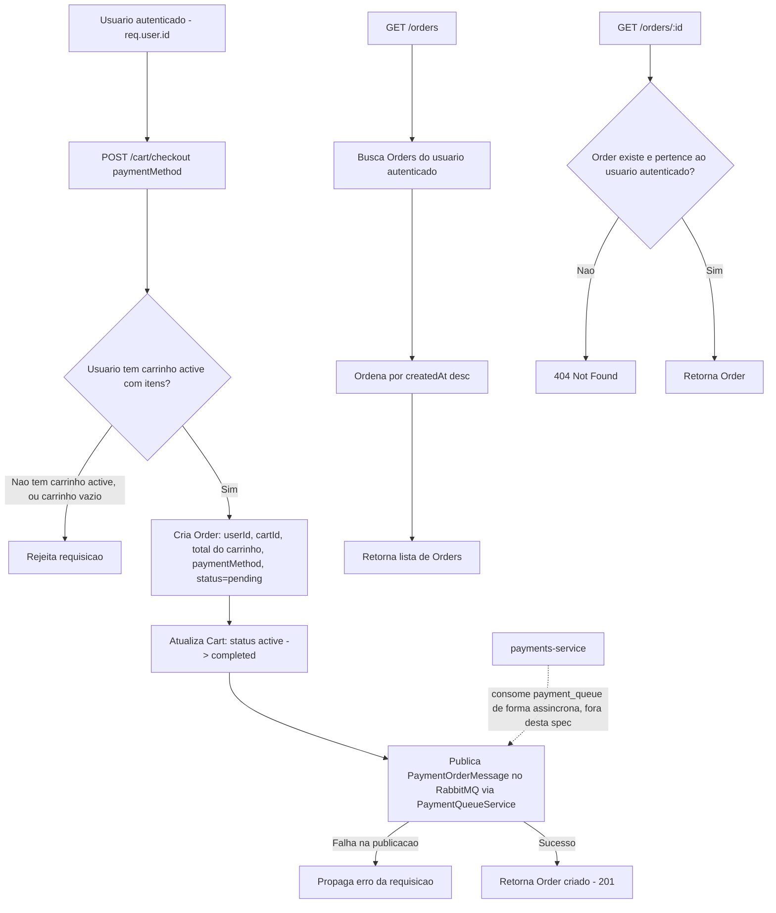

# Spec: Finalização do pedido (checkout)

## Contexto

O `checkout-service` (porta 3003) já possui, desde as specs [02-entidades-e-jwt.md](./02-entidades-e-jwt.md) e [03-gerenciamento-carrinho.md](./03-gerenciamento-carrinho.md): as entidades `Cart`, `CartItem` e `Order` (esta última ainda sem uso), o guard JWT global (`JwtAuthGuard` + `@Public()`, com `req.user` contendo `id`, `email` e `role`), o `CartModule` com `POST /cart/items`, `GET /cart` e `DELETE /cart/items/:itemId` funcionais, e o `EventsModule` com `RabbitmqService` e `PaymentQueueService.publishPaymentOrder()`, que publica no exchange `payments` com routing key `payment.order`.

A interface `PaymentOrderMessage` (já existente em `src/events/payment-queue.interface.ts`) espera: `orderId`, `userId`, `amount`, `items` (lista de `productId`, `quantity`, `price`), `paymentMethod`, e opcionalmente `description` e `createdAt`. O `payments-service` consome essas mensagens da queue `payment_queue` e processa o pagamento de forma assíncrona — o `checkout-service` não aguarda nem conhece o resultado desse processamento.

Esta spec cobre a finalização do carrinho como pedido (`Order`) e a consulta de pedidos já criados. A criação do `Order` e a publicação da mensagem no RabbitMQ acontecem de forma síncrona dentro do próprio request de checkout; o processamento do pagamento em si é responsabilidade exclusiva do `payments-service` e ocorre depois, de forma assíncrona.

## Objetivo

Permitir que um usuário autenticado finalize seu carrinho ativo, transformando-o em um `Order` com status `pending` e disparando a solicitação de pagamento via RabbitMQ, e permitir que ele consulte os pedidos já realizados.

## Requisitos Funcionais

### RF01 — `POST /cart/checkout`: finalizar carrinho (rota protegida)

Permite ao usuário autenticado finalizar seu carrinho ativo, criando um pedido a partir dele.

Entrada:
- `paymentMethod` (obrigatório, um dos valores: `credit_card`, `debit_card`, `pix`, `boleto`)

Comportamento:
- Busca o carrinho com status `active` do usuário autenticado.
- Se o usuário não possui carrinho `active`, ou o carrinho `active` não possui nenhum item, a requisição é rejeitada — não é possível finalizar um carrinho vazio ou inexistente.
- Cria um novo `Order` a partir do carrinho, com: `userId` do usuário autenticado, `cartId` do carrinho finalizado, `total` igual ao `total` atual do carrinho, `paymentMethod` informado na entrada, e `status` inicial `pending`.
- Altera o status do carrinho de `active` para `completed`, para que ele deixe de ser considerado o carrinho ativo do usuário (permitindo que um novo carrinho `active` seja criado em um checkout futuro).
- Publica uma mensagem `PaymentOrderMessage` no RabbitMQ (via `PaymentQueueService.publishPaymentOrder`), contendo o `orderId` do pedido recém-criado, o `userId`, o `amount` (total do pedido), os `items` do carrinho (cada um com `productId`, `quantity` e `price`) e o `paymentMethod` informado.
- Se a publicação da mensagem no RabbitMQ falhar, o pedido já criado e a alteração de status do carrinho não devem ficar em um estado que impeça a identificação do problema — a falha deve ser propagada como erro da requisição.
- Retorna o `Order` criado, com status HTTP `201 Created`.

### RF02 — `GET /orders`: listar pedidos do usuário (rota protegida)

Retorna todos os pedidos (`Order`) pertencentes ao usuário autenticado, independentemente do `status`.

Comportamento:
- A lista é ordenada por data de criação (`createdAt`), do mais recente para o mais antigo.
- Um usuário nunca recebe pedidos de outro usuário — o filtro é sempre por `req.user.id`.
- Se o usuário não possui nenhum pedido, retorna uma lista vazia.

### RF03 — `GET /orders/:id`: detalhe de um pedido (rota protegida)

Retorna os dados completos de um pedido específico do usuário autenticado.

Comportamento:
- Se o `id` informado não corresponde a nenhum pedido existente, ou corresponde a um pedido de outro usuário, a requisição é rejeitada com `404 Not Found` — a existência de um pedido de outro usuário não deve ser revelada ao solicitante.

## Regras de Negócio

- Um `Order` é sempre criado a partir de um carrinho `active` não vazio; não existe criação de pedido sem carrinho correspondente.
- Ao ser finalizado, o carrinho muda de `active` para `completed` e nunca mais volta a ser o carrinho ativo do usuário — um checkout subsequente exige um novo carrinho (criado via `POST /cart/items`, fora do escopo desta spec).
- O `total` do `Order` é uma cópia do `total` do carrinho no momento do checkout; alterações futuras no carrinho (que já estará `completed`) não afetam o pedido.
- O `status` de um `Order` só é definido como `pending` nesta spec; qualquer transição posterior (`paid`, `failed`, `cancelled`) é de responsabilidade do `payments-service` e está fora do escopo deste documento.
- Um usuário só pode visualizar seus próprios pedidos — a identidade do usuário vem exclusivamente de `req.user.id` (JWT), nunca de um parâmetro da requisição.
- Todas as funções, variáveis e parâmetros envolvidos nesta implementação (DTOs, serviços, controllers, respostas) devem ser explicitamente tipados — sem uso de `any` implícito ou inferência não intencional.

## Fora de Escopo

- Processamento de pagamento em si (cobrança, integração com gateway, confirmação) — responsabilidade exclusiva do `payments-service`.
- Atualização do `status` do `Order` após sua criação (ex.: `paid`, `failed`) — inclusive qualquer consumo de mensagens vindas do `payments-service` de volta ao `checkout-service`.
- Cancelamento de pedido (ex.: `DELETE /orders/:id` ou mudança para `status: cancelled`).
- Verificação de estoque dos produtos no momento do checkout.
- Qualquer alteração na interface `PaymentOrderMessage`, no `PaymentQueueService` ou no `RabbitmqService` existentes.
- Paginação ou filtros (por `status`, data, etc.) em `GET /orders`.

## Módulo

O `OrdersModule` passa a registrar o `OrdersController` e o `OrdersService` (além do `TypeOrmModule.forFeature([Order])` já existente), importando o `CartModule` (para acesso ao carrinho ativo do usuário) e o `EventsModule` (para acesso ao `PaymentQueueService`).

## Fluxo da Implementação

## Critérios de Aceite

- `POST /cart/checkout` sem header `Authorization` retorna `401 Unauthorized`.
- `POST /cart/checkout` com `paymentMethod` ausente ou fora dos valores aceitos (`credit_card`, `debit_card`, `pix`, `boleto`) rejeita a requisição por validação de entrada.
- `POST /cart/checkout` para um usuário sem carrinho `active` rejeita a requisição e não cria `Order`.
- `POST /cart/checkout` para um usuário com carrinho `active` mas sem itens rejeita a requisição e não cria `Order`.
- `POST /cart/checkout` bem-sucedido cria um `Order` com `userId` do usuário autenticado, `cartId` do carrinho finalizado, `total` igual ao total do carrinho, `paymentMethod` informado e `status` `pending`.
- `POST /cart/checkout` bem-sucedido altera o status do carrinho utilizado de `active` para `completed`.
- `POST /cart/checkout` bem-sucedido invoca `PaymentQueueService.publishPaymentOrder` com uma mensagem contendo o `orderId` do pedido criado, `userId`, `amount` igual ao total do pedido, `items` correspondentes aos itens do carrinho e o `paymentMethod` informado.
- `POST /cart/checkout` bem-sucedido retorna `201 Created` com os dados do `Order` criado.
- Após um `POST /cart/checkout` bem-sucedido, um novo `POST /cart/items` para o mesmo usuário cria um novo carrinho `active`, distinto do carrinho já `completed`.
- `GET /orders` sem header `Authorization` retorna `401 Unauthorized`.
- `GET /orders` retorna apenas os pedidos do usuário autenticado, ordenados do mais recente para o mais antigo.
- `GET /orders` para um usuário sem pedidos retorna lista vazia.
- `GET /orders/:id` sem header `Authorization` retorna `401 Unauthorized`.
- `GET /orders/:id` com `id` inexistente retorna `404 Not Found`.
- `GET /orders/:id` com `id` de um pedido de outro usuário retorna `404 Not Found`.
- `GET /orders/:id` com `id` de um pedido do próprio usuário retorna os dados completos do pedido.

## Referências

- Spec anterior: [03-gerenciamento-carrinho.md](./03-gerenciamento-carrinho.md) — `CartModule`, `Cart`/`CartItem`, regras de carrinho ativo.
- Spec anterior: [02-entidades-e-jwt.md](./02-entidades-e-jwt.md) — entidade `Order`, `AuthModule`, `JwtAuthGuard`, `@Public()`.
- `src/events/payment-queue.interface.ts` — contrato `PaymentOrderMessage`.
- `src/events/payment-queue/payment-queue.service.ts` — `PaymentQueueService.publishPaymentOrder`, exchange `payments`, routing key `payment.order`.
- `payments-service` — consumidor da queue `payment_queue`, responsável pelo processamento assíncrono do pagamento.
