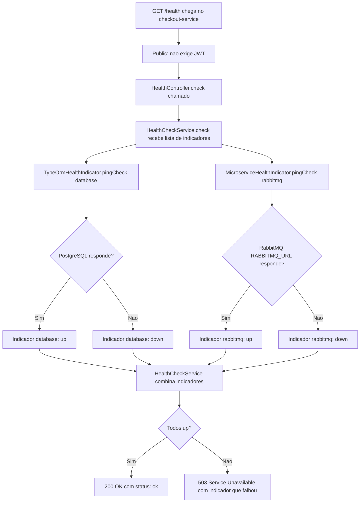

# Spec: Health Check com @nestjs/terminus (PostgreSQL + RabbitMQ)

## Contexto

O `checkout-service` expõe hoje `GET /health` diretamente em `src/app.controller.ts` (`@Public() @Get('health') health() { return { status: 'ok', service: 'checkout-service' } }`), sem checagem real de nenhuma dependência. Existe também uma pasta `src/health/` vazia (nenhum controller declarado nela ainda).

O serviço depende de duas peças de infraestrutura que hoje não são verificadas:
- **PostgreSQL** (`checkout-service-db`, ver `src/config/database.config.ts`), via TypeORM.
- **RabbitMQ** (container `marketplace-rabbitmq`, ver `messaging-service/docker-compose.yml`), acessado via `amqplib` bruto (não `@nestjs/microservices`) em `src/events/rabbitmq/rabbitmq.service.ts` (`RabbitmqService`), configurado pela variável `RABBITMQ_URL` (ver `.env.example`). É essa conexão que `OrdersService` usa para publicar pedidos na fila `payment.order` (ver `docs/specs/04-finalizacao-do-pedido.md`).

Se o RabbitMQ cair, hoje nada no `/health` do `checkout-service` indica isso — o pedido é salvo no banco, mas a publicação na fila falha silenciosamente do ponto de vista do health check.

## Objetivo

Fazer `GET /health` no `checkout-service` verificar PostgreSQL e RabbitMQ, retornando `503 Service Unavailable` (com o indicador que falhou) se qualquer um dos dois estiver inacessível, e `200 OK` quando ambos estiverem saudáveis.

## Requisitos Funcionais

### RF01 — Dependência `@nestjs/terminus`
Adicionar `@nestjs/terminus` como dependência do `checkout-service`.

### RF02 — `HealthModule`
Criar `src/health/health.module.ts` e `src/health/health.controller.ts` dentro da pasta `src/health/` já existente:
- `HealthModule` importa `TerminusModule` (de `@nestjs/terminus`) e declara `HealthController`.
- `HealthModule` é importado em `src/app.module.ts`.

### RF03 — `HealthController`
- Injeta `HealthCheckService`, `TypeOrmHealthIndicator` e `MicroserviceHealthIndicator` (todos de `@nestjs/terminus`).
- Expõe `GET /health`, decorado com `@HealthCheck()` e `@Public()`.
- Delega a checagem a `HealthCheckService.check([...])` com dois indicadores:
  - `TypeOrmHealthIndicator.pingCheck('database', ...)` — conexão TypeORM já configurada no serviço.
  - `MicroserviceHealthIndicator.pingCheck('rabbitmq', ...)` — transporte `Transport.RMQ`, usando a mesma `RABBITMQ_URL` já configurada (ver `RabbitmqService`), sem reutilizar a fila/exchange de negócio (`payment.order`) — a checagem deve abrir sua própria conexão de ping, independente da conexão de publicação usada pelo `RabbitmqService`.

### RF04 — Formato de resposta padrão do Terminus
Não customizar o corpo da resposta — usar o formato padrão do `@nestjs/terminus` (`status`, `info`, `error`, `details`), com um indicador (`database` ou `rabbitmq`) por dependência.

### RF05 — Remoção do endpoint estático do `AppController`
Remover o método `health()` e o `@Get('health')` de `src/app.controller.ts` — a rota `/health` passa a ser servida exclusivamente pelo novo `HealthController`.

## Regras de Negócio

- RN01 — `/health` continua acessível sem `Authorization` header (`@Public()`), mesmo com o `JwtAuthGuard` global ativo.
- RN02 — Uma falha em **qualquer um** dos dois indicadores (`database` ou `rabbitmq`) faz `/health` responder `503` — o serviço só é considerado saudável com as duas dependências no ar.
- RN03 — A checagem do RabbitMQ é independente da conexão de publicação usada por `RabbitmqService` (RF03) — uma falha temporária no ping de health check não deve derrubar a conexão usada para publicar pedidos, e vice-versa.

## Fora de Escopo

- Readiness/liveness probes — conceito de Kubernetes, fora do escopo deste projeto.
- Alterações em `/metrics` ou no `MetricsModule` existente (`docs/specs/05-metricas-http-prometheus.md`).
- Alterações em `RabbitmqService`, na fila `payment.order` ou em qualquer lógica de publicação de pedidos.
- Alertas no Prometheus/Grafana sobre este serviço — cobertos pela spec `observability-stack/docs/specs/02-alerting-rules-prometheus.md`.

## Fluxo da Implementação

## Critérios de Aceite

- Com PostgreSQL e RabbitMQ no ar, `curl -i http://localhost:3003/health` (sem `Authorization`) retorna `200 OK`, com `"database":{"status":"up"}` e `"rabbitmq":{"status":"up"}`.
- Com o container `checkout-service-db` parado, `curl -i http://localhost:3003/health` retorna `503`, com `"database":{"status":"down"}`.
- Com o container `marketplace-rabbitmq` parado, `curl -i http://localhost:3003/health` retorna `503`, com `"rabbitmq":{"status":"down"}`.
- Com RabbitMQ fora do ar, um `POST` de checkout ainda consegue salvar o pedido no banco (nenhuma regressão em `docs/specs/04-finalizacao-do-pedido.md`), mesmo com `/health` reportando `503`.
- `src/app.controller.ts` não possui mais a rota `GET /health`.

## Referências

- `users-service/docs/specs/08-health-check-terminus.md` — mesmo padrão de `HealthController` baseado em Terminus.
- `docs/specs/04-finalizacao-do-pedido.md` — publicação de pedidos na fila `payment.order` via `RabbitmqService`.
- `src/events/rabbitmq/rabbitmq.service.ts` — conexão `amqplib` existente e variável `RABBITMQ_URL`.
- `messaging-service/docker-compose.yml` — container `marketplace-rabbitmq` compartilhado entre `checkout-service` e `payments-service`.
- Documentação oficial: [@nestjs/terminus — Microservice health check](https://docs.nestjs.com/recipes/terminus#microservice-health-check).
