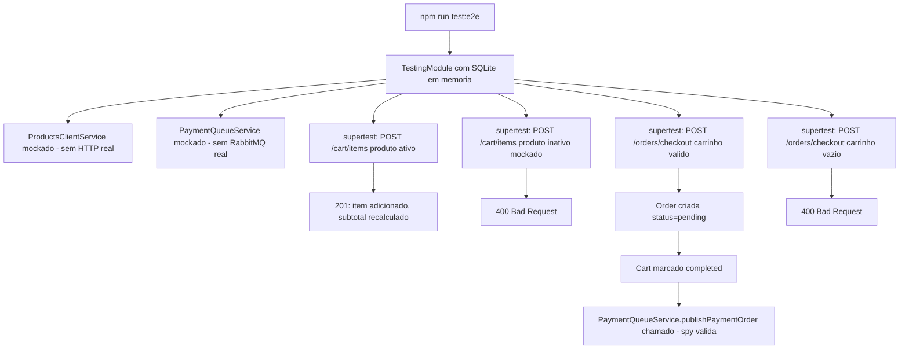

# Spec: Testes Automatizados (Unitários e de Integração)

## Contexto

O `checkout-service` já tem boa cobertura unitária: `app.controller`, os 3 arquivos de `metrics/`, `health/health.controller`, `cart/cart.service`, `orders/orders.service`, `cart/products-client.service`, `events/rabbitmq/rabbitmq.service`, `auth/guards/jwt-auth.guard` e `auth/strategies/jwt.strategy`. E e2e para `app`, `orders`, `metrics`, `health`, `auth` e `cart`. Faltam:

- Testes unitários de `cart/cart.controller.ts` e `orders/orders.controller.ts` (hoje só os services são testados).
- Os e2e dependem de PostgreSQL real e, indiretamente, de duas integrações externas que hoje não são isoladas de forma explícita nos testes: `ProductsClientService` (chamada HTTP a `products-service`) e `RabbitmqService`/`PaymentQueueService` (publicação em fila via `amqplib`).

Este serviço tem a lógica de negócio mais complexa dos quatro serviços com banco: `CartService.addItem` valida produto ativo via HTTP e mescla quantidades; `OrdersService.checkout` orquestra validação de carrinho, criação de pedido, conclusão do carrinho e publicação de evento de pagamento.

## Objetivo

Fechar as lacunas de teste de controller, migrar os e2e para SQLite em memória, e garantir que nenhum teste (unitário ou e2e) dependa de `products-service` ou RabbitMQ reais — ambos mockados.

## Requisitos Funcionais

### RF01 — Banco SQLite em memória exclusivo para testes
Adicionar `better-sqlite3` como devDependency e um `TypeOrmModule` de teste (SQLite em memória, `synchronize: true`) usado somente pelos `*.e2e-spec.ts`, sem alterar `src/config/database.config.ts` nem o `docker-compose.yaml`.

### RF02 — Teste unitário de `CartController` e `OrdersController`
Criar `src/cart/cart.controller.spec.ts` e `src/orders/orders.controller.spec.ts`, mockando os respectivos services.

### RF03 — Mock de `ProductsClientService` nos e2e de carrinho
`test/cart.e2e-spec.ts` mocka `ProductsClientService` (sem chamada HTTP real a `products-service`), cobrindo: adicionar item de produto ativo (mescla quantidade se já existe no carrinho), rejeitar item de produto inativo (`400`), rejeitar produto inexistente (`404` vindo do client mockado).

### RF04 — Mock de `RabbitmqService`/`PaymentQueueService` nos e2e de pedido
`test/orders.e2e-spec.ts` mocka `PaymentQueueService`/`RabbitmqService` (sem publicação real em fila), cobrindo: checkout de carrinho não vazio cria `Order` com `status=pending`, marca o carrinho como `completed` e chama a publicação do evento de pagamento (verificado via spy); checkout de carrinho vazio ou inexistente retorna `400`.

## Regras de Negócio

- RN01 — Nenhum teste depende de PostgreSQL, RabbitMQ ou `products-service` reais em execução.
- RN02 — `ProductsClientService` é substituído por mock/stub (`jest.fn()`) tanto nos testes unitários de `CartService` quanto nos e2e.
- RN03 — `RabbitmqService`/`PaymentQueueService` são substituídos por mock/stub tanto nos testes unitários de `OrdersService` quanto nos e2e — nenhuma conexão `amqplib` real é aberta durante os testes.

## Fluxo da Implementação

## Critérios de Aceite

- `npm test`, `npm run test:e2e` e `npm run test:cov` passam sem PostgreSQL, RabbitMQ ou `products-service` real em execução.
- `cart.controller.spec.ts` e `orders.controller.spec.ts` existem e cobrem os endpoints existentes.
- `cart.e2e-spec.ts` cobre os cenários do RF03 (produto ativo, inativo, inexistente).
- `orders.e2e-spec.ts` cobre os cenários do RF04 (checkout válido com publicação do evento, carrinho vazio/inexistente).

## Fora de Escopo

- Alteração de código de produção.
- Migração real de PostgreSQL para SQLite em dev/produção.
- Testes de carga/performance.
- Testes e2e cross-service (que dependam de `products-service` ou `payments-service` reais rodando).

## Referências

- `src/cart/cart.service.ts`, `src/cart/products-client.service.ts`, `src/orders/orders.service.ts` — regras de negócio a cobrir.
- `src/events/rabbitmq/rabbitmq.service.ts`, `src/events/payment-queue/payment-queue.service.ts` — integrações a mockar.
- `docs/specs/03-gerenciamento-carrinho.md`, `docs/specs/04-finalizacao-do-pedido.md` — especificação original das regras testadas aqui.
