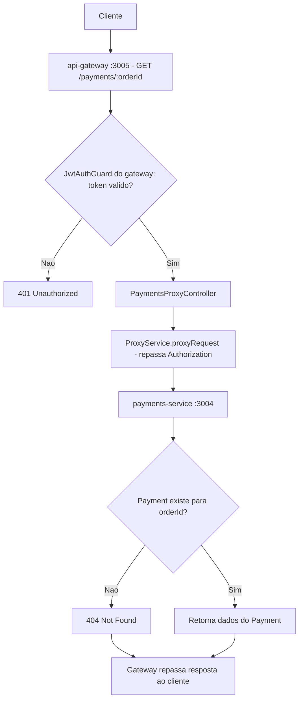
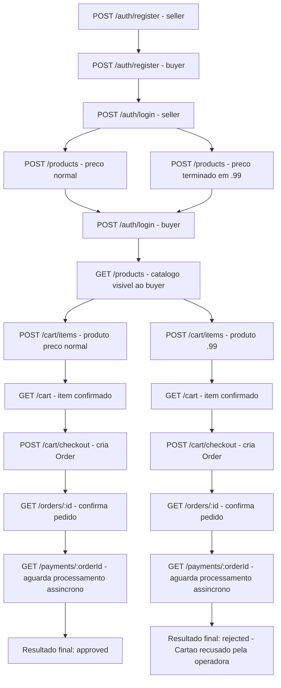

# Spec: Integração do Payments Service ao API Gateway e Teste E2E Completo do Marketplace

## Contexto

O `payments-service` (porta 3004) já possui, desde `payments-service/docs/specs/01-processamento-pagamento.md`: a entidade `Payment`, o `FakePaymentGatewayService` (aprovação/rejeição determinística por valor), o `PaymentConsumerService` funcional (consome `payment_queue`, processa e persiste o resultado), o endpoint `GET /payments/:orderId` (retorna os dados do pagamento ou `404 Not Found`) e o endpoint `GET /health`. Não há autenticação/autorização nos endpoints deste serviço.

O `api-gateway` (porta 3005) já possui a infraestrutura genérica de proxy (`ProxyService`, com circuit breaker, retry, timeout e fallback), o `JwtAuthGuard` local, e o padrão de controller-proxy replicado três vezes — `UsersController`, `ProductsController` e o par `CartProxyController`/`OrdersProxyController` (`api-gateway/docs/specs/02-integracao-checkout-service.md`). `serviceConfig.payments` (`api-gateway/src/config/gateway.config.ts`) já aponta para `http://localhost:3004` via `PAYMENTS_SERVICE_URL`, mas nenhum controller do gateway expõe hoje rotas `/payments/*` — o `payments-service` só é alcançável diretamente pela porta 3004.

Com essa última integração, todos os serviços do marketplace — `users` (3000), `products` (3001), `checkout` (3003) e `payments` (3004) — passam a ser alcançáveis inteiramente através do `api-gateway` (3005), fechando o fluxo de ponta a ponta: cadastro/login, catálogo de produtos, carrinho, checkout e consulta do resultado do pagamento.

## Objetivo

Expor no `api-gateway`, por meio de um novo controller de proxy, o endpoint já existente de consulta de pagamento do `payments-service`, seguindo o mesmo padrão já usado para `users`, `products` e `checkout`; e validar, com um teste e2e, o fluxo de compra completo do marketplace executado inteiramente através do gateway — do cadastro dos usuários até a consulta do resultado (aprovado ou rejeitado) do pagamento.

## Requisitos Funcionais

### RF01 — `PaymentsModule` no gateway

Deve existir um módulo `PaymentsModule` no `api-gateway`, importando o `ProxyModule` (mesmo padrão de `UsersModule`/`ProductsModule`/`CheckoutModule`), que registra um `PaymentsProxyController`. O `PaymentsModule` deve ser registrado no `AppModule` do gateway.

### RF02 — `GET /payments/:orderId` exposto pelo gateway (`PaymentsProxyController`)

Deve existir, no `api-gateway`, um controller de pagamentos, protegido por `JwtAuthGuard`, que expõe a consulta de pagamento por pedido já existente no `payments-service`, repassando a requisição via `ProxyService`:

- `GET /payments/:orderId` — consulta o resultado do pagamento associado ao pedido informado.

### RF03 — Repasse do header Authorization

Toda requisição encaminhada pelo `PaymentsProxyController` ao `payments-service` deve repassar, sem modificação, o header `Authorization` recebido pelo gateway, no mesmo padrão já usado pelos demais controllers de proxy — ainda que o `payments-service` não valide esse header hoje (RN01).

### RF04 — Uso da infraestrutura de proxy existente

O encaminhamento da rota definida em RF02 deve ser feito através do `ProxyService` já existente no gateway (circuit breaker, retry, timeout, fallback), sem chamadas HTTP diretas e paralelas a essa infraestrutura, e sem nenhuma alteração no mecanismo de proxy em si.

### RF05 — Configuração do endereço do payments-service

`PAYMENTS_SERVICE_URL` e `serviceConfig.payments` já existentes (`http://localhost:3004`) continuam sendo a única fonte da URL do `payments-service` — nenhuma URL deve ser hardcoded no novo controller.

### RF06 — Teste e2e do fluxo de compra completo via gateway

Deve existir, no `api-gateway`, um teste e2e que executa o fluxo de compra completo do marketplace, do início ao fim, chamando exclusivamente a porta do gateway (3005), cobrindo os dois desfechos possíveis de pagamento:

1. Registro de um usuário `seller` e de um usuário `buyer` (`POST /auth/register`).
2. Login como `seller` (`POST /auth/login`), obtendo o token JWT.
3. Criação de dois produtos pelo `seller` autenticado (`POST /products`): um com preço que resulte em pagamento aprovado (não terminado em `.99` e não superior a `10000`), e outro com preço terminado em `.99` (resulta em pagamento rejeitado).
4. Login como `buyer` (`POST /auth/login`), obtendo o token JWT.
5. Consulta do catálogo de produtos pelo `buyer` (`GET /products`), confirmando que os dois produtos criados estão visíveis.
6. Adição do produto de preço "normal" ao carrinho do `buyer` (`POST /cart/items`) e consulta do carrinho (`GET /cart`), confirmando o item adicionado.
7. Finalização do checkout (`POST /cart/checkout`), obtendo o pedido criado.
8. Consulta do pedido criado (`GET /orders/:id`), confirmando seus dados.
9. Consulta do pagamento do pedido (`GET /payments/:orderId`), aguardando o processamento assíncrono do pagamento, até obter o resultado final `approved`.
10. Repetição dos passos 6 a 9 para o produto de preço terminado em `.99` (novo item de carrinho, novo checkout, nova consulta de pedido e de pagamento), até obter o resultado final `rejected`, com o motivo de rejeição correspondente.

## Regras de Negócio

- RN01 — O `payments-service` não possui autenticação própria (confirmado em `payments-service/docs/specs/01-processamento-pagamento.md`, seção "Fora de Escopo"); a proteção de `GET /payments/:orderId` no passo do gateway é feita exclusivamente pelo `JwtAuthGuard` do próprio gateway, que apenas exige um token JWT válido de qualquer usuário autenticado — não verifica se o solicitante é o dono do pedido consultado.
- RN02 — O processamento do pagamento é assíncrono (mensagem publicada no `payment_queue` durante o checkout e consumida pelo `payment-consumer`); a consulta em `GET /payments/:orderId` pode inicialmente não encontrar um `Payment` (`404 Not Found`, enquanto o status é `pending` ou a mensagem ainda não foi processada) antes de retornar o resultado final (`approved`/`rejected`) — o teste e2e deve considerar essa janela assíncrona ao aguardar o resultado.
- RN03 — Cada pedido tem no máximo um pagamento com resultado final, já garantido pela idempotência do `payments-service` — esta spec não introduz nenhuma regra nova de negócio sobre pagamentos, apenas expõe a consulta já existente.

## Fora de Escopo

- Qualquer alteração no `payments-service` (controllers, services, entidade, regras do gateway simulado) além do já definido em `payments-service/docs/specs/01-processamento-pagamento.md`.
- Qualquer alteração no `checkout-service` além do já existente — nenhuma limpeza é necessária, o `AppController` já expõe apenas `GET /` e `GET /health`.
- Webhook ou qualquer notificação de volta ao `checkout-service` sobre o resultado do pagamento, e qualquer atualização do `status` do `Order` a partir desse resultado.
- Verificação de que o solicitante de `GET /payments/:orderId` é o dono do pedido consultado, tanto no `payments-service` quanto no `api-gateway`.
- Qualquer alteração no mecanismo de proxy do gateway (circuit breaker, retry, timeout, fallback) — apenas seu uso para a rota `/payments/:orderId`.
- Novos endpoints em `payments-service` além do `GET /payments/:orderId` já existente (ex.: listagem de pagamentos, reprocessamento via gateway).
- Testes de carga, concorrência ou de resiliência (ex.: queda proposital do RabbitMQ ou de um serviço durante o fluxo).

## Módulo

Novo `PaymentsModule` no `api-gateway`, registrando `PaymentsProxyController`, importando o `ProxyModule` já existente. O `PaymentsModule` é registrado no `AppModule` do gateway, no mesmo ponto onde `UsersModule`, `ProductsModule` e `CheckoutModule` já estão registrados.

## Fluxo Esperado

1. Um cliente autenticado (token JWT obtido via `POST /auth/login`, já integrado ao gateway) faz uma requisição `GET /payments/:orderId` na porta do gateway (3005).
2. O `JwtAuthGuard` do gateway valida o token presente no header `Authorization`; se inválido ou ausente, a requisição é rejeitada antes de chegar ao `payments-service`.
3. Com a requisição autorizada, o gateway a encaminha ao `payments-service` (porta 3004) via `ProxyService`, repassando o header `Authorization`.
4. O `payments-service` processa a requisição (sem validação própria de autenticação) e retorna os dados do pagamento, ou `404 Not Found` se ainda não existir um `Payment` para o `orderId`.
5. O gateway repassa a resposta do `payments-service` ao cliente original.

## Diagrama de Fluxo

## Diagrama do Teste E2E

## Respostas Esperadas

| Rota (via gateway :3005) | Situação | Status | Corpo |
|---|---|---|---|
| `GET /payments/:orderId` | Sem token | `401 Unauthorized` | Erro de autenticação (bloqueado pelo gateway) |
| `GET /payments/:orderId` | Token válido, pagamento ainda não processado | `404 Not Found` | Erro repassado do payments-service |
| `GET /payments/:orderId` | Token válido, pagamento aprovado | `200 OK` | Dados do pagamento com `status: approved` e `transactionId` |
| `GET /payments/:orderId` | Token válido, pagamento rejeitado | `200 OK` | Dados do pagamento com `status: rejected` e `rejectionReason` |
| `GET /payments/:orderId` | `orderId` inexistente | `404 Not Found` | Erro repassado do payments-service |

## Critérios de Aceite

1. `GET http://localhost:3005/payments/:orderId` sem token retorna `401 Unauthorized`.
2. `GET http://localhost:3005/payments/:orderId` com token válido e `orderId` de um pagamento existente retorna `200 OK`, replicando o comportamento de `GET http://localhost:3004/payments/:orderId`.
3. `GET http://localhost:3005/payments/:orderId` com token válido e `orderId` inexistente (ou ainda não processado) retorna `404 Not Found`, repassado do payments-service.
4. Toda requisição autenticada encaminhada ao `payments-service` chega com o mesmo header `Authorization` recebido pelo gateway.
5. Existe um teste e2e no `api-gateway` que executa, exclusivamente via porta 3005, o fluxo completo: registro de seller e buyer → login do seller → criação de dois produtos (preço normal e preço `.99`) → login do buyer → consulta do catálogo → adição ao carrinho → consulta do carrinho → checkout → consulta do pedido → consulta do pagamento.
6. Nesse teste e2e, o fluxo com o produto de preço normal resulta em um pagamento com `status: approved`.
7. Nesse teste e2e, o fluxo com o produto de preço terminado em `.99` resulta em um pagamento com `status: rejected` e `rejectionReason: "Cartão recusado pela operadora"`.
8. Em nenhum momento do teste e2e é feita uma chamada direta a `users-service` (3000), `products-service` (3001), `checkout-service` (3003) ou `payments-service` (3004) — todas as chamadas passam pelo gateway (3005).
9. Nenhuma alteração é feita no `payments-service` ou no `checkout-service` além do já existente.

## Referências

- `payments-service/docs/specs/01-processamento-pagamento.md` — `GET /payments/:orderId`, `GET /health`, regras do `FakePaymentGatewayService`.
- `checkout-service/docs/specs/04-finalizacao-do-pedido.md` — `POST /cart/checkout`, origem da mensagem processada pelo payments-service.
- `api-gateway/docs/specs/02-integracao-checkout-service.md` — precedente do mesmo padrão de integração (proxy + `JwtAuthGuard` + teste e2e), aplicado aqui a `payments`.
- `api-gateway/src/checkout/cart-proxy.controller.ts`, `api-gateway/src/checkout/orders-proxy.controller.ts`, `api-gateway/src/products/products.controller.ts`, `api-gateway/src/users/users.controller.ts` — padrão de controller proxy replicado para payments.
- `api-gateway/src/config/gateway.config.ts` — `serviceConfig.payments`, já configurado.
- `api-gateway/src/proxy/service/proxy.service.ts` — infraestrutura de proxy existente.
- `products-service/docs/specs/04-catalogo-e-integracao-gateway.md`, `users-service/docs/specs/06-integracao-api-gateway.md` — integrações já validadas dos demais serviços com o gateway.
