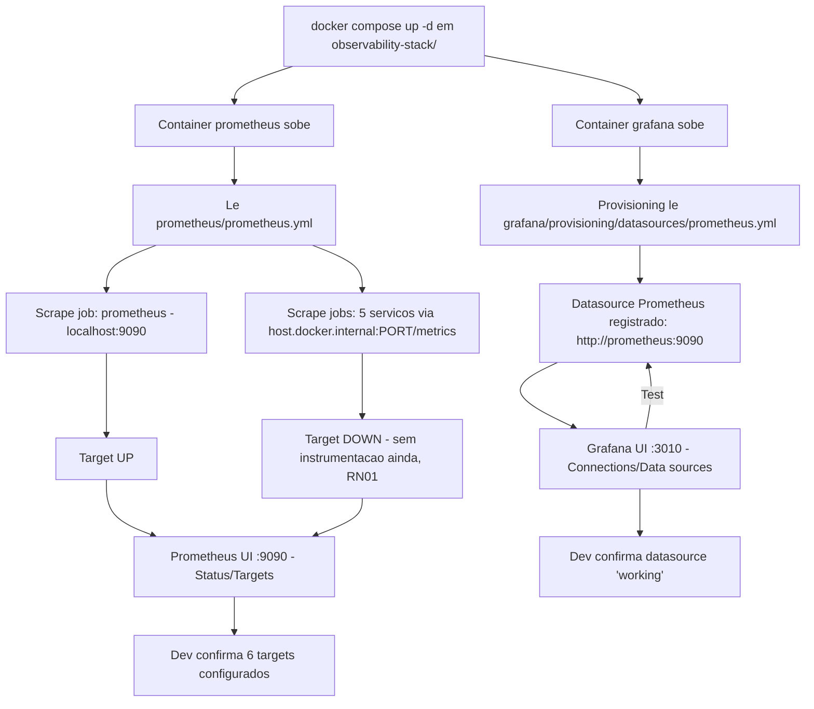

# Spec: Infraestrutura de Observabilidade (Prometheus + Grafana)

## Contexto

O projeto `marketplace-ms` é composto hoje pelos seguintes serviços:

| Serviço | Porta | Responsabilidade |
|---|---|---|
| users-service | 3000 | Gerenciar usuários |
| products-service | 3001 | Catálogo de produtos |
| checkout-service | 3003 | Carrinho e pedidos |
| payments-service | 3004 | Pagamentos |
| api-gateway | 3005 | Roteamento, auth, resiliência |
| messaging-service | - (RabbitMQ: 5672 / 15672) | Infra de mensageria (RabbitMQ) |

O `messaging-service` já estabeleceu o padrão do projeto para infraestrutura compartilhada que não é um serviço NestJS: uma pasta própria na raiz do repositório, com seu próprio `docker-compose.yml` e `README.md`, independente dos serviços de aplicação.

O projeto ainda não possui nenhuma infraestrutura de observabilidade (métricas, dashboards). Esta spec cria essa infraestrutura seguindo o mesmo padrão do `messaging-service`: uma pasta dedicada `observability-stack/` com um Docker Compose próprio, subindo Prometheus (coleta e armazenamento de métricas) e Grafana (visualização), pronta para os serviços NestJS serem instrumentados em uma spec futura.

## Objetivo

Disponibilizar, via `docker-compose`, uma stack de observabilidade (Prometheus + Grafana) que já vem configurada para tentar coletar métricas dos 5 serviços do marketplace (rodando no host, fora do Docker) e com o Grafana já conectado ao Prometheus como datasource ao subir, sem exigir nenhuma configuração manual pós-`up`.

## Requisitos Funcionais

### RF01 — Estrutura de pastas `observability-stack/`

Deve existir, na raiz do repositório, uma pasta `observability-stack/` com a seguinte estrutura:

```
observability-stack/
├── docker-compose.yml
├── .env.example
├── .gitignore
├── README.md
├── prometheus/
│   └── prometheus.yml
└── grafana/
    └── provisioning/
        └── datasources/
            └── prometheus.yml
```

- `.gitignore` ignora o `.env` (credenciais locais) e os diretórios de dados montados por volume, seguindo o padrão já usado pelos demais serviços do projeto.

### RF02 — Docker Compose com Prometheus e Grafana

O `docker-compose.yml` deve subir dois serviços, na mesma rede dedicada (`observability-network`):

| Serviço | Imagem | Container | Porta host:container | Volumes |
|---|---|---|---|---|
| `prometheus` | `prom/prometheus:latest` | `marketplace-prometheus` | `9090:9090` | `./prometheus/prometheus.yml` montado em `/etc/prometheus/prometheus.yml` (read-only) + volume nomeado para dados (`/prometheus`) |
| `grafana` | `grafana/grafana:latest` | `marketplace-grafana` | `3010:3000` | `./grafana/provisioning` montado em `/etc/grafana/provisioning` (read-only) + volume nomeado para dados (`/var/lib/grafana`) |

Regras adicionais do compose:

- Ambos os serviços têm `restart: unless-stopped`.
- O container do `prometheus` recebe `extra_hosts: ["host.docker.internal:host-gateway"]`, para que `host.docker.internal` resolva corretamente também em Docker Engine no Linux (não só em Docker Desktop) — necessário para o RF03.
- As credenciais de admin do Grafana (`GF_SECURITY_ADMIN_USER`, `GF_SECURITY_ADMIN_PASSWORD`) são lidas de variáveis de ambiente, com `.env` (não versionado, valores reais) e `.env.example` (versionado, valores de exemplo), no mesmo padrão de `.env`/`.env.example` já usado pelos serviços NestJS do projeto — nenhuma credencial hardcoded no `docker-compose.yml`.

### RF03 — `prometheus.yml` com scrape configs para os 5 serviços

`prometheus/prometheus.yml` deve definir um `scrape_config` (job) por serviço de aplicação, todos apontando para `host.docker.internal` (já que os 5 serviços rodam no host, fora do Docker) na porta correspondente, no caminho `/metrics`:

```yaml
global:
  scrape_interval: 15s

scrape_configs:
  - job_name: prometheus
    static_configs:
      - targets: ["localhost:9090"]

  - job_name: users-service
    metrics_path: /metrics
    static_configs:
      - targets: ["host.docker.internal:3000"]

  - job_name: products-service
    metrics_path: /metrics
    static_configs:
      - targets: ["host.docker.internal:3001"]

  - job_name: checkout-service
    metrics_path: /metrics
    static_configs:
      - targets: ["host.docker.internal:3003"]

  - job_name: payments-service
    metrics_path: /metrics
    static_configs:
      - targets: ["host.docker.internal:3004"]

  - job_name: api-gateway
    metrics_path: /metrics
    static_configs:
      - targets: ["host.docker.internal:3005"]
```

O job `prometheus` (auto-scrape do próprio Prometheus) é o único que tem garantia de ficar `UP` nesta spec, já que nenhum dos 5 serviços expõe `/metrics` ainda (RN01) — os demais jobs ficam configurados, mas com status `DOWN` até a spec de instrumentação.

### RF04 — Provisioning do datasource Prometheus no Grafana

`grafana/provisioning/datasources/prometheus.yml` deve provisionar automaticamente, na subida do container, um datasource Prometheus já pronto para uso — sem passar por nenhuma tela de configuração manual no Grafana:

```yaml
apiVersion: 1

datasources:
  - name: Prometheus
    type: prometheus
    access: proxy
    url: http://prometheus:9090
    isDefault: true
    editable: false
```

O `url` usa o nome do serviço (`prometheus`) definido no `docker-compose.yml`, resolvido via rede Docker interna (`observability-network`) — não `localhost` nem `host.docker.internal`, já que aqui a comunicação é entre dois containers da mesma stack.

### RF05 — Mapa de portas atualizado

O `README.md` da `observability-stack/` (RF06) deve conter a tabela de portas do projeto já existente (ver Contexto), acrescida das duas novas entradas:

| Serviço | Porta | Responsabilidade |
|---|---|---|
| users-service | 3000 | Gerenciar usuários |
| products-service | 3001 | Catálogo de produtos |
| checkout-service | 3003 | Carrinho e pedidos |
| payments-service | 3004 | Pagamentos |
| api-gateway | 3005 | Roteamento, auth, resiliência |
| **Grafana** | **3010** | **Dashboards de observabilidade (a criar)** |
| messaging-service (RabbitMQ) | 5672 / 15672 | Infra de mensageria |
| **Prometheus** | **9090** | **Coleta e armazenamento de métricas** |

A porta `3010` para o Grafana evita o conflito com o `users-service` (3000) e com as demais portas de aplicação já em uso (3001, 3003, 3004, 3005).

### RF06 — README da `observability-stack/`

Deve existir um `README.md` na raiz de `observability-stack/`, no mesmo espírito do `messaging-service/README.md`, contendo:

- Objetivo da stack (uma frase).
- A tabela de portas do RF05.
- Como subir (`docker compose up -d`) e como derrubar (`docker compose down`) a stack.
- URLs de acesso: Prometheus (`http://localhost:9090`) e Grafana (`http://localhost:3010`).
- Como acessar o Grafana pela primeira vez (usuário/senha vindos do `.env`).
- Um aviso curto de que o datasource Prometheus já vem configurado no Grafana, e que os 5 jobs de scrape existem mas ficam `DOWN` até os serviços exporem `/metrics` (spec futura).

## Regras de Negócio

- RN01 — Nenhum dos 5 serviços NestJS expõe `/metrics` nesta etapa; os jobs de scrape do Prometheus para esses serviços ficarão com status `DOWN` no Prometheus até a spec de instrumentação ser implementada. Isso é esperado e não é uma falha da stack.
- RN02 — `host.docker.internal` é usado exclusivamente para o Prometheus alcançar serviços rodando no host; a comunicação Grafana → Prometheus usa o nome do serviço na rede Docker interna (`observability-network`), nunca `host.docker.internal` nem `localhost`.
- RN03 — Dados do Prometheus e do Grafana são persistidos em volumes Docker nomeados, sobrevivendo a `docker compose down` (sem `-v`), mas não são versionados no Git.

## Fora de Escopo

- Instrumentar qualquer um dos 5 serviços NestJS com métricas (`/metrics`, `prom-client`, interceptors, etc.) — spec futura.
- Criar dashboards no Grafana (além do datasource provisionado) — spec futura.
- Configurar alerting (Alertmanager, regras de alerta no Prometheus, notificação) — spec futura.
- Qualquer ferramenta além de Prometheus e Grafana (Loki, Jaeger, Tempo, OpenTelemetry Collector, etc.).
- Métricas de infraestrutura (node-exporter, cAdvisor, métricas de container/host).
- Autenticação/HTTPS no Prometheus ou exposição pública dessas portas — uso é local, de desenvolvimento.
- Alterações nos `docker-compose.yaml` dos serviços de aplicação ou do `messaging-service`.

## Fluxo Esperado

1. Desenvolvedor roda `docker compose up -d` dentro de `observability-stack/`.
2. O container `prometheus` sobe, carrega `prometheus.yml` e começa a fazer scrape dos 6 jobs configurados (a cada 15s): o próprio Prometheus (sempre `UP`) e os 5 serviços do marketplace via `host.docker.internal` (inicialmente `DOWN`, sem instrumentação).
3. O container `grafana` sobe e, durante a inicialização, o provisioning carrega `grafana/provisioning/datasources/prometheus.yml`, registrando automaticamente o datasource Prometheus apontando para `http://prometheus:9090`.
4. Desenvolvedor acessa `http://localhost:9090` (Prometheus) e confere em Status → Targets os 6 jobs configurados.
5. Desenvolvedor acessa `http://localhost:3010` (Grafana), autentica com as credenciais do `.env`, e confirma em Connections → Data sources que o datasource "Prometheus" já existe e está com status "working" (teste de conexão contra o próprio Prometheus, não contra os serviços do marketplace).

## Diagrama de Fluxo



## Critérios de Aceite

- `docker compose up -d` dentro de `observability-stack/` sobe os containers `marketplace-prometheus` e `marketplace-grafana` sem erros.
- `http://localhost:9090` responde e a UI do Prometheus lista, em Status → Targets, exatamente 6 jobs: `prometheus`, `users-service`, `products-service`, `checkout-service`, `payments-service`, `api-gateway`.
- O job `prometheus` aparece como `UP`; os demais 5 podem estar `DOWN` (RN01) — a stack não deve travar nem falhar por isso.
- `http://localhost:3010` responde e permite login com o usuário/senha definidos no `.env`.
- No Grafana, em Connections → Data sources, existe um datasource `Prometheus` marcado como padrão, apontando para `http://prometheus:9090`, sem precisar de nenhuma configuração manual, e o teste de conexão ("Save & test") retorna sucesso.
- Nenhum dashboard existe no Grafana além dos que vêm por padrão da instalação (nenhum dashboard customizado foi criado).
- Nenhuma regra de alerta existe no Prometheus ou no Grafana.
- `docker compose down` na pasta `observability-stack/` remove os containers sem afetar os demais serviços do projeto.
- `.env` não está versionado no Git; `.env.example` está.

## Referências

- Padrão de referência de infraestrutura dedicada: `messaging-service/` (`docker-compose.yml`, `README.md`).
- Documentação oficial: [Prometheus - Configuration](https://prometheus.io/docs/prometheus/latest/configuration/configuration/), [Grafana - Provisioning](https://grafana.com/docs/grafana/latest/administration/provisioning/).
