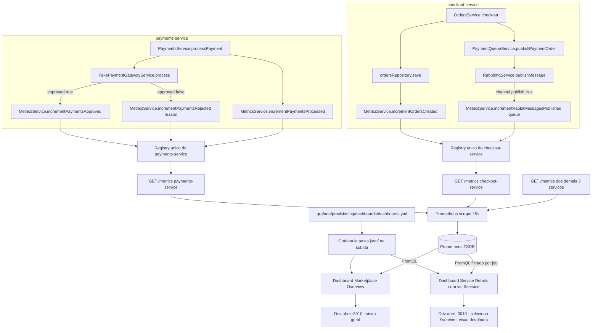

# Spec: Dashboards Grafana e Métricas de Negócio

## Contexto

O `marketplace-ms` já possui toda a infraestrutura de observabilidade técnica no ar:

- `observability-stack/` (ver `docs/specs/02-observability-stack-prometheus-grafana.md`, na raiz do repositório) sobe Prometheus (`:9090`) e Grafana (`:3010`) via Docker Compose, com o datasource Prometheus já provisionado no Grafana.
- Prometheus faz scrape de `GET /metrics` nos 5 serviços NestJS (`users-service`, `products-service`, `checkout-service`, `payments-service`, `api-gateway`) a cada 15s, via jobs nomeados com o próprio nome do serviço (label `job`).
- Cada um dos 5 serviços já expõe, via `prom-client`, um `MetricsService` `@Global()` (ver specs `NN-metricas-http-prometheus.md` de cada serviço) com:
  - `Counter` `http_requests_total` (labels `method`, `route`, `status_code`).
  - `Histogram` `http_request_duration_seconds` (mesmos labels).
  - Métricas padrão de processo Node.js (`collectDefaultMetrics`): `process_cpu_seconds_total`, `process_resident_memory_bytes`, `nodejs_eventloop_lag_seconds`, etc.

O que falta é (a) visualizar essas métricas em dashboards, hoje só acessíveis via `curl /metrics` ou consultas manuais no Prometheus, e (b) métricas de **negócio** (pagamentos processados/aprovados/rejeitados, pedidos criados, mensagens publicadas no RabbitMQ) — que hoje só existem como logs (`Logger.log`) em `payments-service` (`PaymentConsumerService`) e `checkout-service` (`PaymentQueueService`), sem nenhuma série no Prometheus.

Esta spec cobre exclusivamente: (1) as novas métricas de negócio em `payments-service` e `checkout-service`, reaproveitando o `MetricsService` já existente em cada um; e (2) dois dashboards no Grafana, provisionados via JSON versionado no repositório (mesmo padrão de "provisioning" já usado para o datasource — sem clique manual na UI).

## Objetivo

Ao final desta atividade, qualquer pessoa deve conseguir abrir o Grafana (`http://localhost:3010`) e, sem nenhuma configuração manual, encontrar dois dashboards prontos — uma visão geral do marketplace e uma visão detalhada por serviço — refletindo tanto a saúde técnica (throughput, erros, latência, memória) quanto o negócio (pagamentos, pedidos) dos 5 serviços.

## Requisitos Funcionais

### RF01 — `payments_processed_total` (payments-service)

Um `Counter` `payments_processed_total`, sem labels, incrementado uma vez em `PaymentsService.processPayment()` (`payments-service/src/payments/payments.service.ts`) para cada pagamento que chega a um estado final (`approved` ou `rejected`) — ou seja, uma vez por chamada que não retorna antecipadamente por `existing.status !== 'pending'`.

### RF02 — `payments_approved_total` (payments-service)

Um `Counter` `payments_approved_total`, sem labels, incrementado em `PaymentsService.processPayment()` quando `result.approved === true`.

### RF03 — `payments_rejected_total` (payments-service)

Um `Counter` `payments_rejected_total`, com label `reason`, incrementado em `PaymentsService.processPayment()` quando `result.approved === false`, usando `result.rejectionReason` (ex.: `"Limite excedido"`, `"Cartão recusado pela operadora"`, ver `FakePaymentGatewayService`) como valor do label.

### RF04 — `orders_created_total` (checkout-service)

Um `Counter` `orders_created_total`, sem labels, incrementado em `OrdersService.checkout()` (`checkout-service/src/orders/orders.service.ts`) após o pedido ser salvo com sucesso (após o `this.ordersRepository.save(...)`, antes ou depois da publicação na fila).

### RF05 — `rabbitmq_messages_published_total` (checkout-service)

Um `Counter` `rabbitmq_messages_published_total`, com label `queue`, incrementado em `RabbitmqService.publishMessage()` (`checkout-service/src/events/rabbitmq/rabbitmq.service.ts`) sempre que `channel.publish(...)` retornar `true`, usando a `routingKey` recebida (ex.: `payment.order`) como valor do label `queue`.

### RF06 — Registro das métricas de negócio no `MetricsService` de cada serviço

Em `payments-service` e `checkout-service`, os novos `Counter`s (RF01–RF05) devem ser registrados no mesmo `Registry` já usado pelas métricas HTTP (`this.registry`, dentro do `MetricsService` existente de cada serviço) — não um registry separado — para que apareçam na mesma resposta de `GET /metrics`. O `MetricsService` deve expor um método por métrica de negócio (ex.: `incrementPaymentsProcessed()`, `incrementPaymentsApproved()`, `incrementPaymentsRejected(reason)`, `incrementOrdersCreated()`, `incrementRabbitMessagesPublished(queue)`), injetado nas classes descritas nos RF01–RF05 via `MetricsService` (já `@Global()`).

### RF07 — Dashboard "Marketplace Overview"

Um dashboard Grafana chamado **Marketplace Overview**, com os seguintes painéis:

| Painel | Tipo | Métrica base |
|---|---|---|
| Status dos serviços | Stat (um por serviço, ou tabela com cor por linha) | `up{job=~"users-service\|products-service\|checkout-service\|payments-service\|api-gateway"}` |
| Throughput geral | Time series, uma linha por serviço | `sum by (job) (rate(http_requests_total[1m]))` |
| Taxa de erros 4xx/5xx | Time series, uma linha por serviço (%) | `sum by (job) (rate(http_requests_total{status_code=~"4..\|5.."}[5m])) / sum by (job) (rate(http_requests_total[5m]))` |
| Latência P95 por serviço | Time series, uma linha por serviço | `histogram_quantile(0.95, sum by (job, le) (rate(http_request_duration_seconds_bucket[5m])))` |
| Memória por serviço | Time series, uma linha por serviço | `process_resident_memory_bytes` |
| Pagamentos (aprovados x rejeitados) | Time series ou barras empilhadas | `rate(payments_approved_total[5m])`, `rate(payments_rejected_total[5m])` |
| Pedidos criados | Time series ou Stat (total) | `rate(orders_created_total[5m])` / `increase(orders_created_total[1h])` |

### RF08 — Dashboard "Service Details"

Um dashboard Grafana chamado **Service Details**, com uma variável `$service` (tipo `query`, baseada em `label_values(up, job)`) que filtra todos os painéis abaixo pelo serviço selecionado:

| Painel | Tipo | Métrica base |
|---|---|---|
| Rate (req/s) por rota | Time series | `sum by (route) (rate(http_requests_total{job=~"$service"}[5m]))` |
| Errors (%) por rota | Time series | `sum by (route) (rate(http_requests_total{job=~"$service", status_code=~"4..\|5.."}[5m])) / sum by (route) (rate(http_requests_total{job=~"$service"}[5m]))` |
| Duration P50/P95/P99 | Time series, 3 linhas | `histogram_quantile(0.50\|0.95\|0.99, sum by (le, route) (rate(http_request_duration_seconds_bucket{job=~"$service"}[5m])))` |
| Top rotas por volume | Tabela, ordenada desc | `topk(10, sum by (route) (rate(http_requests_total{job=~"$service"}[5m])))` |
| Distribuição de status codes | Pie chart | `sum by (status_code) (increase(http_requests_total{job=~"$service"}[1h]))` |
| CPU do processo | Time series | `rate(process_cpu_seconds_total{job=~"$service"}[5m])` |
| Memória do processo | Time series | `process_resident_memory_bytes{job=~"$service"}` |
| Event loop lag | Time series | `nodejs_eventloop_lag_seconds{job=~"$service"}` |

### RF09 — Provisioning dos dashboards via JSON versionado

Os dois dashboards (RF07, RF08) devem ser definidos como arquivos JSON versionados no repositório, carregados automaticamente pelo Grafana na subida do container — sem import manual pela UI:

```
observability-stack/
└── grafana/
    └── provisioning/
        ├── datasources/
        │   └── prometheus.yml          (já existe)
        └── dashboards/
            ├── dashboards.yml          (novo: provider de dashboards)
            └── json/
                ├── marketplace-overview.json
                └── service-details.json
```

`grafana/provisioning/dashboards/dashboards.yml` define um provider apontando para a pasta `json/`:

```yaml
apiVersion: 1

providers:
  - name: marketplace
    orgId: 1
    folder: Marketplace
    type: file
    disableDeletion: false
    updateIntervalSeconds: 30
    options:
      path: /etc/grafana/provisioning/dashboards/json
```

Como `docker-compose.yml` já monta `./grafana/provisioning` inteiro em `/etc/grafana/provisioning` (read-only) — ver `docs/specs/02-observability-stack-prometheus-grafana.md`, RF02 —, nenhuma alteração no `docker-compose.yml` é necessária: o novo diretório `dashboards/` é carregado automaticamente por já estar dentro do volume existente.

### RF10 — Tabela de referência de queries PromQL

O `README.md` da `observability-stack/` deve ganhar uma seção "Queries PromQL de referência" com uma tabela contendo, no mínimo, as queries usadas nos RF07 e RF08 (uma linha por painel), para consulta rápida sem precisar abrir os JSONs dos dashboards.

## Regras de Negócio

- RN01 — As métricas de negócio (RF01–RF05) são registradas no mesmo `Registry` das métricas HTTP de cada serviço, nunca em um registry paralelo — um único `GET /metrics` por serviço continua sendo a única fonte de verdade.
- RN02 — O label `reason` de `payments_rejected_total` reflete o texto retornado por `FakePaymentGatewayService` (baixa cardinalidade, hoje 2 valores fixos); se o gateway de pagamento vier a gerar motivos de rejeição com texto livre/dinâmico no futuro, este label deixa de ser adequado — fora do escopo desta spec resolver isso.
- RN03 — `orders_created_total` é incrementado independentemente do resultado do pagamento subsequente (o pedido é criado antes do pagamento ser processado de forma assíncrona via fila) — esta métrica mede criação de pedidos, não conclusão de pagamento.
- RN04 — Os dois dashboards (RF07, RF08) ficam na pasta "Marketplace" do Grafana (via `folder` do provider, RF09), separados dos dashboards padrão da instalação.
- RN05 — `disableDeletion: false` no provider (RF09) permite edição/exclusão pela UI para fins de exploração durante a aula, mas qualquer mudança feita apenas na UI é descartada no próximo `docker compose up` / restart do container, já que o JSON versionado no repositório é a fonte de verdade — mudanças permanentes exigem editar o arquivo JSON e commitar.

## Fora de Escopo

- Alerting (regras de alerta no Prometheus/Grafana, Alertmanager, notificações) — spec futura.
- Métricas de banco de dados (PostgreSQL) ou exporter do RabbitMQ (`rabbitmq_exporter`, management plugin) — spec futura.
- Qualquer alteração em `docker-compose.yml` do `observability-stack/` ou dos serviços de aplicação.
- Métricas de negócio em `users-service`, `products-service` ou `api-gateway` (apenas `payments-service` e `checkout-service` nesta spec).
- Tracing distribuído, logs estruturados/centralizados.
- Autenticação/permissões de dashboard no Grafana além do que já vem por padrão.

## Fluxo Esperado

1. Desenvolvedor implementa os `Counter`s de negócio (RF01–RF06) em `payments-service` e `checkout-service`, reaproveitando o `MetricsService` de cada um.
2. Desenvolvedor cria `grafana/provisioning/dashboards/dashboards.yml` e os dois arquivos JSON (RF09) em `observability-stack/`.
3. `docker compose up -d` (ou restart do container `grafana`, já que o volume é o mesmo) carrega o provider de dashboards e os dois dashboards aparecem automaticamente na pasta "Marketplace".
4. Requisições reais aos serviços (rotas HTTP, checkout, processamento de pagamento) geram dados nas métricas HTTP e de negócio, coletados pelo Prometheus a cada 15s.
5. Desenvolvedor abre "Marketplace Overview" e confirma a visão consolidada; abre "Service Details", seleciona um serviço na variável `$service` e confirma que os painéis filtram corretamente.

## Diagrama de Fluxo



## Tabela de Métricas de Negócio Adicionadas

| Métrica | Serviço | Tipo | Labels | Emitida em |
|---|---|---|---|---|
| `payments_processed_total` | payments-service | Counter | — | `PaymentsService.processPayment()`, sempre que atinge estado final |
| `payments_approved_total` | payments-service | Counter | — | `PaymentsService.processPayment()`, quando aprovado |
| `payments_rejected_total` | payments-service | Counter | `reason` | `PaymentsService.processPayment()`, quando rejeitado |
| `orders_created_total` | checkout-service | Counter | — | `OrdersService.checkout()`, após salvar o pedido |
| `rabbitmq_messages_published_total` | checkout-service | Counter | `queue` | `RabbitmqService.publishMessage()`, quando `channel.publish` retorna `true` |

## Tabela de Queries PromQL de Referência

| Uso | Query |
|---|---|
| Status UP/DOWN por serviço | `up{job="<service>"}` |
| Throughput geral (req/s) por serviço | `sum by (job) (rate(http_requests_total[1m]))` |
| Taxa de erro 4xx/5xx por serviço | `sum by (job) (rate(http_requests_total{status_code=~"4..\|5.."}[5m])) / sum by (job) (rate(http_requests_total[5m]))` |
| Latência P95 por serviço | `histogram_quantile(0.95, sum by (job, le) (rate(http_request_duration_seconds_bucket[5m])))` |
| Memória residente por serviço | `process_resident_memory_bytes{job="<service>"}` |
| Rate por rota (dentro de um serviço) | `sum by (route) (rate(http_requests_total{job="<service>"}[5m]))` |
| Duration P50/P95/P99 por rota | `histogram_quantile(0.95, sum by (le, route) (rate(http_request_duration_seconds_bucket{job="<service>"}[5m])))` |
| Top rotas por volume | `topk(10, sum by (route) (rate(http_requests_total{job="<service>"}[5m])))` |
| Distribuição de status codes | `sum by (status_code) (increase(http_requests_total{job="<service>"}[1h]))` |
| CPU do processo | `rate(process_cpu_seconds_total{job="<service>"}[5m])` |
| Event loop lag | `nodejs_eventloop_lag_seconds{job="<service>"}` |
| Pagamentos aprovados/rejeitados (taxa) | `rate(payments_approved_total[5m])`, `rate(payments_rejected_total[5m])` |
| Pagamentos rejeitados por motivo | `sum by (reason) (increase(payments_rejected_total[1h]))` |
| Pedidos criados (total na janela) | `increase(orders_created_total[1h])` |
| Mensagens publicadas no RabbitMQ por fila | `sum by (queue) (rate(rabbitmq_messages_published_total[5m]))` |

## Critérios de Aceite

- `curl http://localhost:3004/metrics` (payments-service) contém `payments_processed_total`, `payments_approved_total` e `payments_rejected_total` após ao menos um pagamento aprovado e um rejeitado terem sido processados (ex.: um pedido com valor terminando em `,99` para forçar rejeição).
- `payments_rejected_total` aparece com pelo menos um label `reason` correspondente a um dos textos retornados por `FakePaymentGatewayService`.
- `curl http://localhost:3003/metrics` (checkout-service) contém `orders_created_total` incrementado após um `POST` de checkout bem-sucedido, e `rabbitmq_messages_published_total` com label `queue="payment.order"` incrementado na mesma operação.
- `docker compose up -d` (ou restart do container `grafana`) dentro de `observability-stack/` faz aparecer, na pasta "Marketplace" do Grafana (`http://localhost:3010`), os dashboards "Marketplace Overview" e "Service Details", sem nenhuma ação manual de import.
- No dashboard "Marketplace Overview", o painel de status mostra `api-gateway`, `users-service`, `products-service`, `checkout-service` e `payments-service` como `UP` quando os 5 serviços estão rodando localmente.
- No dashboard "Service Details", alterar a variável `$service` para `payments-service` atualiza todos os painéis (rate, errors, duration, top rotas, status codes, CPU, memória, event loop) para refletir apenas dados desse serviço.
- Nenhuma regra de alerta existe no Prometheus ou no Grafana após esta spec.
- Nenhuma métrica de banco de dados ou do RabbitMQ (via exporter) aparece nos dashboards — apenas as métricas HTTP e de negócio já expostas pelos próprios serviços NestJS.
- `docker-compose.yml` do `observability-stack/` permanece idêntico ao estado anterior a esta spec (nenhuma linha alterada).

## Referências

- `docs/specs/02-observability-stack-prometheus-grafana.md` — infraestrutura Prometheus/Grafana, datasource provisionado, jobs de scrape.
- `payments-service/docs/specs/02-metricas-http-prometheus.md`, `checkout-service/docs/specs/05-metricas-http-prometheus.md` — `MetricsService` existente reaproveitado por esta spec.
- `payments-service/src/payments/payments.service.ts`, `payments-service/src/payments/fake-payment-gateway.service.ts` — lógica de aprovação/rejeição de pagamento.
- `checkout-service/src/orders/orders.service.ts`, `checkout-service/src/events/rabbitmq/rabbitmq.service.ts` — criação de pedido e publicação no RabbitMQ.
- Documentação oficial: [Grafana - Provisioning dashboards](https://grafana.com/docs/grafana/latest/administration/provisioning/#dashboards), [Prometheus - Query functions](https://prometheus.io/docs/prometheus/latest/querying/functions/), [prom-client](https://github.com/siimon/prom-client).
