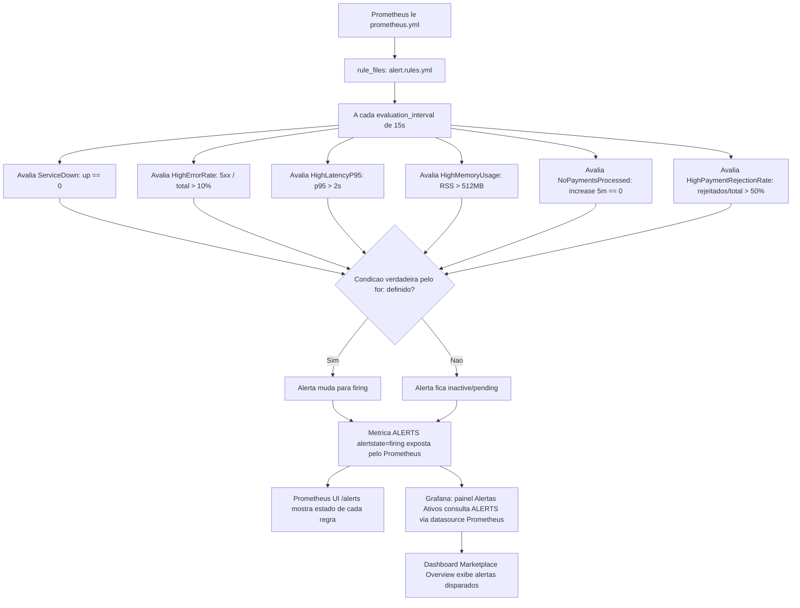

# Spec: Alerting Rules no Prometheus e Painel de Alertas no Grafana

## Contexto

O `observability-stack/` já roda Prometheus (`:9090`) e Grafana (`:3010`) via Docker Compose (`docker-compose.yml`), com scrape de `GET /metrics` nos 5 serviços a cada 15s (`prometheus/prometheus.yml`) e dois dashboards provisionados (`docs/specs/01-dashboards-grafana-metricas-negocio.md`): `Marketplace Overview` (`grafana/provisioning/dashboards/json/marketplace-overview.json`) e `Service Details`.

O Prometheus hoje só coleta e expõe métricas — não tem nenhuma `rule_files` configurada, ou seja, nenhuma regra de alerta é avaliada. Não há Alertmanager no stack (não faz parte deste projeto). Sem regras de alerta, detectar um serviço fora do ar, uma taxa de erro alta ou um problema de pagamentos depende de alguém abrir o Grafana e olhar os gráficos manualmente.

Esta spec adiciona `rule_files` ao Prometheus com regras de alerta declarativas (`alert.rules.yml`), reaproveitando exatamente as mesmas métricas e nomes de `job` já usados nos dois dashboards existentes (`http_requests_total`, `http_request_duration_seconds_bucket`, `process_resident_memory_bytes`, `up`, `payments_processed_total`, `payments_approved_total`, `payments_rejected_total`), e adiciona um painel no dashboard `Marketplace Overview` mostrando quais alertas estão disparados no momento — sem enviar nenhuma notificação externa (sem Alertmanager, sem Slack, sem e-mail).

## Objetivo

Ao final desta atividade, o Prometheus deve avaliar continuamente 6 regras de alerta cobrindo indisponibilidade de serviço, taxa de erro HTTP, latência, uso de memória e problemas de negócio em pagamentos — visíveis tanto em `http://localhost:9090/alerts` quanto em um novo painel no dashboard `Marketplace Overview` do Grafana.

## Requisitos Funcionais

### RF01 — `rule_files` no Prometheus
Criar `observability-stack/prometheus/alert.rules.yml` e referenciá-lo em `prometheus/prometheus.yml` via `rule_files: ["alert.rules.yml"]`. Adicionar `evaluation_interval: 15s` ao bloco `global` de `prometheus.yml` (hoje só `scrape_interval: 15s` está definido), para que o `for:` das regras (RF02–RF07) seja avaliado com granularidade compatível com os valores pedidos (ex.: `30s`).

### RF02 — Regra `ServiceDown`
- Expressão: `up{job=~"users-service|products-service|checkout-service|payments-service|api-gateway"} == 0`.
- `for: 30s`, `severity: critical`.
- Anotação `summary`/`description` identificando o `job` que caiu (`{{ $labels.job }}`).

### RF03 — Regra `HighErrorRate`
- Expressão: taxa de respostas `5xx` sobre o total de requisições, por serviço, `> 0.1` (10%), na mesma janela de 5 minutos já usada no dashboard (`sum by (job) (rate(http_requests_total{status_code=~"5.."}[5m])) / sum by (job) (rate(http_requests_total[5m])) > 0.1`).
- `for: 1m`, `severity: warning`.

### RF04 — Regra `HighLatencyP95`
- Expressão: P95 de duração de requisição, por serviço, `> 2` segundos, usando o mesmo `histogram_quantile` já usado no painel "Latência P95 por serviço" (`histogram_quantile(0.95, sum by (job, le) (rate(http_request_duration_seconds_bucket[5m]))) > 2`).
- `for: 1m`, `severity: warning`.

### RF05 — Regra `HighMemoryUsage`
- Expressão: `process_resident_memory_bytes > 536870912` (512MB), reaproveitando a métrica já usada no painel "Memória por serviço".
- `for: 2m`, `severity: warning`.

### RF06 — Regra `NoPaymentsProcessed`
- Expressão: `increase(payments_processed_total[5m]) == 0` — nenhum pagamento processado (aprovado ou rejeitado) nos últimos 5 minutos.
- Sem `for` adicional (a janela de 5 minutos já está na própria expressão) — dispara assim que a condição é avaliada como verdadeira.
- `severity: info`.

### RF07 — Regra `HighPaymentRejectionRate`
- Expressão: proporção de pagamentos rejeitados sobre o total processado, na janela de 5 minutos, `> 0.5` (50%): `sum(increase(payments_rejected_total[5m])) / sum(increase(payments_processed_total[5m]))> 0.5`.
- `for: 2m`, `severity: warning`.

### RF08 — Grupo único de regras
As 6 regras (RF02–RF07) ficam em um único `group` dentro de `alert.rules.yml` (ex.: `name: marketplace-alerts`), cada uma como um item de `rules`, com `alert`, `expr`, `for` (quando aplicável), `labels.severity` e `annotations.summary`/`annotations.description`.

### RF09 — Painel de alertas ativos no dashboard `Marketplace Overview`
Adicionar um novo painel ao final de `grafana/provisioning/dashboards/json/marketplace-overview.json` (abaixo do painel "Pedidos criados", `gridPos` começando em `y: 28`), do tipo tabela, consultando a métrica `ALERTS{alertstate="firing"}` (exposta automaticamente pelo próprio Prometheus para todo alerta avaliado) na datasource Prometheus já provisionada, exibindo pelo menos as labels `alertname`, `job` e `severity` dos alertas atualmente disparados.

## Regras de Negócio

- RN01 — `HighErrorRate` (RF03) considera apenas respostas `5xx`, diferente do painel "Taxa de erros 4xx/5xx" do dashboard existente (que soma `4xx` e `5xx`) — o alerta foca em erros de servidor, que indicam falha real do serviço, não uso incorreto da API pelo cliente.
- RN02 — Nenhuma notificação externa (Slack, e-mail, webhook) é configurada — sem Alertmanager no stack. Alertas ficam visíveis apenas via Prometheus (`/alerts`, métrica `ALERTS`) e no painel do Grafana (RF09).
- RN03 — `NoPaymentsProcessed` (RF06) é `info`, não `warning`/`critical` — ausência de pagamentos pode ser normal fora do horário de pico; a regra existe para visibilidade, não para acionar ninguém.
- RN04 — As regras reusam exatamente os mesmos nomes de métrica, labels (`job`, `status_code`, `le`) e janelas de agregação (`[5m]`) já usados nos dashboards existentes (`docs/specs/01-dashboards-grafana-metricas-negocio.md`) — nenhuma métrica nova é criada nesta spec.

## Fora de Escopo

- Alertmanager e qualquer canal de notificação (Slack, e-mail, PagerDuty, webhook) — nice-to-have futuro.
- Alertas do tipo "Grafana managed alert" (regras de alerta nativas do Grafana) — os alertas são definidos e avaliados no Prometheus; o Grafana só visualiza o resultado via `ALERTS`.
- Qualquer alteração nos painéis já existentes dos dashboards `Marketplace Overview` e `Service Details`, além da adição do novo painel (RF09).
- Novas métricas de aplicação — todas as expressões usam métricas já expostas pelos 5 serviços.
- Silenciamento, agrupamento (`route`/`inhibit_rules`) ou qualquer configuração de roteamento de alertas — só existe com Alertmanager, fora de escopo.

## Fluxo da Implementação

## Critérios de Aceite

- `docker compose up -d` em `observability-stack/` sobe sem erro de configuração e `http://localhost:9090/rules` lista as 6 regras dentro do grupo `marketplace-alerts`.
- Com um serviço (ex.: `payments-service`) parado por mais de 30s, `http://localhost:9090/alerts` mostra `ServiceDown` em estado `firing` para o `job` correspondente.
- Gerando um volume de requisições com respostas `5xx` sustentado por mais de 1 minuto (ex.: derrubando o banco de um serviço que já tenha os health checks das specs de Terminus implementados, ver `payments-service/docs/specs/03-health-check-terminus.md`), `HighErrorRate` aparece como `firing` para o `job` correspondente.
- Sem nenhum pagamento processado nos últimos 5 minutos, `NoPaymentsProcessed` aparece como `firing` com `severity="info"`.
- Processando pagamentos majoritariamente rejeitados (mais de 50% em uma janela de 5 minutos, sustentado por 2 minutos), `HighPaymentRejectionRate` aparece como `firing`.
- No Grafana, o dashboard `Marketplace Overview` (`http://localhost:3010`) tem um novo painel "Alertas Ativos" que lista, em tempo real, os `alertname`/`job`/`severity` de qualquer alerta em `firing` — vazio quando nenhum alerta está disparado.
- Nenhum dos painéis pré-existentes dos dois dashboards muda de posição, expressão ou comportamento.

## Referências

- `docs/specs/01-dashboards-grafana-metricas-negocio.md` — métricas de negócio (`payments_processed_total`, `payments_approved_total`, `payments_rejected_total`) e expressões PromQL reaproveitadas por esta spec.
- `prometheus/prometheus.yml` — configuração atual de scrape, sem `rule_files`.
- `grafana/provisioning/dashboards/json/marketplace-overview.json` — dashboard onde o novo painel é adicionado.
- `<serviço>/docs/specs/NN-metricas-http-prometheus.md` (um por serviço) — origem de `http_requests_total`, `http_request_duration_seconds` e métricas padrão de processo Node.js.
- Documentação oficial: [Prometheus — Alerting rules](https://prometheus.io/docs/prometheus/latest/configuration/alerting_rules/), [Prometheus — ALERTS metric](https://prometheus.io/docs/prometheus/latest/configuration/alerting_rules/#inspecting-alerts-during-runtime).
