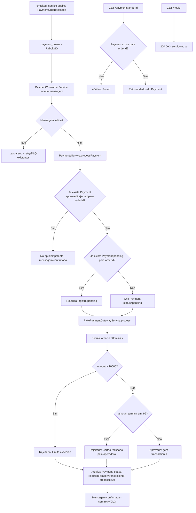

# Spec: Processamento de pagamento

## Contexto

O `payments-service` (porta 3004) já possui, além do scaffold NestJS + TypeORM + PostgreSQL (porta 5435): o `EventsModule`, com `RabbitmqService` e `PaymentQueueService` consumindo a fila `payment_queue` (com retry e Dead Letter Queue já configurados), e o `PaymentConsumerService`, que recebe cada mensagem `PaymentOrderMessage` (`orderId`, `userId`, `amount`, `items[]`, `paymentMethod`, e opcionalmente `description`/`createdAt`/`metadata`, definida em `src/events/payment-queue.interface.ts`), valida seus campos obrigatórios e registra métricas de processamento — mas o processamento do pagamento em si ainda é um `TODO`, apenas logado.

O serviço já expõe endpoints de DLQ (`GET /dlq/stats`, `GET /dlq/messages`, `POST /dlq/reprocess/:orderId`, `POST /dlq/reprocess-all`, `DELETE /dlq/message/:orderId`, `DELETE /dlq/purge`) e de métricas do consumer (`GET /metrics`, `GET /metrics/health`, `GET /metrics/summary`, `POST /metrics/reset`), todos já funcionais e fora do escopo desta spec.

O `checkout-service` publica uma mensagem `PaymentOrderMessage` no exchange `payments` (routing key `payment.order`) ao finalizar um pedido (`POST /cart/checkout`), de forma assíncrona — ele não aguarda nem conhece o resultado do processamento do pagamento.

Esta spec cobre a persistência e o processamento efetivo dessas mensagens: a entidade `Payment`, um gateway de pagamento simulado (fake), a conclusão do `PaymentConsumerService` e um endpoint de consulta do resultado por `orderId`.

## Objetivo

Ao receber uma mensagem de pagamento da fila, o `payments-service` deve registrar a tentativa, decidir de forma determinística se o pagamento é aprovado ou rejeitado (via gateway simulado) e persistir o resultado, tornando-o consultável por `orderId`.

## Requisitos Funcionais

### RF01 — Entidade `Payment`

Nova entidade TypeORM que representa uma tentativa de pagamento associada a um pedido.

Campos:
- `id`: UUID, chave primária, gerado automaticamente.
- `orderId`: UUID, identifica o pedido de origem (vindo da mensagem `PaymentOrderMessage`).
- `userId`: UUID, identifica o usuário dono do pedido.
- `amount`: decimal (10,2), valor do pagamento.
- `status`: enum (`pending`, `approved`, `rejected`), com valor padrão `pending`.
- `paymentMethod`: varchar(50), forma de pagamento informada na mensagem.
- `transactionId`: varchar(255), opcional — identificador retornado pelo gateway simulado quando o pagamento é aprovado.
- `rejectionReason`: varchar(255), opcional — motivo retornado pelo gateway simulado quando o pagamento é rejeitado.
- `processedAt`: timestamp, opcional — momento em que o gateway simulado concluiu a decisão (aprovação ou rejeição).
- `createdAt`, `updatedAt`: timestamps de controle, preenchidos automaticamente.

### RF02 — `FakePaymentGatewayService`: gateway de pagamento simulado

Serviço isolado, responsável exclusivamente por simular a decisão de um gateway de pagamento externo, sem qualquer integração real.

Comportamento:
- Simula latência de rede/processamento entre 500ms e 2s antes de retornar o resultado.
- Aplica as seguintes regras determinísticas, nesta ordem de prioridade:
  1. Se o valor for maior que `10000`, o pagamento é rejeitado com o motivo `"Limite excedido"`.
  2. Caso contrário, se o valor terminar em `.99` (ex.: `199.99`), o pagamento é rejeitado com o motivo `"Cartão recusado pela operadora"`.
  3. Em qualquer outro caso, o pagamento é aprovado.
- Ao aprovar, gera um `transactionId` único para a transação.
- Retorna um resultado contendo: se foi aprovado (`approved`), o `transactionId` (quando aprovado) e o `rejectionReason` (quando rejeitado).
- Não possui nenhuma dependência de rede, banco de dados ou serviços externos reais — a simulação é inteiramente local.

### RF03 — `PaymentsService.processPayment(message)`

Processa uma mensagem `PaymentOrderMessage` recebida da fila, do início ao fim.

Comportamento:
- Se já existir um `Payment` para o `orderId` da mensagem com status `approved` ou `rejected`, a mensagem é considerada já processada: nenhuma nova tentativa é feita e nenhum novo registro é criado (idempotência — evita reprocessar um pagamento já concluído, por exemplo em caso de reentrega da mensagem ou reprocessamento manual via DLQ).
- Se não existir um `Payment` para o `orderId`, cria um novo registro com status `pending`, com os dados vindos da mensagem (`orderId`, `userId`, `amount`, `paymentMethod`).
- Se já existir um `Payment` para o `orderId` ainda com status `pending` (ex.: tentativa anterior interrompida antes de concluir), reutiliza esse registro em vez de criar um novo.
- Envia o pagamento (valor) para o `FakePaymentGatewayService` e aguarda a decisão.
- Atualiza o registro com o resultado: `status` (`approved` ou `rejected`), `transactionId` ou `rejectionReason` conforme o caso, e `processedAt` com o momento da decisão.
- Persiste o registro atualizado.

### RF04 — `PaymentsService.findByOrderId(orderId)`

Busca o pagamento associado a um pedido.

Comportamento:
- Se existir um `Payment` para o `orderId` informado, retorna seus dados.
- Se não existir nenhum `Payment` para o `orderId` informado, retorna erro `404 Not Found`.

### RF05 — Conclusão do `PaymentConsumerService`

Substitui o `TODO` existente pela chamada real ao processamento de pagamento.

Comportamento:
- Após a validação da mensagem (já existente, mantida sem alterações), o consumer invoca `PaymentsService.processPayment` com a mensagem recebida.
- Um pagamento **rejeitado** pelo gateway simulado é um desfecho de negócio válido, não um erro de processamento: a mensagem é confirmada normalmente (sem acionar retry/DLQ), com o resultado da rejeição já persistido no `Payment`.
- Uma falha real durante o processamento (ex.: erro de banco de dados, exceção inesperada) continua propagando o erro para fora do consumer, exatamente como hoje, para que o mecanismo existente de retry e DLQ trate a falha — nenhuma alteração nesse mecanismo é feita por esta spec.
- O registro de métricas do consumer (`updateMetrics`, contadores de sucesso/falha) continua funcionando como hoje, tratando a conclusão do processamento (aprovado ou rejeitado) como sucesso, e uma exceção real como falha.

### RF06 — `GET /payments/:orderId`

Endpoint de consulta do status de um pagamento.

Comportamento:
- Retorna os dados do `Payment` associado ao `orderId` informado (incluindo `status`, `transactionId` ou `rejectionReason`, `amount`, `paymentMethod`, `processedAt`, etc.).
- Se não existir pagamento para o `orderId` informado, retorna `404 Not Found`.

### RF07 — `GET /health`

Endpoint simples de verificação de disponibilidade do serviço (liveness), distinto do `GET /metrics/health` já existente (que reporta a saúde do consumer de mensagens).

Comportamento:
- Retorna `200 OK` com uma indicação de que o serviço HTTP está no ar, enquanto o processo estiver rodando e respondendo.

## Regras de Negócio

- As regras de aprovação/rejeição do gateway simulado (limite de valor e final `.99`) são fixas e determinísticas — o mesmo valor de entrada sempre produz o mesmo resultado (aprovado/rejeitado e motivo), variando apenas o `transactionId` gerado e a latência simulada.
- Cada pedido (`orderId`) possui no máximo um `Payment` com status final (`approved` ou `rejected`) — o processamento é idempotente por `orderId`.
- A rejeição de um pagamento pelo gateway simulado nunca deve ser tratada como falha de processamento da mensagem (não deve gerar retry nem envio à DLQ) — é um resultado de negócio esperado.
- Todo o código novo (entidade, serviços, controller, DTOs de resposta) deve ser explicitamente tipado, sem uso de `any` implícito.

## Fora de Escopo

- Integração com gateway de pagamento real (Stripe, PagSeguro, etc.).
- Webhook ou qualquer notificação de volta ao `checkout-service` sobre o resultado do pagamento.
- Alteração dos endpoints e do comportamento existentes de DLQ (`DlqController`/`DlqService`) e de métricas (`MetricsController`).
- Alteração do mecanismo de retry/DLQ do `PaymentConsumerService` e do `PaymentQueueService`.
- Listagem ou paginação de pagamentos (apenas consulta unitária por `orderId`).
- Autenticação/autorização nos endpoints deste serviço (não existe hoje no `payments-service` e não é introduzida por esta spec).
- Migrations — o schema continua sendo gerado via `synchronize` em desenvolvimento.

## Módulo

Novo `PaymentsModule`, registrando `PaymentsController`, `PaymentsService`, `FakePaymentGatewayService` e `TypeOrmModule.forFeature([Payment])`, importado pelo `AppModule`.

O `EventsModule` passa a importar o `PaymentsModule`, para que o `PaymentConsumerService` tenha acesso ao `PaymentsService`.

O `GET /health` é adicionado ao `AppController` já existente (ou controller equivalente de nível de aplicação), sem relação com o `EventsModule`.

## Fluxo da Implementação

## Critérios de Aceite

- Uma mensagem válida recebida em `payment_queue` gera exatamente um `Payment` para o `orderId` correspondente.
- Um pagamento com `amount` maior que `10000` é persistido com `status` `rejected` e `rejectionReason` `"Limite excedido"`.
- Um pagamento com `amount` terminando em `.99` (e não maior que `10000`) é persistido com `status` `rejected` e `rejectionReason` `"Cartão recusado pela operadora"`.
- Um pagamento com `amount` que não se enquadra em nenhuma das regras acima é persistido com `status` `approved` e um `transactionId` preenchido.
- Todo `Payment` processado (aprovado ou rejeitado) tem `processedAt` preenchido.
- Reenviar a mesma mensagem (mesmo `orderId`) para um pedido já `approved` ou `rejected` não cria um segundo `Payment` nem altera o resultado já persistido.
- Uma mensagem processada com pagamento rejeitado é confirmada normalmente na fila — não aciona retry nem é enviada à DLQ.
- Uma falha real de processamento (ex.: erro inesperado) continua acionando o mecanismo de retry/DLQ já existente, sem alterações.
- `GET /payments/:orderId` com `orderId` existente retorna `200 OK` com os dados do pagamento.
- `GET /payments/:orderId` com `orderId` inexistente retorna `404 Not Found`.
- `GET /health` retorna `200 OK` com o serviço em execução.
- Os endpoints `GET /dlq/*`, `POST /dlq/*`, `DELETE /dlq/*`, `GET /metrics`, `GET /metrics/health`, `GET /metrics/summary` e `POST /metrics/reset` continuam funcionando exatamente como antes.

## Referências

- `src/events/payment-queue.interface.ts` — contrato `PaymentOrderMessage`.
- `src/events/payment-consumer/payment-consumer.service.ts` — consumer atual, com o `TODO` a ser substituído.
- `src/events/dlq/dlq.controller.ts`, `src/events/dlq/dlq.service.ts` — endpoints de DLQ existentes, inalterados.
- `src/events/metrics/metrics.controller.ts` — endpoints de métricas existentes, inalterados.
- `checkout-service/docs/specs/04-finalizacao-do-pedido.md` — origem das mensagens `PaymentOrderMessage` publicadas em `payment_queue`.
