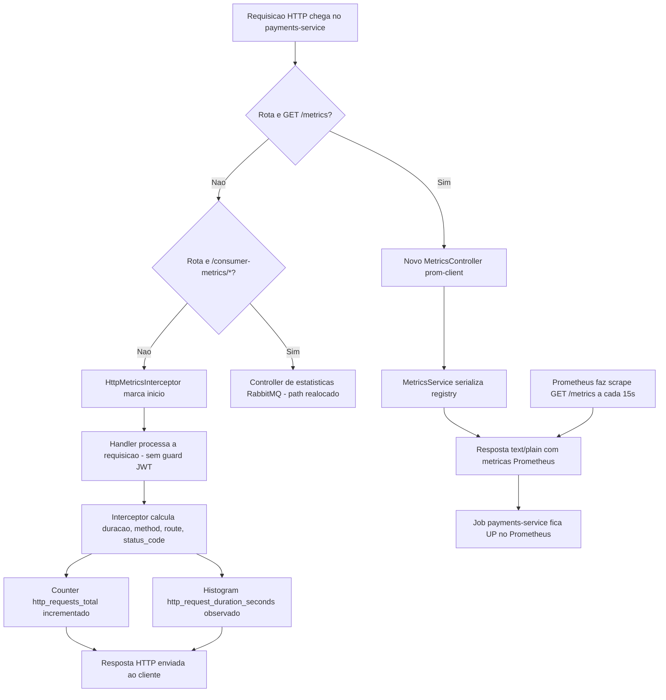

# Spec: Métricas HTTP com prom-client

## Contexto

A `observability-stack/` (ver `docs/specs/02-observability-stack-prometheus-grafana.md`, na raiz do repositório) já está no ar com Prometheus configurado para fazer scrape de `GET /metrics` em cada um dos 5 serviços a cada 15s, incluindo o job `payments-service` apontando para `host.docker.internal:3004/metrics`. Como nenhum serviço expõe esse endpoint no formato Prometheus ainda, o target `payments-service` aparece como `DOWN`.

O `payments-service` (porta 3004) é o único dos 5 serviços que **não possui nenhum guard de autenticação JWT**: não há `AuthModule`, `JwtAuthGuard` nem decorator `@Public()` neste serviço hoje — todas as rotas já são acessíveis sem token. Isso simplifica esta spec: o novo endpoint `/metrics` não precisa de nenhuma marcação especial para ficar público, pois nenhuma rota do serviço exige autenticação atualmente.

Existe, porém, um conflito de rota a resolver: o `payments-service` já expõe um `@Controller('metrics')` (`src/events/metrics/metrics.controller.ts`, registrado em `EventsModule`), com os endpoints `GET /metrics`, `GET /metrics/health`, `GET /metrics/summary` e `POST /metrics/reset`, usados para acompanhar as estatísticas do consumidor RabbitMQ de pagamentos (`PaymentConsumerService`). Como o `prometheus.yml` já está configurado (fora de escopo desta spec) para fazer scrape de `GET /metrics` esperando o formato de texto do Prometheus, e o path `/metrics` já responde hoje com um JSON de estatísticas de consumo, os dois não podem conviver no mesmo path.

Esta spec cobre exclusivamente a exposição de métricas técnicas de HTTP (contagem e duração de requisições) via `prom-client`, no formato que o Prometheus já está configurado para consumir — o que exige realocar o controller de métricas do consumidor RabbitMQ para outro path. Métricas de negócio (ex.: pagamentos aprovados/recusados) ficam para uma spec futura.

## Objetivo

Fazer o `payments-service` expor `GET /metrics` em formato Prometheus, contendo métricas HTTP (contagem e duração de requisições por método/rota/status) e as métricas padrão do Node.js, liberando o path `/metrics` do controller de estatísticas do consumidor RabbitMQ existente, de forma que o job `payments-service` no Prometheus passe a `UP`.

## Requisitos Funcionais

### RF01 — Dependência `prom-client`
Adicionar `prom-client` como dependência do `payments-service`.

### RF02 — `MetricsModule` global
Criar um módulo `MetricsModule`, marcado com `@Global()` e importado no `AppModule`, agrupando o serviço, o interceptor e o controller descritos abaixo — para que o `MetricsService` possa ser injetado em qualquer módulo sem reimportação explícita.

### RF03 — `MetricsService`
Deve existir um `MetricsService` responsável por:
- Manter um `Registry` próprio do `prom-client`.
- Registrar um `Counter` `http_requests_total`, com labels `method`, `route` e `status_code`, incrementado a cada requisição HTTP finalizada.
- Registrar um `Histogram` `http_request_duration_seconds`, com os mesmos labels, observando a duração de cada requisição HTTP em segundos.
- Habilitar a coleta das métricas padrão do processo Node.js (`collectDefaultMetrics`) no mesmo registry.
- Expor um método que retorne, de forma assíncrona, o conteúdo do registry serializado no formato de texto do Prometheus, junto do `Content-Type` correspondente.

### RF04 — `HttpMetricsInterceptor`
Deve existir um interceptor, registrado globalmente via `APP_INTERCEPTOR`, que para cada requisição HTTP:
- Marque o instante de início antes de a requisição seguir para o handler.
- Ao finalizar a resposta (sucesso ou erro), calcule a duração, obtenha `method`, o padrão de rota (não a URL crua — ex.: `/payments/:orderId`, não `/payments/123`, para não gerar séries com cardinalidade alta) e `status_code`.
- Incremente o `Counter` e observe a duração no `Histogram` do `MetricsService` com esses labels.
- **Não** processe a própria requisição a `GET /metrics` (ver RN01).

### RF05 — `MetricsController` (prom-client)
Deve existir um controller novo com `GET /metrics` que:
- Retorne o conteúdo produzido pelo `MetricsService` (RF03) com o `Content-Type` apropriado (`text/plain; version=0.0.4` ou o que o `prom-client` definir).
- Não exija autenticação — hoje nenhuma rota do serviço exige (ver Contexto).

### RF06 — Realocação do controller de estatísticas do consumidor RabbitMQ
O controller existente em `src/events/metrics/metrics.controller.ts` (`PaymentConsumerService`, estatísticas de consumo RabbitMQ) deve ser movido para um path que não conflite com o `/metrics` do prom-client — por exemplo, `/consumer-metrics` — preservando os 4 endpoints já existentes (`GET /`, `GET /health`, `GET /summary`, `POST /reset`) sob o novo prefixo, sem alterar seu comportamento interno.

### RF07 — Registro no `AppModule`
O `MetricsModule` deve ser importado em `src/app.module.ts`, junto dos demais módulos já existentes (`EventsModule`, `PaymentsModule`).

## Regras de Negócio

- RN01 — A requisição a `GET /metrics` não deve ser contabilizada nas próprias métricas HTTP (nem no `Counter`, nem no `Histogram`), para evitar que o endpoint de scrape polua a série que ele mesmo expõe.
- RN02 — O path `/metrics` passa a ser exclusivo do formato Prometheus (`prom-client`); qualquer estatística de consumo RabbitMQ que hoje vive em `/metrics` precisa estar sob outro prefixo (RF06) antes desta spec ser considerada concluída.
- RN03 — Nenhuma rota do `payments-service` exige JWT hoje; esta spec não introduz autenticação em `/metrics` nem em nenhuma outra rota — isso é responsabilidade de uma spec de autenticação futura, caso venha a existir.
- RN04 — O label `route` deve refletir o padrão de rota declarado no controller, não a URL literal recebida, para não gerar uma série de métrica por identificador único (ex.: `orderId`).

## Fora de Escopo

- Métricas de negócio (ex.: total de pagamentos aprovados/recusados, valor total processado) — spec futura.
- Adicionar autenticação (JWT ou qualquer outra) a qualquer rota do `payments-service`, incluindo `/metrics` — este serviço não possui guards hoje e esta spec não introduz nenhum.
- Dashboards no Grafana — spec futura.
- Qualquer alteração no Prometheus ou no Grafana (`observability-stack/`) — já configurados.
- Qualquer mudança de comportamento nos endpoints de estatísticas do consumidor RabbitMQ além da mudança de path (RF06).
- Tracing distribuído, logs estruturados ou correlação de request ID.
- Métricas de banco de dados (TypeORM/PostgreSQL) ou de mensageria (RabbitMQ, DLQ) — os endpoints existentes de consumo continuam expondo isso em JSON, fora do formato Prometheus.

## Fluxo da Implementação

## Tabela de Métricas Expostas

| Métrica | Tipo | Labels | Descrição |
|---|---|---|---|
| `http_requests_total` | Counter | `method`, `route`, `status_code` | Total de requisições HTTP processadas |
| `http_request_duration_seconds` | Histogram | `method`, `route`, `status_code` | Duração das requisições HTTP, em segundos |
| `process_cpu_*`, `process_resident_memory_bytes`, `nodejs_*`, etc. | Gauge/Counter (via `collectDefaultMetrics`) | — | Métricas padrão do processo Node.js (CPU, memória, event loop, GC) |

## Critérios de Aceite

- `curl http://localhost:3004/metrics` retorna `200 OK`, com corpo em formato texto do Prometheus contendo, no mínimo, `http_requests_total`, `http_request_duration_seconds` e alguma métrica com prefixo `process_` ou `nodejs_` — não mais o JSON de estatísticas de consumo.
- As estatísticas de consumo RabbitMQ antes disponíveis em `GET /metrics`, `GET /metrics/health`, `GET /metrics/summary` e `POST /metrics/reset` continuam funcionando sob o novo prefixo (ex.: `GET /consumer-metrics`, `GET /consumer-metrics/health`, `GET /consumer-metrics/summary`, `POST /consumer-metrics/reset`), sem alteração de comportamento.
- Após algumas requisições a rotas existentes (ex.: `GET /payments/:orderId`), o `curl` a `/metrics` mostra o `Counter` `http_requests_total` incrementado com os labels `method`, `route` e `status_code` corretos para essas rotas.
- Nenhuma série em `/metrics` referencia a rota `/metrics` (RN01) — o endpoint não se autocontabiliza.
- No Prometheus (`http://localhost:9090/targets`), o job `payments-service` aparece como `UP`.

## Referências

- `docs/specs/02-observability-stack-prometheus-grafana.md` — infraestrutura Prometheus/Grafana já configurada, jobs de scrape.
- `payments-service/src/events/metrics/metrics.controller.ts` — controller existente de estatísticas do consumidor RabbitMQ, a ser realocado (RF06).
- `products-service/docs/specs/02-validacao-jwt.md` — para referência do padrão de `JwtAuthGuard`/`@Public()` usado nos demais serviços, caso este serviço venha a adotar autenticação em spec futura (fora de escopo aqui).
- Documentação oficial: [prom-client](https://github.com/siimon/prom-client), [Prometheus - Histograms and summaries](https://prometheus.io/docs/practices/histograms/).
