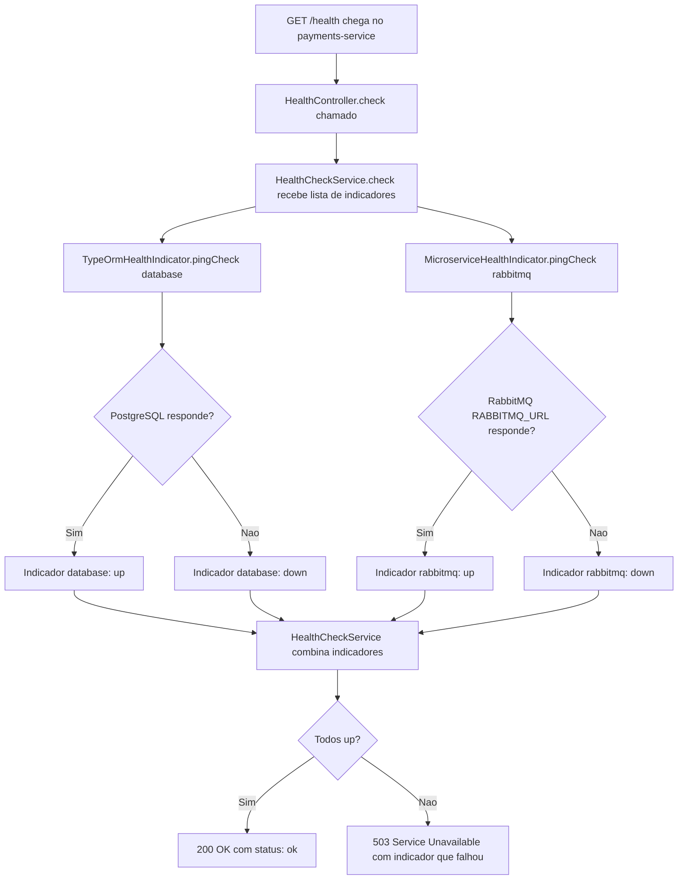

# Spec: Health Check com @nestjs/terminus (PostgreSQL + RabbitMQ)

## Contexto

O `payments-service` expõe hoje `GET /health` diretamente em `src/app.controller.ts` (`@Get('health') health() { return { status: 'ok' } }`), sem checagem real de dependência. O serviço não tem uma pasta `src/health/` ainda.

Existe também `GET /consumer-metrics/health` (`src/events/consumer-metrics/consumer-metrics.controller.ts`), que reporta a saúde do *consumo* da fila (taxa de sucesso, mensagens processadas nos últimos 5 minutos etc.) — um endpoint de negócio já específico, que não verifica conectividade de infraestrutura e **não é afetado** por esta spec.

O serviço depende de:
- **PostgreSQL** (`payments-service-db`, ver `src/config/database.config.ts`), via TypeORM.
- **RabbitMQ** (container `marketplace-rabbitmq`, ver `messaging-service/docker-compose.yml`), acessado via `amqplib` bruto em `src/events/rabbitmq/rabbitmq.service.ts` (`RabbitmqService`), configurado pela variável `RABBITMQ_URL` (ver `.env.example`) — é essa conexão que `PaymentConsumerService` usa para consumir a fila `payment.order` e processar pagamentos (ver `docs/specs/01-processamento-pagamento.md`).

## Objetivo

Fazer `GET /health` no `payments-service` verificar PostgreSQL e RabbitMQ, retornando `503 Service Unavailable` (com o indicador que falhou) se qualquer um dos dois estiver inacessível, e `200 OK` quando ambos estiverem saudáveis.

## Requisitos Funcionais

### RF01 — Dependência `@nestjs/terminus`
Adicionar `@nestjs/terminus` como dependência do `payments-service`.

### RF02 — Novo `HealthModule`
Criar `src/health/health.module.ts` e `src/health/health.controller.ts` (o serviço ainda não tem `src/health/`):
- `HealthModule` importa `TerminusModule` (de `@nestjs/terminus`) e declara `HealthController`.
- `HealthModule` é importado em `src/app.module.ts`.

### RF03 — `HealthController`
- Injeta `HealthCheckService`, `TypeOrmHealthIndicator` e `MicroserviceHealthIndicator` (todos de `@nestjs/terminus`).
- Expõe `GET /health`, decorado com `@HealthCheck()`.
- Delega a checagem a `HealthCheckService.check([...])` com dois indicadores:
  - `TypeOrmHealthIndicator.pingCheck('database', ...)` — conexão TypeORM já configurada no serviço.
  - `MicroserviceHealthIndicator.pingCheck('rabbitmq', ...)` — transporte `Transport.RMQ`, usando a mesma `RABBITMQ_URL` já configurada (ver `RabbitmqService`), com conexão de ping própria, independente da conexão de consumo usada por `PaymentConsumerService`.

### RF04 — Formato de resposta padrão do Terminus
Não customizar o corpo da resposta — usar o formato padrão do `@nestjs/terminus` (`status`, `info`, `error`, `details`).

### RF05 — Remoção do endpoint estático do `AppController`
Remover o método `health()` e o `@Get('health')` de `src/app.controller.ts` — a rota `/health` passa a ser servida exclusivamente pelo novo `HealthController`.

## Regras de Negócio

- RN01 — Uma falha em **qualquer um** dos dois indicadores (`database` ou `rabbitmq`) faz `/health` responder `503`.
- RN02 — A checagem do RabbitMQ é independente da conexão de consumo usada por `PaymentConsumerService` (RF03) — uma falha temporária no ping de health check não deve interromper o consumo da fila `payment.order`, e vice-versa.
- RN03 — `GET /consumer-metrics/health` (saúde do processamento de mensagens) e `GET /health` (saúde de infraestrutura) continuam sendo dois endpoints distintos, com propósitos diferentes — esta spec não unifica nem remove `/consumer-metrics/health`.

## Fora de Escopo

- `GET /consumer-metrics/health`, `GET /consumer-metrics` e `GET /consumer-metrics/summary` (`ConsumerMetricsController`) — endpoint de negócio já existente, fora do escopo desta spec.
- Readiness/liveness probes — conceito de Kubernetes, fora do escopo deste projeto.
- Alterações em `/metrics` ou no `MetricsModule` existente (`docs/specs/02-metricas-http-prometheus.md`).
- Alterações em `RabbitmqService`, `PaymentConsumerService` ou na fila `payment.order`.
- Alertas no Prometheus/Grafana sobre este serviço — cobertos pela spec `observability-stack/docs/specs/02-alerting-rules-prometheus.md`.

## Fluxo da Implementação

## Critérios de Aceite

- Com PostgreSQL e RabbitMQ no ar, `curl -i http://localhost:3004/health` retorna `200 OK`, com `"database":{"status":"up"}` e `"rabbitmq":{"status":"up"}`.
- Com o container `payments-service-db` parado, `curl -i http://localhost:3004/health` retorna `503`, com `"database":{"status":"down"}`.
- Com o container `marketplace-rabbitmq` parado, `curl -i http://localhost:3004/health` retorna `503`, com `"rabbitmq":{"status":"down"}`.
- `curl http://localhost:3004/consumer-metrics/health` continua funcionando exatamente como antes (nenhuma regressão).
- `src/app.controller.ts` não possui mais a rota `GET /health`.

## Referências

- `checkout-service/docs/specs/06-health-check-terminus.md` — mesmo padrão (PostgreSQL + RabbitMQ) no serviço irmão, mesma decisão de indicador de RabbitMQ.
- `docs/specs/01-processamento-pagamento.md` — consumo da fila `payment.order` via `PaymentConsumerService`.
- `src/events/rabbitmq/rabbitmq.service.ts` — conexão `amqplib` existente e variável `RABBITMQ_URL`.
- `src/events/consumer-metrics/consumer-metrics.controller.ts` — endpoint `/consumer-metrics/health` já existente, fora de escopo.
- Documentação oficial: [@nestjs/terminus — Microservice health check](https://docs.nestjs.com/recipes/terminus#microservice-health-check).
