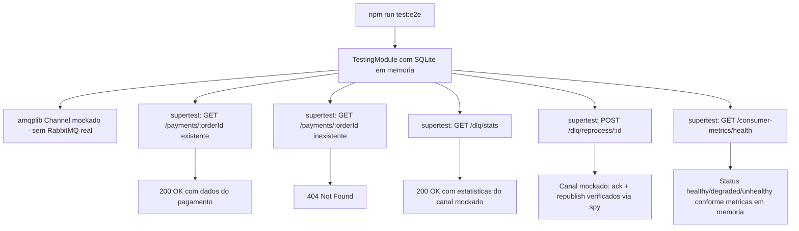

# Spec: Testes Automatizados (Unitários e de Integração)

## Contexto

O `payments-service` já tem testes unitários para `app.controller`, `payments/payments.service`, `payments/fake-payment-gateway.service`, os 3 arquivos de `metrics/`, `health/health.controller` e `events/payment-consumer/payment-consumer.service`. E e2e para `app`, `metrics`, `payments` e `health`. Faltam:

- Testes unitários de `payments/payments.controller.ts`, `events/dlq/dlq.service.ts`, `events/dlq/dlq.controller.ts`, `events/consumer-metrics/consumer-metrics.controller.ts` e `events/rabbitmq/rabbitmq.service.ts`.
- Testes e2e dos endpoints de DLQ e de consumer-metrics (hoje só `GET /payments/:orderId` e `/health` têm e2e).
- Os e2e dependem de PostgreSQL real para rodar.

Diferente dos demais serviços, o `payments-service` não tem `JwtAuthGuard`/módulo de autenticação — seus endpoints HTTP (`payments`, DLQ, consumer-metrics) não são protegidos por token, por design (serviço consumido internamente, não exposto a clientes finais via `api-gateway` da mesma forma). Este documento não adiciona autenticação; apenas testa o comportamento atual.

## Objetivo

Fechar as lacunas de teste unitário e e2e listadas acima e migrar os e2e para SQLite em memória, mockando RabbitMQ/`amqplib` em todos os testes, sem depender de PostgreSQL ou RabbitMQ reais.

## Requisitos Funcionais

### RF01 — Banco SQLite em memória exclusivo para testes
Adicionar `better-sqlite3` como devDependency e um `TypeOrmModule` de teste (SQLite em memória, `synchronize: true`) usado somente pelos `*.e2e-spec.ts`, sem alterar `src/config/database.config.ts` nem o `docker-compose.yaml`.

### RF02 — Teste unitário de `PaymentsController`
Criar `src/payments/payments.controller.spec.ts`, mockando `PaymentsService`, cobrindo `GET /payments/:orderId` (sucesso e `404`).

### RF03 — Teste unitário de `DlqService` e `DlqController`
Criar `src/events/dlq/dlq.service.spec.ts` e `src/events/dlq/dlq.controller.spec.ts`, com o canal `amqplib` (`amqp.Channel`) mockado, cobrindo `getStats`, `peekMessages`, `reprocessMessage`, `reprocessAll` e `discardMessage`.

### RF04 — Teste unitário de `ConsumerMetricsController`
Criar `src/events/consumer-metrics/consumer-metrics.controller.spec.ts`, cobrindo a lógica de status derivado em `getHealth()` (healthy/degraded/unhealthy conforme taxa de sucesso e tempo desde o último processamento).

### RF05 — Teste unitário de `RabbitmqService`
Criar `src/events/rabbitmq/rabbitmq.service.spec.ts`, com conexão/canal `amqplib` mockados.

### RF06 — E2E de DLQ e consumer-metrics
Criar `test/dlq.e2e-spec.ts` e `test/consumer-metrics.e2e-spec.ts`, com `amqplib`/`RabbitmqService` mockados, cobrindo os endpoints HTTP existentes desses dois módulos.

## Regras de Negócio

- RN01 — Nenhum teste depende de PostgreSQL ou RabbitMQ reais; toda interação com `amqplib` (conexão, canal, publish, consume) é mockada.
- RN02 — `PaymentConsumerService`/`DlqService`/`RabbitmqService` usam mocks/stubs de canal (`amqp.Channel`) tanto nos testes unitários quanto nos e2e.

## Fluxo da Implementação

## Critérios de Aceite

- `npm test`, `npm run test:e2e` e `npm run test:cov` passam sem PostgreSQL ou RabbitMQ reais em execução.
- `payments.controller.spec.ts`, `dlq.service.spec.ts`, `dlq.controller.spec.ts`, `consumer-metrics.controller.spec.ts` e `rabbitmq.service.spec.ts` existem e cobrem os cenários acima.
- `dlq.e2e-spec.ts` e `consumer-metrics.e2e-spec.ts` existem e cobrem os endpoints HTTP existentes.

## Fora de Escopo

- Alteração de código de produção, incluindo não adicionar autenticação aos endpoints (fora do escopo desta atividade).
- Migração real de PostgreSQL para SQLite em dev/produção.
- Testes de carga/performance.
- Testes e2e cross-service.

## Referências

- `src/payments/payments.service.ts`, `src/payments/fake-payment-gateway.service.ts` — já cobertos, referência de padrão.
- `src/events/dlq/dlq.service.ts`, `src/events/consumer-metrics/consumer-metrics.controller.ts`, `src/events/rabbitmq/rabbitmq.service.ts` — lacunas a cobrir.
- `docs/specs/01-processamento-pagamento.md` — especificação original das regras de negócio testadas aqui.
