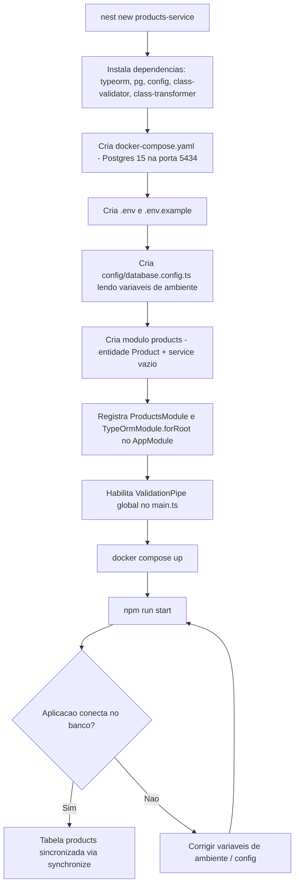

# Spec: Scaffold do products-service

## Contexto

O projeto `marketplace-ms` já possui os seguintes microsserviços:

| Serviço | Porta | Responsabilidade |
|---|---|---|
| api-gateway | 3005 | Roteamento, auth, resiliência |
| users-service | 3000 | Gerenciar usuários |
| checkout-service | 3003 | Carrinho e pedidos |
| payments-service | 3004 | Pagamentos |
| messaging-service | - | Infra RabbitMQ |
| **products-service** | **3001** | **Gerenciar catálogo de produtos (a criar)** |

O `products-service` ainda não existe além do scaffold básico gerado pelo Nest CLI (`nest new`). Esta spec define o que falta para que o projeto tenha uma base funcional mínima — banco de dados, conexão, módulo de domínio e validação global — sem ainda expor nenhum endpoint. Este é um projeto de curso: a stack e a estrutura devem seguir o mesmo padrão já estabelecido nos demais serviços, com o `users-service` como referência mais próxima (mesmo tipo de recurso de domínio simples, sem dependências de outros serviços no banco).

## Objetivo

Deixar o `products-service` no mesmo nível de maturidade estrutural dos demais serviços (conexão com banco funcionando, projeto rodável localmente via Docker Compose, validação global ativa), pronto para que endpoints e regras de negócio sejam adicionados em specs futuras.

## Requisitos Funcionais

### RF01 — Dependências do projeto
O projeto deve ter as seguintes dependências adicionadas ao scaffold já criado pelo Nest CLI:
- `@nestjs/typeorm` e `typeorm` — ORM e integração com NestJS
- `pg` — driver PostgreSQL
- `@nestjs/config` — carregamento de variáveis de ambiente
- `class-validator` e `class-transformer` — suporte ao `ValidationPipe`

Não devem ser adicionadas dependências de autenticação, mensageria ou de outros domínios (JWT, passport, bcrypt, amqp) nesta etapa — ficam para specs futuras, se necessário.

### RF02 — Docker Compose com PostgreSQL 15
Deve existir um `docker-compose.yaml` na raiz do `products-service` subindo um container PostgreSQL 15, seguindo o mesmo formato usado nos demais serviços:
- Imagem: `postgres:15`
- Nome do container: `products-db`
- Database: `products_db`
- Usuário/senha: `postgres` / `postgres`
- Porta exposta no host: `5434` (mapeada para `5432` no container)
- Volume nomeado para persistência dos dados
- Rede dedicada (bridge), seguindo o padrão `<serviço>-network`

### RF03 — Configuração de conexão com banco via variáveis de ambiente
A conexão com o banco deve ser inteiramente configurável por variáveis de ambiente (sem valores sensíveis hardcoded), seguindo o padrão dos demais serviços:
- Arquivo `.env` (valores reais de desenvolvimento, não versionado) e `.env.example` (chaves em branco, versionado)
- Variáveis: `PORT`, `NODE_ENV`, `DB_HOST`, `DB_PORT`, `DB_USERNAME`, `DB_PASSWORD`, `DB_DATABASE`
- A aplicação NestJS deve carregar essas variáveis e configurar o `TypeOrmModule` a partir delas, com fallback sensato para desenvolvimento local (mesmo padrão do `database.config.ts` dos demais serviços)
- Em ambiente de desenvolvimento, o schema do banco é sincronizado automaticamente a partir das entidades (sem uso de migrations nesta etapa — mesmo padrão dos outros serviços)

### RF04 — Módulo de produtos (estrutura de domínio)
Deve existir um módulo `products` dentro de `src/`, contendo:
- A entidade `Product` (ver estrutura de dados abaixo), registrada no `TypeOrmModule.forFeature`
- O módulo deve ser importado no `AppModule`
- **Não** deve conter controllers nem endpoints HTTP nesta etapa — apenas a estrutura de módulo, entidade e (se necessário para o módulo compilar) um service vazio. Endpoints ficam para uma spec futura.

### RF05 — Validação global
A aplicação deve habilitar um `ValidationPipe` global no bootstrap (`main.ts`), com as mesmas opções usadas nos demais serviços: transformação automática de payloads, remoção de propriedades não declaradas nos DTOs e rejeição de propriedades não esperadas.

## Estrutura de Dados

### Entidade: Product

| Campo | Tipo | Regras |
|---|---|---|
| `id` | UUID | Chave primária, gerado automaticamente |
| `name` | string (255) | Obrigatório |
| `description` | text | Obrigatório |
| `price` | decimal (10,2) | Obrigatório |
| `stock` | int | Obrigatório, default `0` |
| `sellerId` | UUID | Obrigatório — referência ao usuário vendedor no `users-service`; **sem foreign key**, pois cada serviço tem seu próprio banco |
| `isActive` | boolean | Obrigatório, default `true` |
| `createdAt` | timestamp | Gerado automaticamente na criação |
| `updatedAt` | timestamp | Atualizado automaticamente a cada alteração |

Não há, nesta etapa, relacionamentos com outras entidades nem validação de que `sellerId` corresponda a um usuário existente.

## Fluxo da Implementação

## Fora de Escopo

- Endpoints REST (controllers, DTOs de request/response)
- Autenticação, autorização ou validação de que o `sellerId` existe no `users-service`
- Migrations (usa-se `synchronize` em desenvolvimento, como nos demais serviços)
- Integração com RabbitMQ/eventos
- Categorias, imagens, avaliações ou qualquer outro campo além dos listados na estrutura de dados
- Testes automatizados além do que o Nest CLI já gera por padrão

## Critérios de Aceite

- `docker compose up` na pasta `products-service` sobe um PostgreSQL 15 acessível em `localhost:5434`, database `products_db`
- A aplicação NestJS sobe na porta `3001`, conecta no banco usando as variáveis de ambiente e sincroniza a tabela `products` a partir da entidade `Product`
- A tabela `products` no banco possui exatamente as colunas descritas na estrutura de dados (`id`, `name`, `description`, `price`, `stock`, `sellerId`, `isActive`, `createdAt`, `updatedAt`), sem chave estrangeira para outra tabela
- O `ValidationPipe` global está ativo
- O módulo `products` existe, compila e está importado no `AppModule`, sem expor nenhuma rota

## Referências

- Padrão de referência principal: `users-service` (`docker-compose.yaml`, `src/config/database.config.ts`, `src/main.ts`, `docs/specs/01-scaffold.md`)
