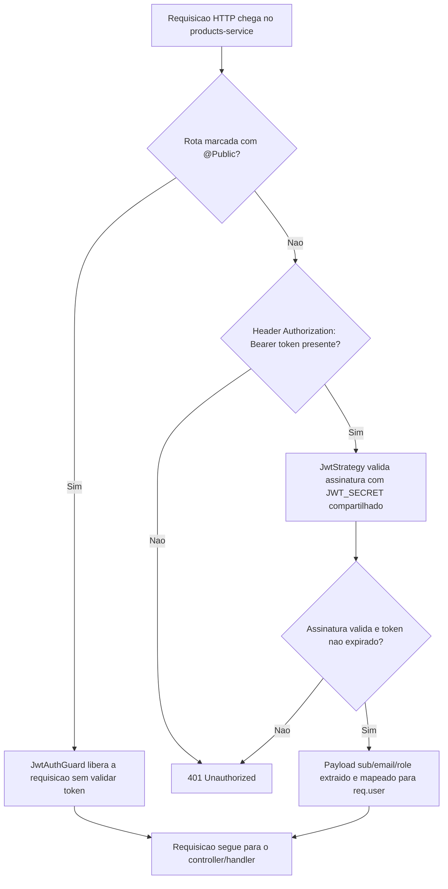

# Spec: Validação de JWT no products-service

## Contexto

O `users-service` (porta 3000) já possui login funcional e emite tokens JWT assinados com um `JWT_SECRET`, contendo o payload `{ sub: UUID, email: string, role: "seller" | "buyer" }`. O `products-service` (porta 3001) já possui scaffold, Docker Compose com PostgreSQL, TypeORM configurado e a entidade `Product` (ver `01-scaffold.md`), mas ainda não expõe nenhum endpoint HTTP e não possui nenhuma camada de autenticação.

À medida que endpoints de catálogo forem adicionados ao `products-service` em specs futuras, será preciso restringir o acesso a usuários autenticados. Como o `JWT_SECRET` é compartilhado entre os serviços, o `products-service` pode validar localmente os tokens emitidos pelo `users-service`, sem precisar chamar esse serviço em cada requisição.

Esta spec cobre **apenas a validação de tokens** — o `products-service` não emite tokens, não faz login nem registro. Essas responsabilidades permanecem exclusivamente no `users-service`.

## Objetivo

Adicionar ao `products-service` a infraestrutura de autenticação necessária para que qualquer endpoint futuro possa exigir um JWT válido, seguindo exatamente o mesmo padrão já implementado no `users-service` (`AuthModule`, `JwtStrategy`, `JwtAuthGuard`, decorator `@Public()`), com o guard aplicado globalmente por padrão.

## Requisitos Funcionais

### RF01 — Estratégia de validação de JWT (`JwtStrategy`)
Deve existir uma estratégia Passport que:
- Extraia o token do header `Authorization: Bearer <token>` da requisição
- Valide a assinatura do token usando o mesmo `JWT_SECRET` configurado no `users-service` (via variável de ambiente)
- Valide automaticamente a expiração do token, rejeitando tokens expirados
- A partir do payload validado (`sub`, `email`, `role`), disponibilize os dados do usuário autenticado em `req.user`, com os campos `id` (a partir de `sub`), `email` e `role`

### RF02 — Guard global de autenticação (`JwtAuthGuard`)
Deve existir um guard que:
- Utilize a `JwtStrategy` para validar o token em toda requisição
- Seja registrado como guard **global** da aplicação (via `APP_GUARD`), de forma que toda rota exija autenticação por padrão, sem necessidade de aplicar o guard manualmente em cada controller
- Reconheça rotas marcadas como públicas (ver RF03) e, nesse caso, permita a requisição sem exigir token

### RF03 — Decorator `@Public()`
Deve existir um decorator que permita marcar um handler ou controller inteiro como não protegido, para casos em que uma rota não deva exigir autenticação (ex.: health check). O `JwtAuthGuard` deve respeitar essa marcação.

### RF04 — Módulo de autenticação (`AuthModule`)
Deve existir um módulo dedicado à autenticação, agrupando `JwtStrategy` e o registro global do `JwtAuthGuard`, importado no `AppModule`. Esse módulo:
- **Não** deve conter controller, endpoint, service de login/registro ou qualquer lógica de emissão de token
- Deve seguir a mesma organização de pastas usada no `users-service` (estratégia, guard e decorator em subpastas dedicadas dentro de `auth/`)

### RF05 — Configuração do segredo compartilhado
O `JWT_SECRET` deve ser lido de variável de ambiente, seguindo o mesmo padrão de configuração já usado para as demais variáveis do `products-service` (`.env` / `.env.example`). O valor usado em desenvolvimento deve ser idêntico ao configurado no `users-service`, para que tokens emitidos por um serviço sejam válidos no outro.

## Fora de Escopo

- Endpoints de login, registro, refresh token ou logout (permanecem no `users-service`)
- Emissão ou assinatura de tokens pelo `products-service`
- `RoleGuard` ou qualquer verificação de autorização por `role` — a checagem de `role` (ex.: exigir `seller`) será feita diretamente nos controllers/services de cada endpoint, em specs futuras
- Qualquer endpoint de catálogo (`products`) protegido pelo guard — a aplicação do guard/decorator em rotas concretas acontece quando essas rotas forem criadas
- Comunicação entre serviços (chamadas HTTP do `products-service` ao `users-service`) — a validação é feita localmente a partir do segredo compartilhado

## Fluxo da Implementação

## Critérios de Aceite

- Uma requisição a uma rota protegida sem header `Authorization` retorna `401 Unauthorized`
- Uma requisição a uma rota protegida com um JWT inválido (assinatura incorreta) retorna `401 Unauthorized`
- Uma requisição a uma rota protegida com um JWT expirado retorna `401 Unauthorized`
- Uma requisição a uma rota protegida com um JWT válido, emitido pelo `users-service` e assinado com o `JWT_SECRET` compartilhado, é autorizada e o handler recebe `req.user` com `id`, `email` e `role` extraídos do payload
- Uma rota marcada com `@Public()` é acessível sem token, mesmo com o guard global ativo
- O `products-service` não expõe nenhuma rota de login, registro ou emissão de token
- Nenhum `RoleGuard` ou verificação de `role` é adicionada nesta etapa

## Referências

- Padrão de referência: `users-service/src/auth` (`auth.module.ts`, `strategies/jwt.strategy.ts`, `guards/jwt-auth.guard.ts`, `decorators/public.decorator.ts`)
- `products-service/docs/specs/01-scaffold.md` — scaffold base sobre o qual esta spec é implementada
