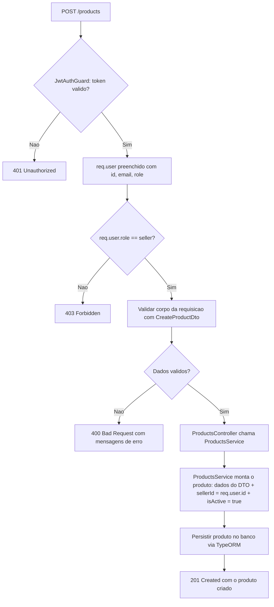

# Spec: Criação de Produto

## Contexto

O `products-service` já possui scaffold, PostgreSQL configurado via TypeORM e a entidade `Product` (`id`, `name`, `description`, `price`, `stock`, `sellerId`, `isActive`, `createdAt`, `updatedAt`), definida em `01-scaffold.md`. A validação de JWT também já está em funcionamento (`02-validacao-jwt.md`): o `JwtAuthGuard` é global, rotas podem ser marcadas como públicas com `@Public()`, e toda requisição autenticada recebe `req.user` com `id`, `email` e `role` extraídos do token emitido pelo `users-service`.

Esta spec cobre o primeiro endpoint de catálogo: o cadastro de um novo produto por um vendedor autenticado. Até aqui o `products-service` não expõe nenhuma rota de negócio — apenas a infraestrutura de autenticação.

## Objetivo

Permitir que um usuário autenticado com `role` igual a `"seller"` cadastre um novo produto, associado automaticamente a ele como vendedor.

## Requisitos Funcionais

### RF01 — Endpoint de criação de produto
Deve existir um endpoint `POST /products`, protegido pelo `JwtAuthGuard` (sem `@Public()`), que recebe os dados de um produto e o cadastra no banco de dados.

### RF02 — Vendedor extraído do token, não do corpo da requisição
O `sellerId` do produto criado deve ser sempre o `id` do usuário autenticado (`req.user.id`), extraído do JWT validado. O corpo da requisição não deve conter nem aceitar um campo de vendedor — qualquer valor de vendedor enviado no corpo é ignorado.

### RF03 — Restrição por papel (`role`)
Apenas usuários cujo `req.user.role` seja `"seller"` podem criar produtos. Se o usuário autenticado tiver `role` diferente de `"seller"` (ex.: `"buyer"`), a requisição deve ser rejeitada com `403 Forbidden`, sem criar nenhum registro.

### RF04 — Produto criado sempre ativo
Todo produto criado por este endpoint deve ter `isActive` definido automaticamente como `true`, independentemente de qualquer valor enviado na requisição.

### RF05 — Validação dos dados de entrada
Os dados recebidos no corpo da requisição devem ser validados antes da criação do produto. Uma requisição com dados inválidos deve ser rejeitada com `400 Bad Request` e mensagens de erro claras, indicando qual campo é inválido e por quê.

### RF06 — Estrutura e registro dos componentes
A lógica de criação deve ser implementada em um `ProductsService` (persistência) e exposta por um `ProductsController` (rota HTTP), ambos registrados no `ProductsModule` já existente, seguindo o mesmo padrão arquitetural dos demais serviços do projeto.

## Estrutura de Dados

### DTO de criação de produto (corpo da requisição)

| Campo | Tipo | Obrigatório | Regras |
|---|---|---|---|
| `name` | string | Sim | Máximo de 255 caracteres |
| `description` | string | Sim | Texto livre |
| `price` | number | Sim | Decimal com até 2 casas, valor mínimo `0.01` |
| `stock` | number | Sim | Inteiro, valor mínimo `0` |

O DTO **não** inclui `sellerId` nem `isActive` — ambos são determinados pelo servidor (RF02 e RF04), nunca pelo cliente.

## Respostas Esperadas

| Situação | Status |
|---|---|
| Produto criado com sucesso | `201 Created` |
| Corpo da requisição com dados inválidos (campo ausente, tipo errado, fora dos limites) | `400 Bad Request` |
| Requisição sem token ou com token inválido/expirado | `401 Unauthorized` |
| Usuário autenticado não possui `role` `"seller"` | `403 Forbidden` |

## Fora de Escopo

- Endpoints de consulta (listagem, busca por id), atualização ou remoção de produtos — ficam para specs futuras
- Upload ou associação de imagens ao produto
- Categorias ou qualquer taxonomia de produtos
- Qualquer alteração na entidade `Product` além do já definido em `01-scaffold.md`

## Fluxo da Implementação

## Critérios de Aceite

- Uma requisição `POST /products` sem header `Authorization` retorna `401 Unauthorized`
- Uma requisição `POST /products` com JWT válido, mas de um usuário com `role` `"buyer"`, retorna `403 Forbidden` e nenhum produto é criado
- Uma requisição `POST /products` com JWT válido de um usuário `"seller"` e corpo válido retorna `201 Created` com os dados do produto criado
- O produto criado tem `sellerId` igual ao `id` do usuário autenticado, mesmo que a requisição tente enviar outro valor de vendedor no corpo
- O produto criado tem `isActive` igual a `true`, mesmo que a requisição tente enviar outro valor para esse campo
- Uma requisição com `name` ausente ou com mais de 255 caracteres retorna `400 Bad Request`
- Uma requisição com `price` ausente, negativo, zero ou com mais de 2 casas decimais retorna `400 Bad Request`
- Uma requisição com `stock` ausente, negativo ou não inteiro retorna `400 Bad Request`
- Uma requisição com `description` ausente retorna `400 Bad Request`

## Referências

- `products-service/docs/specs/01-scaffold.md` — entidade `Product` sobre a qual esta spec é implementada
- `products-service/docs/specs/02-validacao-jwt.md` — infraestrutura de autenticação (`JwtAuthGuard`, `req.user`) usada por este endpoint
