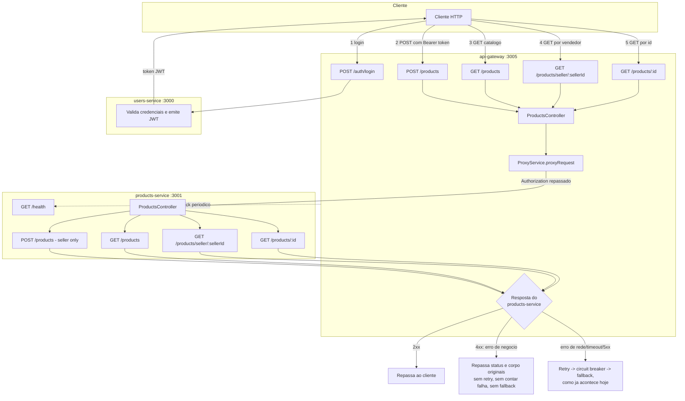

# Spec: Catálogo de Produtos e Integração com o API Gateway

> Esta spec substitui e consolida `04-consulta-produtos.md` (já implementada e mergeada) e `05-integracao-api-gateway.md` (implementação em andamento), reunindo as duas frentes — consulta ao catálogo e integração com o `api-gateway` — num único documento, e acrescenta a correção de um bug encontrado durante a verificação manual da integração.

## Contexto

O `products-service` já possui a entidade `Product` (`id`, `name`, `description`, `price`, `stock`, `sellerId`, `isActive`, `createdAt`, `updatedAt`, definida em `01-scaffold.md`), autenticação JWT global via `JwtAuthGuard` com suporte a rotas públicas via `@Public()` (`02-validacao-jwt.md`), e o endpoint `POST /products` para cadastro de produtos por vendedores autenticados (`03-criacao-produto.md`).

Esta spec cobre três frentes:

1. **Consulta ao catálogo** — três endpoints públicos de consulta no `products-service` (listagem, por vendedor, por id)
2. **Integração ponta a ponta com o `api-gateway`** — health check, Swagger, e um `ProductsController` no gateway que hoje não existe (o `api-gateway`, porta 3005, já tem a infraestrutura genérica de proxy — `ProxyService` com circuit breaker, retry, timeout e fallback, health check periódico, Swagger e `PRODUCTS_SERVICE_URL` configurado — mas nada nele expõe rotas `/products/*`; o padrão a seguir já existe para outro serviço em `UsersController`, `api-gateway/src/users/users.controller.ts`)
3. **Correção de um bug de resiliência descoberto na verificação manual da integração** — o `CircuitBreakerService` do gateway (`api-gateway/src/common/circuit-breaker/circuit-breaker.service.ts`) trata **qualquer** erro lançado pela chamada ao serviço downstream — inclusive uma resposta HTTP de erro legítima, como um `404` de `GET /products/:id` inexistente ou um `403` de `POST /products` com papel errado — como falha de infraestrutura. Isso faz o `RetryService` tentar de novo uma requisição que já teve resposta definitiva, conta como falha no circuit breaker, e por fim aciona o fallback genérico (`api-gateway/src/common/fallback/`), substituindo a resposta real do `products-service` por um corpo genérico e um status `200` (ou um erro `500` opaco), mascarando o resultado real da operação. Isso foi verificado manualmente: `GET /products/:id` via gateway com um id inexistente retornou `200` com `{"products":[],"total":0,"page":1,"limit":10}` em vez de `404`.

## Objetivo

Permitir que qualquer cliente, autenticado ou não, consulte o catálogo de produtos ativos; fechar a integração entre `api-gateway` e `products-service` de ponta a ponta (login → criação → consulta, tudo via porta 3005); e garantir que respostas de erro HTTP legítimas do `products-service` cheguem ao cliente final sem serem mascaradas pela camada de resiliência do gateway.

## Requisitos Funcionais

### No `products-service`

#### RF01 — Listagem de todos os produtos ativos
Deve existir um endpoint `GET /products`, público (`@Public()`), que retorna todos os produtos com `isActive` igual a `true`, ordenados por `createdAt` de forma decrescente (mais recentes primeiro).

#### RF02 — Listagem de produtos por vendedor
Deve existir um endpoint `GET /products/seller/:sellerId`, público (`@Public()`), que retorna todos os produtos com `isActive` igual a `true` cujo `sellerId` corresponda ao parâmetro informado. Se o vendedor não tiver nenhum produto ativo, o endpoint retorna uma lista vazia (não é um erro).

#### RF03 — Consulta de um produto por id
Deve existir um endpoint `GET /products/:id`, público (`@Public()`), que retorna os dados de um único produto pelo seu `id`. Se não existir produto com o `id` informado, a requisição é rejeitada com `404 Not Found`. Este endpoint não filtra por `isActive`: um produto inativo consultado diretamente por id ainda é retornado.

#### RF04 — Ordem de declaração das rotas no `products-service`
Como o roteamento do NestJS resolve rotas na ordem em que são declaradas, a rota `GET /products/seller/:sellerId` deve ser declarada antes de `GET /products/:id` no `ProductsController` do `products-service`, para que `seller` não seja interpretado como valor de `:id`.

#### RF05 — Endpoint de health check
Deve existir um endpoint `GET /health`, público (sem exigir token), que responde com o status do serviço. É consultado periodicamente pelo `HealthCheckService` do gateway, que hoje já tenta acessar `<PRODUCTS_SERVICE_URL>/health` para compor o status geral do sistema.

#### RF06 — Documentação Swagger/OpenAPI
O `products-service` deve expor documentação OpenAPI gerada automaticamente, acessível em `/api`, com título "Products Service" e versão "1.0". A documentação deve descrever o esquema de autenticação Bearer (JWT), para refletir que os endpoints de escrita exigem token.

### No `api-gateway`

#### RF07 — Rotas de produtos expostas pelo gateway
Deve existir, no `api-gateway`, um controller de produtos que expõe as mesmas operações já implementadas no `products-service`, repassando cada requisição via `ProxyService` (mesmo padrão do `UsersController`):

- `POST /products` — cria um produto; rota protegida (exige token JWT válido no gateway), repassando o header `Authorization` para o `products-service`, que continua sendo responsável pela checagem de papel (`role` `"seller"`)
- `GET /products` — lista o catálogo de produtos ativos; rota pública no gateway
- `GET /products/seller/:sellerId` — lista produtos ativos de um vendedor; rota pública no gateway
- `GET /products/:id` — retorna um produto específico; rota pública no gateway

A ordem de declaração das rotas segue a mesma regra do RF04: `seller/:sellerId` antes de `:id`.

#### RF08 — Configuração da URL do serviço
A variável `PRODUCTS_SERVICE_URL` já configurada em `api-gateway/.env` e usada em `gateway.config.ts` deve continuar sendo a única fonte da URL do `products-service` — nenhuma URL deve ser hardcoded no novo controller.

#### RF09 — Repasse do header de autenticação
Toda requisição encaminhada ao `products-service` que exija autenticação (`POST /products`) deve repassar o header `Authorization` recebido pelo gateway, sem modificação, para que o `products-service` valide o mesmo token JWT e identifique o vendedor autor da requisição.

#### RF10 — Repasse de erros HTTP legítimos do serviço (correção do bug encontrado)
Quando o `products-service` responder com um erro HTTP de negócio (qualquer `4xx` — por exemplo, `404` de `GET /products/:id` inexistente, `403` de `POST /products` com papel diferente de `seller`, ou `400` de dados inválidos), o gateway deve repassar ao cliente exatamente o status code e o corpo da resposta original, sem substituí-los pela resposta de fallback.

#### RF11 — Erros 4xx não contam como falha de circuit breaker
Um erro HTTP `4xx` recebido do `products-service` é um resultado de negócio válido, não uma indisponibilidade do serviço. Portanto, não deve incrementar o contador de falhas do circuit breaker nem contribuir para abrir o circuito para esse serviço.

#### RF12 — Erros 4xx não disparam nova tentativa (retry)
Uma resposta `4xx` do `products-service` é definitiva — o servidor já processou e recusou a requisição, e tentar de novo não pode produzir um resultado diferente. Esses erros não devem acionar o mecanismo de retry do gateway.

#### RF13 — Fallback continua válido para falhas reais de infraestrutura
Falhas de rede, timeout, indisponibilidade de conexão, ou respostas `5xx` do `products-service` continuam sendo tratadas como falha real de serviço: disparam retry, contam como falha no circuit breaker e, se aplicável, acionam a resposta de fallback — esse comportamento já existe hoje e não muda.

## Estrutura de Dados

Nenhum DTO de entrada é necessário para os endpoints de consulta: eles não recebem corpo de requisição. `GET /products/seller/:sellerId` e `GET /products/:id` recebem o identificador via parâmetro de rota (`sellerId` e `id`, ambos UUID). A resposta de cada endpoint é composta pelos campos já existentes na entidade `Product` (`id`, `name`, `description`, `price`, `stock`, `sellerId`, `isActive`, `createdAt`, `updatedAt`), sem transformação ou omissão de campos.

### Resposta de `GET /health` (products-service)

| Campo | Tipo | Descrição |
|---|---|---|
| `status` | string | Sempre `"ok"` quando o serviço está no ar |
| `service` | string | Sempre `"products-service"` |

Nenhum outro dado de entrada ou saída é alterado por esta spec: os endpoints `/products/*` no gateway repassam integralmente o corpo, os parâmetros de rota e as respostas já definidas em `03-criacao-produto.md`.

## Fluxo da Implementação

## Respostas Esperadas

| Situação | Status |
|---|---|
| `GET /products`, `GET /products/seller/:sellerId` — lista retornada (vazia ou não) | `200 OK` |
| `GET /products/:id` — produto encontrado | `200 OK` |
| `GET /products/:id` — produto não encontrado (direto no `products-service` ou via gateway) | `404 Not Found` |
| `GET /health` no `products-service` | `200 OK` |
| Fluxo completo via gateway (login → criação → consulta) executado com sucesso | `200`/`201` em cada etapa |
| `POST /products` via gateway sem token | `401 Unauthorized` |
| `POST /products` via gateway com token de usuário que não é `seller` | `403 Forbidden` (repassado do `products-service`, não mascarado) |

## Fora de Escopo

- Paginação, filtros (ex.: por faixa de preço), busca textual, atualização (`PUT`/`PATCH`) ou remoção (`DELETE`) de produtos
- Qualquer alteração na entidade `Product` além do já definido em `01-scaffold.md`
- Qualquer alteração nos guards de autenticação do gateway (`JwtAuthGuard`, `@Public()`)
- Novas regras de negócio no `products-service` além do endpoint de health
- Testes de carga ou métricas de observabilidade além do já existente
- A correção do RF10–RF13 é feita no mecanismo genérico de proxy (`ProxyService`, `CircuitBreakerService`, `RetryService`), portanto beneficia qualquer serviço futuro roteado pelo gateway — mas a validação de aceite desta spec cobre apenas o fluxo de `products`
- Rotas `/auth/*` e `/users/*` do gateway, que hoje não passam pelo `ProxyService`, não são alteradas por esta spec

## Critérios de Aceite

- Uma requisição `GET /products` retorna apenas produtos com `isActive` igual a `true`, ordenados do mais recente para o mais antigo
- Uma requisição `GET /products/seller/:sellerId` retorna apenas produtos ativos daquele vendedor, ou lista vazia se ele não tiver produtos
- Uma requisição `GET /products/:id` com um id existente retorna `200` com os dados do produto; com um id inexistente retorna `404`
- `GET /products/seller/:sellerId` continua funcionando corretamente e não é capturado pela rota `GET /products/:id`
- Com o `products-service` no ar, `GET http://localhost:3001/health` responde `200` com `{ status: "ok", service: "products-service" }`
- Com o `products-service` no ar, `GET http://localhost:3001/api` carrega a documentação Swagger, listando os endpoints de produtos e o esquema Bearer Auth
- O painel de health do gateway (`GET /health/services` no api-gateway) reporta o serviço `products` como saudável quando o `products-service` está no ar
- Via gateway (porta 3005): `POST /auth/login` com credenciais de um vendedor retorna um token JWT válido
- Via gateway: `POST /products` com o token do vendedor no header `Authorization` cria o produto e retorna `201`, com o produto refletindo `sellerId` do usuário autenticado
- Via gateway: `POST /products` sem header `Authorization` retorna `401`
- Via gateway: `GET /products`, `GET /products/seller/:sellerId` e `GET /products/:id` (existente) sem token retornam `200`
- **Via gateway: `GET /products/:id` com um id inexistente retorna `404`, com o mesmo corpo de erro que o `products-service` retornaria diretamente — não a resposta de fallback genérica** (critério que valida a correção do bug)
- **Via gateway: `POST /products` com token válido de um usuário que não é `seller` retorna `403`, não um erro genérico de serviço indisponível**
- O log do gateway não registra tentativas de retry nem incremento de falha do circuit breaker para uma resposta `4xx` do `products-service`
- Nenhuma requisição às rotas de produtos via gateway acessa o `products-service` na porta 3001 diretamente — todo o fluxo passa pela porta 3005

## Referências

- `products-service/docs/specs/01-scaffold.md` — entidade `Product`
- `products-service/docs/specs/02-validacao-jwt.md` — infraestrutura de autenticação do `products-service`
- `products-service/docs/specs/03-criacao-produto.md` — endpoint `POST /products`
- `api-gateway/src/users/users.controller.ts` — padrão de controller proxy replicado para produtos
- `api-gateway/src/config/gateway.config.ts` — configuração de URL e timeout por serviço
- `api-gateway/src/common/circuit-breaker/circuit-breaker.service.ts` — onde o bug de mascaramento de erros 4xx foi identificado
- `api-gateway/src/common/retry/retry.service.ts` — retry sem distinção entre falha de infraestrutura e erro de negócio
- `api-gateway/src/common/fallback/` — fallback genérico acionado indevidamente para erros 4xx
