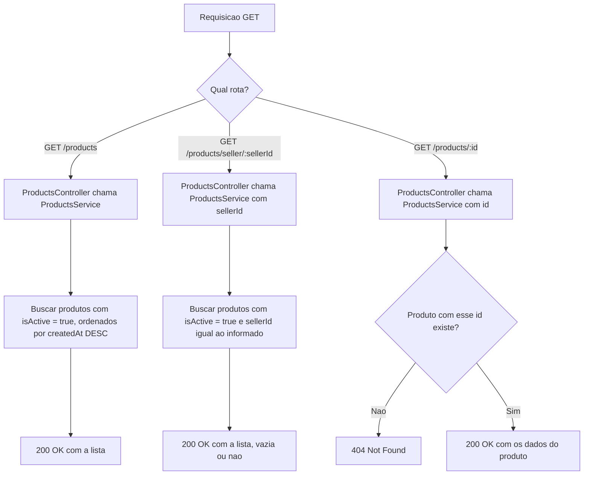

# Spec: Consulta de Produtos

## Contexto

O `products-service` já possui a entidade `Product` (`id`, `name`, `description`, `price`, `stock`, `sellerId`, `isActive`, `createdAt`, `updatedAt`, definida em `01-scaffold.md`), autenticação JWT global via `JwtAuthGuard` com suporte a rotas públicas via `@Public()` (`02-validacao-jwt.md`), e o endpoint `POST /products` para cadastro de produtos por vendedores autenticados (`03-criacao-produto.md`).

Até aqui, não existe nenhuma forma de consultar os produtos cadastrados — o catálogo é opaco para qualquer cliente do serviço. Esta spec cobre os endpoints essenciais de consulta, necessários para que o marketplace tenha um catálogo navegável.

## Objetivo

Permitir que qualquer pessoa, autenticada ou não, consulte o catálogo de produtos ativos: a lista completa, os produtos de um vendedor específico, e os dados de um produto individual.

## Requisitos Funcionais

### RF01 — Listagem de todos os produtos ativos
Deve existir um endpoint `GET /products`, público (`@Public()`), que retorna todos os produtos com `isActive` igual a `true`, ordenados por `createdAt` de forma decrescente (mais recentes primeiro).

### RF02 — Listagem de produtos por vendedor
Deve existir um endpoint `GET /products/seller/:sellerId`, público (`@Public()`), que retorna todos os produtos com `isActive` igual a `true` cujo `sellerId` corresponda ao parâmetro informado. Se o vendedor não tiver nenhum produto ativo, o endpoint retorna uma lista vazia (não é um erro).

### RF03 — Consulta de um produto por id
Deve existir um endpoint `GET /products/:id`, público (`@Public()`), que retorna os dados de um único produto pelo seu `id`. Se não existir produto com o `id` informado, a requisição é rejeitada com `404 Not Found`. Este endpoint não filtra por `isActive`: um produto inativo consultado diretamente por id ainda é retornado.

### RF04 — Rotas públicas
Os três endpoints de consulta desta spec são públicos e não exigem token de autenticação. O endpoint `POST /products` (`03-criacao-produto.md`) permanece protegido pelo `JwtAuthGuard`, sem alteração.

### RF05 — Ordem de declaração das rotas
Como o roteamento do NestJS resolve rotas na ordem em que são declaradas, a rota `GET /products/seller/:sellerId` deve ser declarada antes de `GET /products/:id` no `ProductsController`, para que `seller` não seja interpretado como valor de `:id`.

## Estrutura de Dados

Nenhum DTO de entrada é necessário: os três endpoints não recebem corpo de requisição. `GET /products/seller/:sellerId` e `GET /products/:id` recebem o identificador via parâmetro de rota (`sellerId` e `id`, ambos UUID).

A resposta de cada endpoint é composta pelos campos já existentes na entidade `Product` (`id`, `name`, `description`, `price`, `stock`, `sellerId`, `isActive`, `createdAt`, `updatedAt`), sem transformação ou omissão de campos.

## Respostas Esperadas

| Situação | Status |
|---|---|
| `GET /products` — lista retornada (vazia ou não) | `200 OK` |
| `GET /products/seller/:sellerId` — lista retornada (vazia ou não) | `200 OK` |
| `GET /products/:id` — produto encontrado | `200 OK` |
| `GET /products/:id` — produto não encontrado | `404 Not Found` |

## Fora de Escopo

- Atualização (`PUT`/`PATCH`) ou remoção (`DELETE`) de produtos
- Paginação, filtros (ex.: por faixa de preço) ou busca textual
- Qualquer alteração na entidade `Product` além do já definido em `01-scaffold.md`
- Validação de formato do `sellerId`/`id` como UUID antes da consulta ao banco

## Fluxo da Implementação

## Critérios de Aceite

- `GET /products` sem header `Authorization` retorna `200 OK` (rota pública)
- `GET /products` retorna apenas produtos com `isActive` igual a `true`, ordenados do mais recente para o mais antigo
- `GET /products/seller/:sellerId` sem header `Authorization` retorna `200 OK` (rota pública)
- `GET /products/seller/:sellerId` retorna apenas produtos ativos daquele vendedor
- `GET /products/seller/:sellerId` para um vendedor sem produtos retorna `200 OK` com lista vazia
- `GET /products/:id` sem header `Authorization` retorna `200 OK` (rota pública)
- `GET /products/:id` com um id existente retorna `200 OK` com os dados do produto
- `GET /products/:id` com um id inexistente retorna `404 Not Found`
- `GET /products/seller/:sellerId` continua funcionando corretamente e não é capturado pela rota `GET /products/:id`

## Referências

- `products-service/docs/specs/01-scaffold.md` — entidade `Product` sobre a qual esta spec é implementada
- `products-service/docs/specs/02-validacao-jwt.md` — infraestrutura de autenticação (`JwtAuthGuard`, `@Public()`) usada por este endpoint
- `products-service/docs/specs/03-criacao-produto.md` — endpoint `POST /products`, que permanece protegido e inalterado
