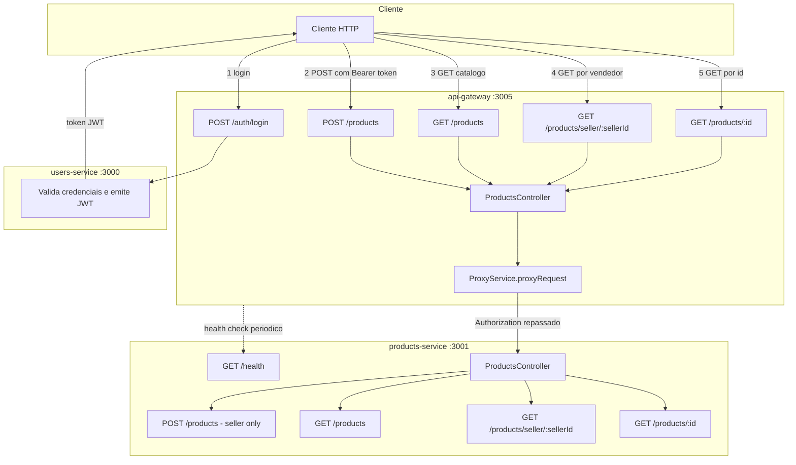

# Spec: Integração do Products Service ao API Gateway

## Contexto

O `products-service` já está completo do ponto de vista de domínio: entidade `Product`, autenticação JWT (`02-validacao-jwt.md`), criação de produto por vendedor (`03-criacao-produto.md`) e os três endpoints de consulta ao catálogo (`04-consulta-produtos.md`). O `api-gateway` (porta 3005) já tem a infraestrutura genérica de proxy — `ProxyService` com circuit breaker, retry, timeout e fallback, health check periódico de cada serviço, Swagger e `PRODUCTS_SERVICE_URL` configurado em `gateway.config.ts`/`.env`.

Essa infraestrutura, porém, ainda não está conectada ao `products-service` de ponta a ponta: não existe endpoint `GET /health` no `products-service` (o health check do gateway falha ao consultá-lo) e não existe nenhum controller no `api-gateway` expondo rotas `/products/*` — o `ProxyService` sabe como encaminhar para o serviço `products`, mas nada no gateway hoje chama esse método para essas rotas. O padrão a seguir já existe no gateway para outro serviço: `UsersController` (`api-gateway/src/users/users.controller.ts`) expõe rotas que chamam `proxyService.proxyRequest('users', ...)`, repassando o header `Authorization` e os dados do usuário autenticado.

Esta spec cobre o que falta para o catálogo de produtos ficar acessível de ponta a ponta através do gateway.

## Objetivo

Fechar a integração entre `api-gateway` e `products-service`, permitindo que um cliente externo faça login, crie produtos e consulte o catálogo público falando apenas com o gateway (porta 3005), sem acessar o `products-service` diretamente.

## Requisitos Funcionais

### No `products-service`

#### RF01 — Endpoint de health check
Deve existir um endpoint `GET /health`, público (sem exigir token), que responde com o status do serviço. É consultado periodicamente pelo `HealthCheckService` do gateway, que hoje já tenta acessar `<PRODUCTS_SERVICE_URL>/health` para compor o status geral do sistema.

#### RF02 — Documentação Swagger/OpenAPI
O `products-service` deve expor documentação OpenAPI gerada automaticamente, acessível em `/api`, com título "Products Service" e versão "1.0". A documentação deve descrever o esquema de autenticação Bearer (JWT), para refletir que os endpoints de escrita exigem token.

### No `api-gateway`

#### RF03 — Rotas de produtos expostas pelo gateway
Deve existir, no `api-gateway`, um controller de produtos que expõe as mesmas operações já implementadas no `products-service`, repassando cada requisição via `ProxyService` (mesmo padrão do `UsersController`):

- `POST /products` — cria um produto; rota protegida (exige token JWT válido no gateway), repassando o header `Authorization` para o `products-service`, que continua sendo responsável pela checagem de papel (`role` `"seller"`)
- `GET /products` — lista o catálogo de produtos ativos; rota pública no gateway
- `GET /products/seller/:sellerId` — lista produtos ativos de um vendedor; rota pública no gateway
- `GET /products/:id` — retorna um produto específico; rota pública no gateway

A ordem de declaração das rotas segue a mesma regra já aplicada no `products-service`: `seller/:sellerId` antes de `:id`.

#### RF04 — Configuração da URL do serviço
A variável `PRODUCTS_SERVICE_URL` já configurada em `api-gateway/.env` e usada em `gateway.config.ts` deve continuar sendo a única fonte da URL do `products-service` — nenhuma URL deve ser hardcoded no novo controller.

#### RF05 — Repasse do header de autenticação
Toda requisição encaminhada ao `products-service` que exija autenticação (`POST /products`) deve repassar o header `Authorization` recebido pelo gateway, sem modificação, para que o `products-service` valide o mesmo token JWT e identifique o vendedor autor da requisição.

## Estrutura de Dados

### Resposta de `GET /health` (products-service)

| Campo | Tipo | Descrição |
|---|---|---|
| `status` | string | Sempre `"ok"` quando o serviço está no ar |
| `service` | string | Sempre `"products-service"` |

Nenhum outro dado de entrada ou saída é alterado por esta spec: os endpoints `/products/*` no gateway repassam integralmente o corpo, os parâmetros de rota e as respostas já definidas em `03-criacao-produto.md` e `04-consulta-produtos.md`.

## Fluxo da Implementação

## Respostas Esperadas

| Situação | Status |
|---|---|
| `GET /health` no `products-service` | `200 OK` |
| Fluxo completo via gateway (login → criação → consulta) executado com sucesso | `200`/`201` em cada etapa, conforme já definido em `03-criacao-produto.md` e `04-consulta-produtos.md` |
| `POST /products` via gateway sem token | `401 Unauthorized` |
| `GET /products/:id` via gateway com id inexistente | `404 Not Found` |

## Fora de Escopo

- Qualquer alteração no mecanismo de proxy (`ProxyService`), circuit breaker, retry, timeout ou fallback já existentes no gateway
- Qualquer alteração nos guards de autenticação do gateway (`JwtAuthGuard`, `@Public()`)
- Novas regras de negócio no `products-service` além do endpoint de health
- Paginação, filtros, atualização ou remoção de produtos
- Testes de carga ou métricas de observabilidade além do já existente

## Critérios de Aceite

- Com o `products-service` no ar, `GET http://localhost:3001/health` responde `200` com `{ status: "ok", service: "products-service" }`
- Com o `products-service` no ar, `GET http://localhost:3001/api` carrega a documentação Swagger, listando os endpoints de produtos e o esquema Bearer Auth
- O painel de health do gateway (`GET /health` no api-gateway) reporta o serviço `products` como saudável quando o `products-service` está no ar
- Via gateway (porta 3005): `POST /auth/login` com credenciais de um vendedor retorna um token JWT válido
- Via gateway: `POST /products` com o token do vendedor no header `Authorization` cria o produto e retorna `201`, com o produto refletindo `sellerId` do usuário autenticado
- Via gateway: `POST /products` sem header `Authorization` retorna `401`
- Via gateway: `GET /products` sem token retorna `200` com o catálogo de produtos ativos
- Via gateway: `GET /products/seller/:sellerId` sem token retorna `200` com os produtos ativos daquele vendedor
- Via gateway: `GET /products/:id` sem token retorna `200` com os dados do produto criado no passo anterior
- Via gateway: `GET /products/:id` com um id inexistente retorna `404`
- Nenhuma requisição às rotas de produtos via gateway acessa o `products-service` na porta 3001 diretamente — todo o fluxo passa pela porta 3005

## Referências

- `products-service/docs/specs/02-validacao-jwt.md` — infraestrutura de autenticação do `products-service`
- `products-service/docs/specs/03-criacao-produto.md` — endpoint `POST /products`
- `products-service/docs/specs/04-consulta-produtos.md` — endpoints de consulta ao catálogo
- `api-gateway/src/users/users.controller.ts` — padrão de controller proxy a ser replicado para produtos
- `api-gateway/src/config/gateway.config.ts` — configuração de URL e timeout por serviço
