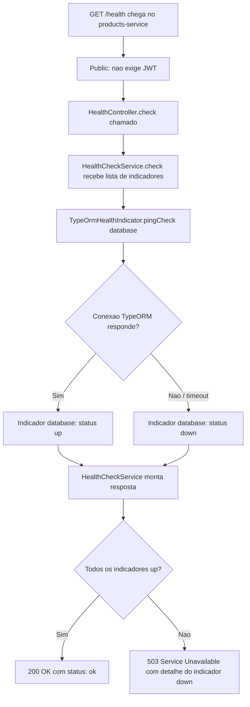

# Spec: Health Check com @nestjs/terminus (PostgreSQL)

## Contexto

O `products-service` expõe hoje `GET /health` diretamente em `src/app.controller.ts` (`@Public() @Get('health') health() { return { status: 'ok', service: 'products-service' } }`), sem nenhuma checagem real de dependência. Se o PostgreSQL do serviço (`products-service-db`, ver `src/config/database.config.ts`) cair, `/health` continua respondendo `200 ok`.

Esta spec cria um `HealthModule` dedicado, seguindo o mesmo padrão adotado no `users-service` (`docs/specs/08-health-check-terminus.md`, na spec irmã), usando `@nestjs/terminus` para checar o PostgreSQL de verdade, e remove o endpoint estático hoje declarado no `AppController`.

## Objetivo

Fazer `GET /health` no `products-service` retornar `503 Service Unavailable` quando o PostgreSQL estiver inacessível, e `200 OK` quando a conexão estiver saudável, usando os indicadores padrão do `@nestjs/terminus`, sem exigir JWT.

## Requisitos Funcionais

### RF01 — Dependência `@nestjs/terminus`
Adicionar `@nestjs/terminus` como dependência do `products-service`.

### RF02 — Novo `HealthModule`
Criar `src/health/health.module.ts` e `src/health/health.controller.ts` (o serviço ainda não tem uma pasta `src/health`), seguindo a mesma estrutura usada no `users-service`:
- `HealthModule` importa `TerminusModule` (de `@nestjs/terminus`) e declara `HealthController`.
- `HealthModule` é importado em `src/app.module.ts`.

### RF03 — `HealthController`
- Injeta `HealthCheckService` e `TypeOrmHealthIndicator` (de `@nestjs/terminus`).
- Expõe `GET /health`, decorado com `@HealthCheck()` e `@Public()`.
- Delega a checagem a `HealthCheckService.check([...])`, com um indicador `TypeOrmHealthIndicator.pingCheck('database', ...)` verificando a conexão TypeORM já configurada no serviço.

### RF04 — Remoção do endpoint estático do `AppController`
Remover o método `health()` e o `@Get('health')` de `src/app.controller.ts` — a rota `/health` passa a ser servida exclusivamente pelo novo `HealthController`, evitando duas rotas conflitantes para o mesmo path.

### RF05 — Formato de resposta padrão do Terminus
Não customizar o corpo da resposta — usar o formato padrão do `@nestjs/terminus` (`status`, `info`, `error`, `details`).

## Regras de Negócio

- RN01 — `/health` continua acessível sem `Authorization` header (`@Public()`), mesmo com o `JwtAuthGuard` global ativo.
- RN02 — Uma falha na checagem do PostgreSQL faz `/health` responder `503`, não `200`.

## Fora de Escopo

- Qualquer outro indicador de saúde além do PostgreSQL (o `products-service` não depende de RabbitMQ).
- Readiness/liveness probes — conceito de Kubernetes, fora do escopo deste projeto.
- Alterações em `/metrics` ou no `MetricsModule` existente (`docs/specs/05-metricas-http-prometheus.md`).
- Alertas no Prometheus/Grafana sobre este serviço — cobertos pela spec `observability-stack/docs/specs/02-alerting-rules-prometheus.md`.

## Fluxo da Implementação

## Critérios de Aceite

- Com o PostgreSQL do `products-service` no ar, `curl -i http://localhost:3001/health` (sem `Authorization`) retorna `200 OK`, corpo com `"status":"ok"` e `"database":{"status":"up"}`.
- Com o container `products-service-db` parado, `curl -i http://localhost:3001/health` retorna `503 Service Unavailable`, com o indicador `database` em `"status":"down"`.
- `src/app.controller.ts` não possui mais a rota `GET /health` — a rota `GET /` (`getHello`) continua funcionando normalmente.
- Uma requisição a `GET /health` continua funcionando sem token JWT.

## Referências

- `users-service/docs/specs/08-health-check-terminus.md` — mesma spec, mesmo padrão, no serviço irmão.
- `docs/specs/05-metricas-http-prometheus.md` — padrão de endpoint público (`@Public()`) já usado neste serviço.
- `src/config/database.config.ts` — configuração da conexão TypeORM/PostgreSQL que o indicador deve reutilizar.
- Documentação oficial: [@nestjs/terminus](https://docs.nestjs.com/recipes/terminus).
