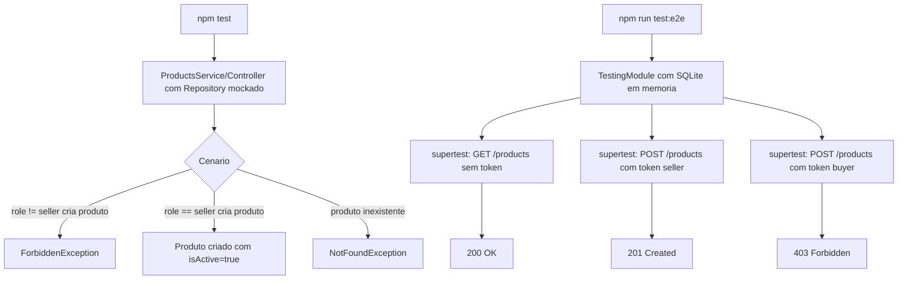

# Spec: Testes Automatizados (Unitários e de Integração)

## Contexto

O `products-service` já tem testes unitários para `app.controller`, os 3 arquivos de `metrics/`, `health/health.controller`, `auth/guards/jwt-auth.guard` e `auth/strategies/jwt.strategy`, e testes e2e para `app`, `products`, `metrics`, `health` e `auth`. Faltam:

- Testes unitários de `products/products.service.ts` e `products/products.controller.ts` — não existe nenhum arquivo `*.spec.ts` para eles hoje, apesar de `create()` ter regra de negócio real (só `role=seller` pode criar produto; `isActive` é sempre forçado para `true` na criação).
- Os e2e dependem do PostgreSQL real (`src/config/database.config.ts`) para rodar.

## Objetivo

Criar os testes unitários que faltam para `ProductsService`/`ProductsController` e migrar os e2e para SQLite em memória, sem depender de PostgreSQL real, mantendo a cobertura de comportamento atual.

## Requisitos Funcionais

### RF01 — Banco SQLite em memória exclusivo para testes
Adicionar `better-sqlite3` como devDependency e um `TypeOrmModule` de teste (SQLite em memória, `synchronize: true`) usado somente pelos `*.e2e-spec.ts`, sem alterar `src/config/database.config.ts` nem o `docker-compose.yaml`.

### RF02 — Teste unitário de `ProductsService`
Criar `src/products/products.service.spec.ts`, com `Repository<Product>` mockado, cobrindo:
- `create()` rejeita (`ForbiddenException`) quando `role !== 'seller'`.
- `create()` força `isActive: true` mesmo se o payload tentar enviar outro valor.
- `findOne()` lança `NotFoundException` quando o produto não existe.
- `findAllActive()`/`findBySeller()` filtram corretamente.

### RF03 — Teste unitário de `ProductsController`
Criar `src/products/products.controller.spec.ts`, mockando `ProductsService`, cobrindo os endpoints existentes.

### RF04 — E2E cobrindo rotas públicas vs. protegidas
Estender `test/products.e2e-spec.ts` para confirmar: `GET /products`, `GET /products/seller/:sellerId` e `GET /products/:id` respondem sem token (`@Public()`); `POST /products` exige token válido e, com token de usuário `role≠seller`, responde `403`.

## Regras de Negócio

- RN01 — Nenhum teste depende de PostgreSQL real; e2e usa exclusivamente o SQLite em memória do RF01.
- RN02 — Testes unitários usam `Repository` mockado (`jest.fn()`), nunca conexão real.

## Fluxo da Implementação

## Critérios de Aceite

- `npm test`, `npm run test:e2e` e `npm run test:cov` passam sem PostgreSQL, RabbitMQ ou serviços externos em execução.
- `products.service.spec.ts` e `products.controller.spec.ts` existem e cobrem os cenários do RF02/RF03.
- `products.e2e-spec.ts` cobre o RF04 (rotas públicas vs. `POST /products` protegida + regra de `role`).

## Fora de Escopo

- Alteração de código de produção.
- Migração real de PostgreSQL para SQLite em dev/produção.
- Testes de carga/performance.
- Testes e2e cross-service.

## Referências

- `src/products/products.service.ts`, `src/products/products.controller.ts` — regras de negócio a cobrir.
- `docs/specs/03-criacao-produto.md`, `docs/specs/04-catalogo-e-integracao-gateway.md` — especificação original das regras testadas aqui.
