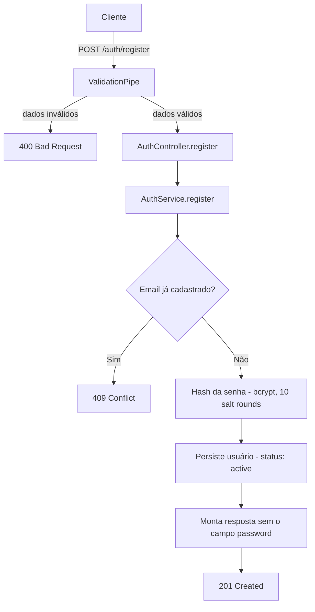

# Spec: Registro de usuário

## Contexto

O `users-service` já possui scaffold funcional: NestJS, Docker Compose com PostgreSQL 15, TypeORM configurado, `ValidationPipe` global ativo e a entidade `User` (`id`, `email`, `password`, `firstName`, `lastName`, `role`, `status`, `createdAt`, `updatedAt`), definida em `01-scaffold.md`. Nenhum endpoint HTTP existe ainda.

Esta spec define o primeiro endpoint do serviço: o registro (cadastro) de novos usuários. É o ponto de entrada para que sellers e buyers passem a existir no sistema.

## Objetivo

Permitir que um novo usuário (seller ou buyer) se registre no `users-service` através de um endpoint HTTP, com senha armazenada de forma segura (hash) e sem duplicidade de email.

## Requisitos Funcionais

### RF01 — Módulo de autenticação (AuthModule)
Deve existir um módulo `auth` dentro de `src/`, contendo controller e service dedicados ao fluxo de registro. O `AuthModule` depende do módulo `users` existente para persistência e consulta de usuários (reutiliza a entidade `User` e seu repositório — não duplica acesso a dados).

### RF02 — Endpoint de registro
Deve existir o endpoint `POST /auth/register`, que recebe os dados de um novo usuário e o cadastra no banco.

### RF03 — Hash de senha
A senha recebida no payload nunca é armazenada em texto plano. Antes da persistência, deve ser transformada em hash usando bcrypt, com fator de custo (salt rounds) 10.

### RF04 — Verificação de email duplicado
Antes de cadastrar, o sistema verifica se já existe um usuário com o mesmo email no banco.
- Se existir, o cadastro é recusado e o erro `409 Conflict` é retornado, sem alterar dados existentes.
- Se não existir, o cadastro prossegue normalmente.

### RF05 — Status inicial do usuário
Todo usuário registrado por este endpoint recebe automaticamente o status `active`. Não há campo de status no payload de entrada — o valor não é controlável pelo cliente da API.

### RF06 — Omissão da senha na resposta
Em nenhuma resposta do endpoint (sucesso ou erro) o campo `password` — nem seu hash — é exposto. A resposta de sucesso contém apenas os demais campos do usuário criado.

### RF07 — Validação dos dados de entrada
Os dados recebidos no corpo da requisição são validados antes de qualquer tentativa de persistência. Quando inválidos, o cadastro não é executado e o cliente recebe uma lista de mensagens de erro claras, indicando quais campos falharam e por quê.

## Estrutura de Dados

### DTO de entrada: RegisterDto

| Campo | Tipo | Regras |
|---|---|---|
| `email` | string | Obrigatório; deve ser um endereço de email válido |
| `password` | string | Obrigatório; mínimo de 6 caracteres |
| `firstName` | string | Obrigatório; máximo de 100 caracteres |
| `lastName` | string | Obrigatório; máximo de 100 caracteres |
| `role` | enum (`seller`, `buyer`) | Obrigatório; nenhum outro valor é aceito |

Nenhum outro campo é aceito no payload (propriedades não declaradas são rejeitadas).

### Resposta de sucesso (corpo)

Dados do usuário criado, exceto a senha:

| Campo | Tipo |
|---|---|
| `id` | UUID |
| `email` | string |
| `firstName` | string |
| `lastName` | string |
| `role` | string (`seller` \| `buyer`) |
| `status` | string (`active`) |
| `createdAt` | timestamp |
| `updatedAt` | timestamp |

## Diagrama de Fluxo

## Respostas Esperadas

| Situação | Status | Corpo |
|---|---|---|
| Usuário criado com sucesso | `201 Created` | Dados do usuário (sem `password`), conforme tabela acima |
| Dados de entrada inválidos (ex.: email malformado, senha curta, campo obrigatório ausente, `role` fora do enum, campo extra não declarado) | `400 Bad Request` | Lista de mensagens de erro de validação, uma por campo/regra violada |
| Email já cadastrado | `409 Conflict` | Mensagem indicando que o email já está em uso |

## Fora de Escopo

- Login e emissão/validação de token (JWT ou qualquer outro mecanismo)
- Qualquer outro endpoint além de `POST /auth/register`
- Recuperação de senha, confirmação de email, ou qualquer fluxo pós-cadastro
- Autorização/guards de rotas
- Rate limiting ou proteção contra abuso do endpoint
- Migrations (mantém-se `synchronize`, como definido em `01-scaffold.md`)

## Critérios de Aceite

1. `POST /auth/register` com payload válido e email inédito retorna `201`, persiste o usuário no banco com `status = active`, e o corpo da resposta não contém o campo `password`.
2. A senha persistida no banco não é igual à senha enviada no payload (está em formato hash bcrypt).
3. `POST /auth/register` com um email que já existe no banco retorna `409`, e nenhum novo registro é criado (a contagem de usuários com aquele email permanece 1).
4. `POST /auth/register` sem `email`, com `email` em formato inválido, com `password` menor que 6 caracteres, sem `firstName`/`lastName`, com `firstName`/`lastName` acima de 100 caracteres, com `role` fora de (`seller`, `buyer`), ou sem `role`, retorna `400` com mensagens de erro identificando o(s) campo(s) inválido(s), e nenhum registro é criado.
5. `POST /auth/register` com um campo extra não declarado no DTO (ex.: `status` ou `isAdmin` no payload) retorna `400`, e o campo extra é rejeitado (não é aceito nem ignorado silenciosamente).
6. O módulo `auth` reutiliza o repositório/entidade `User` já existente no módulo `users`, sem duplicar definição de acesso a dados.

## Referências

- Spec anterior: `01-scaffold.md` (entidade `User`, configuração de banco, `ValidationPipe` global)
- Entidade `User`: `src/users/entities/user.entity.ts`
