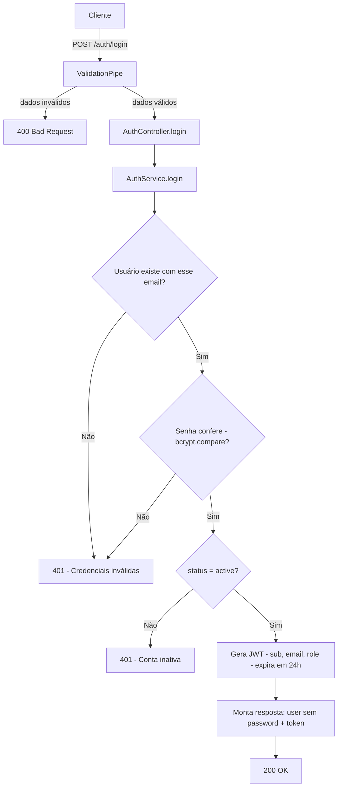

# Spec: Login com JWT

## Contexto

O `users-service` já possui o endpoint `POST /auth/register` funcionando (`02-registro-usuario.md`), com o `AuthModule` (controller e service) e a entidade `User` (`id`, `email`, `password` com hash bcrypt, `firstName`, `lastName`, `role`, `status`, `createdAt`, `updatedAt`).

Esta spec define o segundo endpoint do `AuthModule`: o login, que autentica um usuário já cadastrado e emite um token JWT para uso em requisições futuras.

## Objetivo

Permitir que um usuário registrado (seller ou buyer) se autentique informando email e senha, recebendo em troca seus dados (sem senha) e um token JWT válido por 24 horas.

## Requisitos Funcionais

### RF01 — Endpoint de login
Deve existir o endpoint `POST /auth/login`, que recebe email e senha e, se válidos, retorna os dados do usuário autenticado junto com um token JWT.

### RF02 — Busca do usuário por email
O sistema busca no banco o usuário correspondente ao email informado. Se nenhum usuário for encontrado com aquele email, a autenticação falha.

### RF03 — Verificação de senha
A senha informada no payload é comparada com o hash armazenado no banco (bcrypt). Se não corresponder, a autenticação falha.

### RF04 — Mensagem genérica para credenciais inválidas
Quando o email não existe ou a senha não confere, o sistema retorna a mesma mensagem genérica "Credenciais inválidas", sem indicar qual dos dois campos está incorreto — evita expor a um atacante se um email está cadastrado no sistema.

### RF05 — Verificação de conta ativa
Após confirmar que email e senha são válidos, o sistema verifica se o `status` do usuário é `active`. Se o usuário existir e a senha estiver correta, mas o status não for `active`, a autenticação falha com uma mensagem específica "Conta inativa" (distinta da mensagem de credenciais inválidas).

### RF06 — Emissão do token JWT
Se a conta existe, a senha confere e o status é `active`, o sistema gera um token JWT assinado, contendo os dados definidos na seção "Estrutura do payload JWT", com expiração de 24 horas a partir da emissão.

### RF07 — Secret do JWT via variável de ambiente
A chave usada para assinar o token é lida da variável de ambiente `JWT_SECRET` (via `.env`/`.env.example`, seguindo o padrão de configuração já usado no serviço). O valor não é hardcoded no código.

### RF08 — Omissão da senha na resposta
Assim como no registro, em nenhuma resposta do endpoint de login (sucesso ou erro) o campo `password` — nem seu hash — é exposto.

### RF09 — Validação dos dados de entrada
Os dados recebidos no corpo da requisição são validados antes de qualquer tentativa de autenticação. Quando inválidos, o login não é executado e o cliente recebe mensagens de erro indicando quais campos falharam e por quê.

## Estrutura de Dados

### DTO de entrada: LoginDto

| Campo | Tipo | Regras |
|---|---|---|
| `email` | string | Obrigatório; deve ser um endereço de email válido |
| `password` | string | Obrigatório; mínimo de 6 caracteres |

Nenhum outro campo é aceito no payload (propriedades não declaradas são rejeitadas).

### Estrutura do payload JWT

| Campo | Tipo | Descrição |
|---|---|---|
| `sub` | UUID | ID do usuário autenticado |
| `email` | string | Email do usuário autenticado |
| `role` | string (`seller` \| `buyer`) | Role do usuário autenticado |

### Resposta de sucesso (corpo)

```
{
  "user": { id, email, firstName, lastName, role, status, createdAt, updatedAt },
  "token": "<jwt>"
}
```

O objeto `user` segue exatamente a mesma estrutura da resposta de sucesso do registro (`02-registro-usuario.md`), sem o campo `password`.

## Diagrama de Fluxo



## Respostas Esperadas

| Situação | Status | Corpo |
|---|---|---|
| Login bem-sucedido | `200 OK` | `{ user: {...sem password}, token: "..." }` |
| Dados de entrada inválidos (ex.: email malformado, senha ausente/curta, campo extra não declarado) | `400 Bad Request` | Lista de mensagens de erro de validação |
| Email não cadastrado, ou email cadastrado com senha incorreta | `401 Unauthorized` | Mensagem "Credenciais inválidas" |
| Email e senha corretos, mas conta com `status` diferente de `active` | `401 Unauthorized` | Mensagem "Conta inativa" |

## Fora de Escopo

- Guards/proteção de rotas com o token JWT (fica para a próxima spec)
- Refresh tokens
- Sessões, logout ou invalidação/blacklist de token
- Recuperação de senha
- Rate limiting ou proteção contra brute-force no login
- Alteração da entidade `User` ou do fluxo de registro

## Critérios de Aceite

1. `POST /auth/login` com email e senha corretos de um usuário com `status = active` retorna `200`, com corpo contendo `user` (sem campo `password`) e `token`.
2. O `token` retornado é um JWT válido, assinado com o secret de `JWT_SECRET`, cujo payload decodificado contém `sub` (igual ao `id` do usuário), `email` e `role` corretos, e expiração de 24 horas a partir da emissão.
3. `POST /auth/login` com email não cadastrado retorna `401` com a mensagem "Credenciais inválidas".
4. `POST /auth/login` com email cadastrado e senha incorreta retorna `401` com a mensagem "Credenciais inválidas" — idêntica à do item anterior, sem diferenciar qual campo errou.
5. `POST /auth/login` com email e senha corretos, mas usuário com `status` diferente de `active`, retorna `401` com a mensagem "Conta inativa" — distinta da mensagem de credenciais inválidas.
6. `POST /auth/login` sem `email`, com `email` em formato inválido, sem `password`, com `password` menor que 6 caracteres, ou com campo extra não declarado no payload, retorna `400` com mensagens de erro identificando o(s) campo(s) inválido(s), e nenhuma tentativa de autenticação é realizada.
7. Nenhuma resposta do endpoint (sucesso ou erro) expõe o campo `password` ou seu hash.

## Referências

- Spec anterior: `02-registro-usuario.md` (endpoint de registro, hash de senha, estrutura de resposta do usuário)
- Entidade `User`: `src/users/entities/user.entity.ts`
- `AuthModule`/`AuthService`/`AuthController` existentes: `src/auth/`
