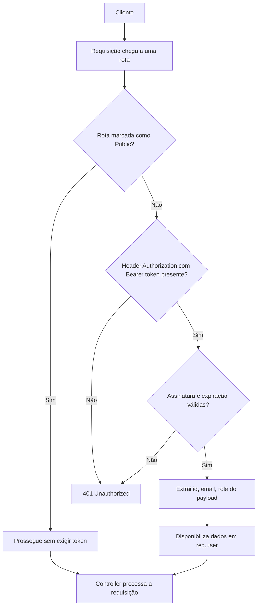

# Spec: Guards e Proteção de Rotas com JWT

## Contexto

O `users-service` já possui `POST /auth/register` (`02-registro-usuario.md`) e `POST /auth/login` (`03-login-jwt.md`) funcionando, com o `JwtModule` configurado no `AuthModule` (secret via `JWT_SECRET`, expiração de 24h) e as dependências `@nestjs/passport`, `passport` e `passport-jwt` já instaladas.

Até aqui, o token JWT emitido no login não é usado para nada além de ser devolvido ao cliente: nenhuma rota do serviço exige autenticação. Esta spec define a proteção das rotas existentes, exigindo um token JWT válido para acessá-las, exceto as que forem explicitamente marcadas como públicas.

## Objetivo

Garantir que, por padrão, toda rota do `users-service` exija um usuário autenticado via JWT, com um mecanismo explícito para marcar exceções (rotas públicas), e disponibilizar os dados do usuário autenticado (`id`, `email`, `role`) para uso pelos controllers em requisições protegidas.

## Requisitos Funcionais

### RF01 — Estratégia de autenticação JWT (Passport)
O sistema deve possuir uma estratégia Passport responsável por extrair o token JWT do header `Authorization` de cada requisição, no formato `Bearer <token>`, e validar automaticamente a assinatura (contra `JWT_SECRET`) e a expiração do token.

### RF02 — Dados do usuário autenticado
Quando o token é válido, a estratégia extrai do payload do token os campos `id` (a partir do `sub`), `email` e `role`, e disponibiliza esse objeto como o usuário autenticado da requisição (`req.user`), para uso pelos controllers em rotas protegidas.

### RF03 — Guard global de autenticação
O sistema deve possuir um guard de autenticação JWT aplicado globalmente, de forma que toda rota do serviço exija autenticação por padrão, sem necessidade de aplicar o guard manualmente em cada controller ou rota.

### RF04 — Mecanismo de rota pública
Deve existir uma forma explícita de marcar uma rota (ou controller) como pública, isentando-a da exigência de autenticação imposta pelo guard global.

### RF05 — Guard respeita rotas públicas
Antes de exigir autenticação, o guard global verifica se a rota (ou controller) foi marcada como pública. Se sim, a requisição prossegue sem exigir token. Se não, o token é extraído e validado normalmente conforme RF01.

### RF06 — Rejeição de requisições não autenticadas
Em qualquer rota não marcada como pública, requisições sem token, com token expirado ou com assinatura inválida são rejeitadas antes de chegar ao controller.

### RF07 — Rotas de autenticação permanecem públicas
Os endpoints `POST /auth/register` e `POST /auth/login` devem ser marcados como públicos, continuando acessíveis sem token, já que são o meio pelo qual o usuário obtém o token.

## Fluxo Esperado

1. Uma requisição chega a qualquer rota do serviço.
2. O guard global verifica se a rota está marcada como pública.
3. Se pública, a requisição prossegue diretamente para o controller, sem checagem de token.
4. Se não pública, o guard extrai o token do header `Authorization` e valida assinatura e expiração.
5. Se o token for inválido, ausente ou expirado, a requisição é rejeitada antes do controller.
6. Se o token for válido, os dados do usuário (`id`, `email`, `role`) ficam disponíveis para o controller, que processa a requisição normalmente.

## Diagrama de Fluxo

## Respostas Esperadas

| Situação | Status | Corpo |
|---|---|---|
| Rota pública, com ou sem token | `200`/conforme o handler | Resposta normal do controller |
| Rota protegida, token ausente | `401 Unauthorized` | Mensagem de erro de autenticação |
| Rota protegida, token expirado | `401 Unauthorized` | Mensagem de erro de autenticação |
| Rota protegida, token com assinatura inválida | `401 Unauthorized` | Mensagem de erro de autenticação |
| Rota protegida, token válido | Resposta normal do handler | Controller processa a requisição, com `req.user` disponível |

## Fora de Escopo

- `RoleGuard`, `SessionGuard` ou qualquer verificação de autorização por `role` (apenas autenticação é tratada nesta spec)
- Novos endpoints (ficam para specs futuras)
- Refresh tokens, logout ou invalidação/blacklist de token
- Alteração da entidade `User`, do fluxo de registro ou do fluxo de login
- Rate limiting ou proteção contra brute-force

## Critérios de Aceite

1. Uma requisição para uma rota protegida sem header `Authorization` retorna `401 Unauthorized` e não chega ao handler do controller.
2. Uma requisição para uma rota protegida com token expirado retorna `401 Unauthorized`.
3. Uma requisição para uma rota protegida com token de assinatura inválida (ex.: assinado com secret diferente) retorna `401 Unauthorized`.
4. Uma requisição para uma rota protegida com token válido é processada normalmente pelo controller, com `req.user` contendo `id`, `email` e `role` correspondentes ao payload do token.
5. `POST /auth/register` e `POST /auth/login` continuam acessíveis sem token, retornando o comportamento já definido em suas specs (`02-registro-usuario.md`, `03-login-jwt.md`).
6. Nenhuma rota do serviço fica desprotegida por omissão — uma rota só é acessível sem token se explicitamente marcada como pública.

## Referências

- Spec anterior: `03-login-jwt.md` (emissão do token JWT, estrutura do payload: `sub`, `email`, `role`)
- `AuthModule`/`JwtModule` existentes: `src/auth/`
