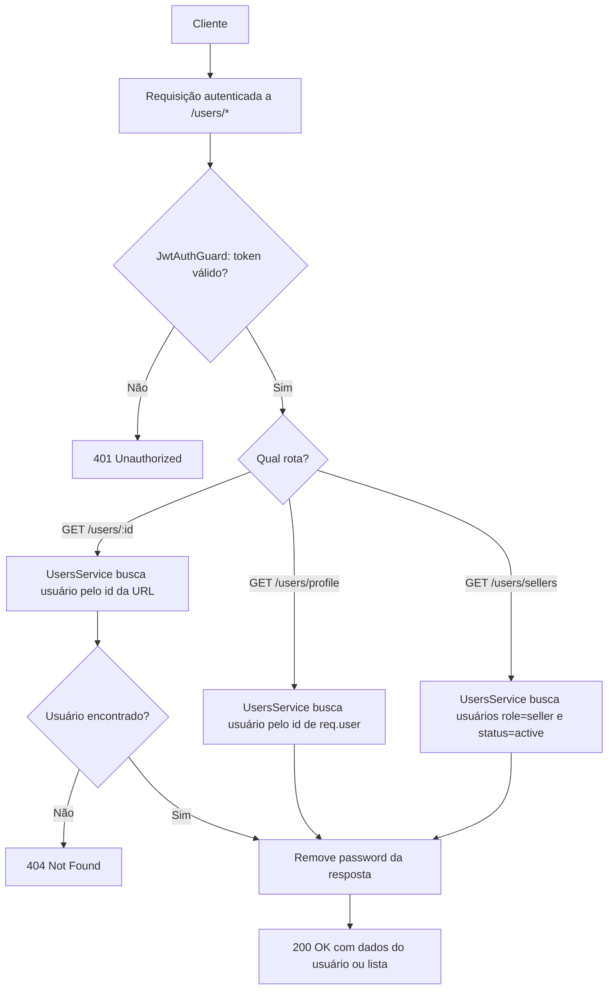

# Spec: Consulta de Usuários

## Contexto

O `users-service` já possui a entidade `User` (`id`, `email`, `password`, `firstName`, `lastName`, `role`, `status`, `createdAt`, `updatedAt`), os fluxos de registro (`02-registro-usuario.md`) e login (`03-login-jwt.md`), e a proteção global de rotas via JWT (`04-guards-protecao-rotas-jwt.md`). O `JwtAuthGuard` global garante que toda rota exige um token válido, salvo as marcadas com `@Public()`, e disponibiliza o usuário autenticado em `req.user` (`id`, `email`, `role`).

O `UsersModule` já existe e já registra o `TypeOrmModule.forFeature([User])`, mas ainda não possui `UsersController` nem um `UsersService` com lógica de consulta. Esta spec define os endpoints de consulta de usuários necessários para o funcionamento do marketplace: o próprio usuário ver seus dados, listar vendedores ativos, e consultar um usuário específico por ID.

## Objetivo

Disponibilizar endpoints de leitura de usuários — perfil do usuário autenticado, listagem de vendedores ativos e busca por ID — para uso pelo frontend e por outros serviços (ex.: `products-service`), sem expor o campo `password` em nenhuma resposta.

## Requisitos Funcionais

### RF01 — Perfil do usuário autenticado (`GET /users/profile`)
O sistema deve retornar os dados completos do usuário autenticado na requisição, buscando-os no banco de dados a partir do `id` presente em `req.user` (garantindo dados atualizados, e não apenas o que estava no payload do token no momento do login).

### RF02 — Listagem de vendedores ativos (`GET /users/sellers`)
O sistema deve retornar a lista de todos os usuários cujo `role` seja `seller` e cujo `status` seja `active`. Usuários com `role` `buyer` ou com `status` `inactive` não devem aparecer nessa listagem.

### RF03 — Consulta de usuário por ID (`GET /users/:id`)
O sistema deve retornar os dados de um usuário específico a partir do seu `id` (UUID). Se nenhum usuário existir com o `id` informado, o sistema deve indicar que o recurso não foi encontrado.

### RF04 — Omissão do campo `password`
Em nenhuma das respostas dos endpoints acima (RF01, RF02, RF03) o campo `password` do usuário deve estar presente, individualmente ou dentro de uma lista.

### RF05 — Autenticação obrigatória
Os três endpoints são protegidos pelo `JwtAuthGuard` global (nenhum deles é marcado como `@Public()`): só são acessíveis mediante um token JWT válido, seguindo o comportamento já definido em `04-guards-protecao-rotas-jwt.md`.

### RF06 — Precedência de rotas estáticas sobre rota dinâmica
As rotas `GET /users/profile` e `GET /users/sellers` devem ser reconhecidas corretamente como tais, e não interpretadas como uma chamada a `GET /users/:id` com `id` igual a `"profile"` ou `"sellers"`.

## Fluxo Esperado

1. Uma requisição autenticada chega a um dos três endpoints (`/users/profile`, `/users/sellers` ou `/users/:id`).
2. O `JwtAuthGuard` global valida o token, conforme já definido em `04-guards-protecao-rotas-jwt.md`; se inválido, a requisição é rejeitada antes de chegar ao controller.
3. Com token válido, o controller delega ao `UsersService` a consulta correspondente:
   - `profile`: busca o usuário pelo `id` de `req.user`.
   - `sellers`: busca usuários com `role=seller` e `status=active`.
   - `:id`: busca o usuário pelo `id` informado na URL; se não encontrado, retorna 404.
4. O resultado (objeto único ou lista) é retornado ao cliente sem o campo `password`.

## Diagrama de Fluxo

## Respostas Esperadas

| Endpoint | Situação | Status | Corpo |
|---|---|---|---|
| `GET /users/profile` | Token válido | `200 OK` | Dados do usuário autenticado, sem `password` |
| `GET /users/sellers` | Token válido | `200 OK` | Lista de usuários com `role=seller` e `status=active`, sem `password` em cada item |
| `GET /users/:id` | Token válido, usuário existe | `200 OK` | Dados do usuário, sem `password` |
| `GET /users/:id` | Token válido, usuário não existe | `404 Not Found` | Mensagem de erro indicando usuário não encontrado |
| Qualquer um dos três | Token ausente ou inválido | `401 Unauthorized` | Mensagem de erro de autenticação (tratado pelo guard global) |

## Fora de Escopo

- Atualização (`PATCH`/`PUT`) ou remoção (`DELETE`) de usuários
- Listagem paginada ou com filtros além de `role=seller`/`status=active`
- Alteração de senha (`change password`)
- Qualquer verificação de autorização por `role` (ex.: restringir `GET /users/:id` a determinados papéis) — todos os endpoints exigem apenas autenticação, não autorização
- Alteração da entidade `User` ou dos fluxos de registro/login

## Critérios de Aceite

1. `GET /users/profile` sem token retorna `401 Unauthorized`.
2. `GET /users/profile` com token válido retorna `200 OK` com os dados do usuário correspondente ao `id` do token, sem o campo `password`.
3. `GET /users/sellers` sem token retorna `401 Unauthorized`.
4. `GET /users/sellers` com token válido retorna `200 OK` com uma lista contendo apenas usuários com `role=seller` e `status=active`, nenhum deles com o campo `password`.
5. `GET /users/:id` sem token retorna `401 Unauthorized`.
6. `GET /users/:id` com token válido e `id` de um usuário existente retorna `200 OK` com os dados desse usuário, sem o campo `password`.
7. `GET /users/:id` com token válido e `id` de um usuário inexistente retorna `404 Not Found`.
8. Uma requisição a `GET /users/profile` ou `GET /users/sellers` é tratada por sua rota estática correspondente, e não pela rota dinâmica `GET /users/:id`.

## Referências

- Spec anterior: `04-guards-protecao-rotas-jwt.md` (guard global, `req.user` com `id`, `email`, `role`)
- Entidade `User`: `src/users/entities/user.entity.ts`
- `UsersModule` existente: `src/users/users.module.ts`
