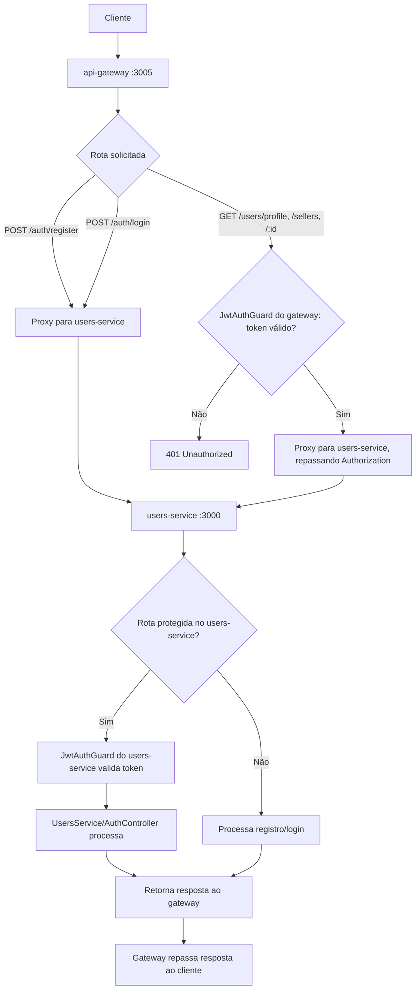

# Spec: Integração do Users Service com o API Gateway

## Contexto

O `users-service` (porta 3000) já implementa registro (`02-registro-usuario.md`), login com JWT (`03-login-jwt.md`), proteção global de rotas via `JwtAuthGuard` (`04-guards-protecao-rotas-jwt.md`) e os endpoints de consulta `GET /users/profile`, `GET /users/sellers` e `GET /users/:id` (`05-consulta-usuarios.md`). Não possui, no entanto, nenhum endpoint pensado para consumo por outro serviço (ex.: validação de token) nem documentação OpenAPI/Swagger, nem um endpoint de health check.

O `api-gateway` (porta 3005) já possui a infraestrutura de proxy (`ProxyService`, com circuit breaker, retry com backoff exponencial, timeout e fallback), guards de autenticação (`JwtAuthGuard`, validando o token JWT localmente via estratégia Passport, e `SessionGuard`), health checks e Swagger. `serviceConfig.users.url` já lê a variável de ambiente `USERS_SERVICE_URL`, com fallback para `http://localhost:3000`.

Essa infraestrutura, porém, ainda não está conectada de ponta a ponta: o `AuthController`/`AuthService` do gateway chamam o `users-service` diretamente via `HttpService` (sem passar pelo `ProxyService`, e portanto sem os benefícios de circuit breaker/retry/timeout), e o endpoint de login chama a URL `{USERS_SERVICE_URL}/login`, que não corresponde à rota real do `users-service` (`POST /auth/login`). Além disso, não existe hoje nenhuma rota no gateway que exponha `/users/*` — o `ProxyService` está registrado no módulo mas não é chamado por nenhum controller para essas rotas. Esta spec define o que falta para que o fluxo completo (registro, login e consultas autenticadas) funcione de ponta a ponta passando pelo gateway.

## Objetivo

Fechar a integração entre `api-gateway` e `users-service`: adicionar ao `users-service` os endpoints de suporte que o gateway precisa (validação de token e health check) e sua documentação Swagger, e garantir que o gateway encaminhe corretamente `/auth/*` e `/users/*` até o `users-service`, repassando o header `Authorization`, de forma que o fluxo de registro, login e consulta de usuários funcione integralmente através da porta do gateway (3005).

## Requisitos Funcionais

### RF01 — Validação de token (`GET /auth/validate-token`, users-service)
O `users-service` deve expor um endpoint que retorna os dados do usuário autenticado a partir do token JWT presente na requisição: `userId`, `email` e `role`. É uma rota protegida (sujeita ao `JwtAuthGuard` global, sem `@Public()`), destinada a uso interno pelo `api-gateway` ou por outros serviços que precisem confirmar a validade de um token e obter os dados do usuário a ele associado.

### RF02 — Health check (`GET /health`, users-service)
O `users-service` deve expor um endpoint público (sem exigência de autenticação) que retorna o status do serviço, incluindo ao menos `status: "ok"` e o nome do serviço (`"users-service"`). Deve responder mesmo sem token, para uso por mecanismos de health check externos (como o do gateway).

### RF03 — Documentação Swagger/OpenAPI (users-service)
O `users-service` deve expor documentação OpenAPI navegável em `/api`, com título "Users Service" e versão "1.0", cobrindo os endpoints existentes (`/auth/register`, `/auth/login`, `/users/profile`, `/users/sellers`, `/users/:id`) e os novos definidos nesta spec (`/auth/validate-token`, `/health`). Deve oferecer suporte a Bearer Auth, permitindo autenticar as chamadas de teste com um token JWT diretamente pela interface do Swagger.

### RF04 — Configuração do endereço do users-service no gateway
O `api-gateway` deve ter `USERS_SERVICE_URL=http://localhost:3000` definido em sua configuração de ambiente (`.env`), de modo que `serviceConfig.users.url` aponte para a instância local do `users-service` em desenvolvimento.

### RF05 — Encaminhamento das rotas `/auth/*` para o users-service
O gateway deve encaminhar `POST /auth/register` e `POST /auth/login`, recebidos em sua própria porta (3005), para os endpoints correspondentes do `users-service` (`POST /auth/register` e `POST /auth/login`), preservando método, corpo da requisição e path de destino, e devolvendo ao cliente a resposta (incluindo o token JWT, no caso do login) tal como recebida do `users-service`.

### RF06 — Encaminhamento das rotas `/users/*` para o users-service
O gateway deve expor e encaminhar `GET /users/profile`, `GET /users/sellers` e `GET /users/:id`, recebidos em sua própria porta (3005), para os endpoints equivalentes do `users-service`, preservando método e path de destino, e devolvendo ao cliente a resposta obtida.

### RF07 — Repasse do header Authorization
Em toda requisição encaminhada ao `users-service` que originalmente contenha o header `Authorization`, o gateway deve repassar esse header inalterado, de forma que o `users-service` consiga validar o token JWT em suas próprias rotas protegidas.

### RF08 — Uso da infraestrutura de proxy existente
O encaminhamento das rotas `/auth/*` e `/users/*` (RF05, RF06) deve ser feito através da infraestrutura de proxy já existente no gateway (circuit breaker, retry e timeout), e não por chamadas HTTP diretas e paralelas a essa infraestrutura.

## Fluxo Esperado

1. Um cliente faz uma requisição a uma rota `/auth/*` ou `/users/*` na porta do gateway (3005).
2. Para rotas `/auth/register` e `/auth/login`, o gateway encaminha a requisição diretamente ao `users-service` (sem exigir autenticação prévia).
3. Para rotas `/users/*`, o gateway valida o token JWT presente no header `Authorization` (guard local, já existente); se inválido ou ausente, a requisição é rejeitada antes de chegar ao `users-service`.
4. Com a requisição autorizada a prosseguir, o gateway a encaminha ao `users-service`, repassando o header `Authorization` quando presente.
5. O `users-service` processa a requisição normalmente (registro, login, ou consulta protegida por seu próprio `JwtAuthGuard`) e retorna a resposta.
6. O gateway repassa a resposta do `users-service` ao cliente original.

## Diagrama de Fluxo

## Respostas Esperadas

| Rota (via gateway :3005) | Situação | Status | Corpo |
|---|---|---|---|
| `POST /auth/register` | Dados válidos | `201 Created` | Usuário criado (resposta do users-service) |
| `POST /auth/login` | Credenciais válidas | `200 OK` | Token JWT e dados do usuário (resposta do users-service) |
| `POST /auth/login` | Credenciais inválidas | `401 Unauthorized` | Erro de autenticação |
| `GET /users/profile` | Sem token | `401 Unauthorized` | Erro de autenticação (bloqueado pelo gateway) |
| `GET /users/profile` | Token válido | `200 OK` | Dados do usuário autenticado |
| `GET /users/sellers` | Token válido | `200 OK` | Lista de vendedores ativos |
| `GET /auth/validate-token` (users-service) | Token válido | `200 OK` | `{ userId, email, role }` |
| `GET /auth/validate-token` (users-service) | Sem token / inválido | `401 Unauthorized` | Erro de autenticação |
| `GET /health` (users-service) | — | `200 OK` | `{ status: "ok", service: "users-service" }` |

## Fora de Escopo

- Qualquer alteração no mecanismo de proxy do gateway (circuit breaker, retry, timeout, fallback) — apenas seu uso para as rotas `/auth/*` e `/users/*`.
- Qualquer alteração nos guards existentes do gateway (`JwtAuthGuard`, `SessionGuard`) ou na forma como validam o token localmente.
- Gerenciamento de sessão (`SessionGuard`, `validateSessionToken`, `sessionToken`) — o fluxo de sessão do gateway não é alterado nem removido, apenas não faz parte desta integração.
- Autorização por `role` nas rotas encaminhadas (segue o comportamento já definido nas specs de cada endpoint).
- Alteração da entidade `User` ou dos fluxos de registro/login no `users-service`.
- Novos endpoints de escrita (`PATCH`/`PUT`/`DELETE`) em `/users/*`.

## Critérios de Aceite

1. `POST http://localhost:3005/auth/register` com dados válidos cria o usuário no `users-service` e retorna `201 Created`.
2. `POST http://localhost:3005/auth/login` com credenciais válidas retorna `200 OK` com um token JWT válido.
3. `POST http://localhost:3005/auth/login` com credenciais inválidas retorna `401 Unauthorized`.
4. `GET http://localhost:3005/users/profile` sem token retorna `401 Unauthorized`.
5. `GET http://localhost:3005/users/profile` com o token obtido no passo 2 retorna `200 OK` com os dados do usuário autenticado.
6. `GET http://localhost:3005/users/sellers` com token válido retorna `200 OK` com a lista de vendedores ativos.
7. `GET http://localhost:3000/auth/validate-token` (diretamente no users-service) com token válido retorna `200 OK` com `userId`, `email` e `role`; sem token, retorna `401 Unauthorized`.
8. `GET http://localhost:3000/health` (diretamente no users-service) retorna `200 OK` com `{ status: "ok", service: "users-service" }`, sem exigir token.
9. `GET http://localhost:3000/api` (diretamente no users-service) exibe a documentação Swagger com título "Users Service", versão "1.0", e permite autenticação via Bearer token.
10. Todo o fluxo dos critérios 1 a 6 é executável via `curl`/Postman apontando apenas para a porta do gateway (3005), sem necessidade de chamar o `users-service` diretamente.

## Referências

- `04-guards-protecao-rotas-jwt.md` (comportamento do `JwtAuthGuard` do users-service, `req.user` com `id`, `email`, `role`)
- `05-consulta-usuarios.md` (endpoints `/users/profile`, `/users/sellers`, `/users/:id`)
- `api-gateway/src/config/gateway.config.ts` (`serviceConfig.users.url`, lido de `USERS_SERVICE_URL`)
- `api-gateway/src/proxy/service/proxy.service.ts` (infraestrutura de proxy existente: circuit breaker, retry, timeout, fallback)
- `api-gateway/src/guards/auth.guard.ts` (`JwtAuthGuard` do gateway, validação local via Passport)
