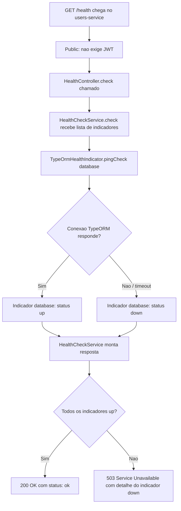

# Spec: Health Check com @nestjs/terminus (PostgreSQL)

## Contexto

O `users-service` já expõe `GET /health` (`src/health/health.controller.ts`), mas o endpoint é estático: sempre retorna `{ status: 'ok', service: 'users-service' }`, sem checar nenhuma dependência real. Se o PostgreSQL do serviço (`users-service-db`, ver `src/config/database.config.ts`) cair ou ficar inacessível, `/health` continua respondendo `200 ok` normalmente — a checagem não serve para detectar indisponibilidade real.

Esta spec substitui esse endpoint estático por um health check real usando `@nestjs/terminus`, verificando a conectividade com o PostgreSQL via TypeORM. `/health` já é `@Public()` (fora do `JwtAuthGuard` global, ver `docs/specs/04-guards-protecao-rotas-jwt.md`) e essa característica deve ser preservada.

## Objetivo

Fazer `GET /health` no `users-service` retornar `503 Service Unavailable` (com o detalhamento de qual dependência falhou) quando o PostgreSQL estiver inacessível, e `200 OK` quando a conexão estiver saudável — usando os indicadores padrão do `@nestjs/terminus`.

## Requisitos Funcionais

### RF01 — Dependência `@nestjs/terminus`
Adicionar `@nestjs/terminus` como dependência do `users-service`.

### RF02 — `HealthModule` com `TerminusModule`
Atualizar `src/health/health.module.ts` para importar `TerminusModule` (de `@nestjs/terminus`) junto do `HealthController` existente.

### RF03 — `HealthController` baseado em `HealthCheckService`
Reescrever `src/health/health.controller.ts` para:
- Injetar `HealthCheckService` e `TypeOrmHealthIndicator` (ambos de `@nestjs/terminus`).
- Manter `GET /health`, decorado com `@HealthCheck()` (de `@nestjs/terminus`) e `@Public()` (comportamento atual preservado).
- Delegar a checagem a `HealthCheckService.check([...])`, com um indicador `TypeOrmHealthIndicator.pingCheck('database', ...)` verificando a conexão TypeORM já configurada no serviço.

### RF04 — Formato de resposta padrão do Terminus
Não customizar o corpo da resposta — usar o formato padrão que `@nestjs/terminus` já produz (`status`, `info`, `error`, `details`), tanto no caso saudável (`200`) quanto no caso de falha (`503`).

## Regras de Negócio

- RN01 — `/health` continua acessível sem `Authorization` header (`@Public()`), mesmo com o `JwtAuthGuard` global ativo.
- RN02 — Uma falha na checagem do PostgreSQL faz `/health` responder `503`, não `200` com um campo de erro dentro de um corpo `200` — o status HTTP deve refletir a saúde real do serviço (comportamento padrão do `HealthCheckService` do Terminus).

## Fora de Escopo

- Qualquer outro indicador de saúde além do PostgreSQL (o `users-service` não depende de RabbitMQ nem de outros serviços).
- Readiness/liveness probes (endpoints `/health/ready`, `/health/live` ou equivalentes) — conceito de Kubernetes, fora do escopo deste projeto.
- Alterações em `/metrics` ou no `MetricsModule` existente (`docs/specs/07-metricas-http-prometheus.md`).
- Alertas no Prometheus/Grafana sobre este serviço — cobertos pela spec `observability-stack/docs/specs/02-alerting-rules-prometheus.md`, que consome o `up{job="users-service"}` do Prometheus (não depende do conteúdo de `/health`).

## Fluxo da Implementação

## Critérios de Aceite

- Com o PostgreSQL do `users-service` no ar, `curl -i http://localhost:3000/health` (sem `Authorization`) retorna `200 OK`, corpo com `"status":"ok"` e `"database":{"status":"up"}` dentro de `info`/`details`.
- Com o container `users-service-db` parado (`docker compose stop`), `curl -i http://localhost:3000/health` retorna `503 Service Unavailable`, corpo com `"status":"error"` e o indicador `database` com `"status":"down"` em `error`/`details`.
- Uma requisição a `GET /health` continua funcionando sem token JWT (nenhuma regressão no `@Public()`).
- Nenhuma outra rota do `users-service` é afetada.

## Referências

- `docs/specs/07-metricas-http-prometheus.md` — padrão de endpoint público (`@Public()`) já usado neste serviço.
- `src/config/database.config.ts` — configuração da conexão TypeORM/PostgreSQL que o indicador deve reutilizar.
- Documentação oficial: [@nestjs/terminus](https://docs.nestjs.com/recipes/terminus), [TypeOrmHealthIndicator](https://docs.nestjs.com/recipes/terminus#database-health-check).
