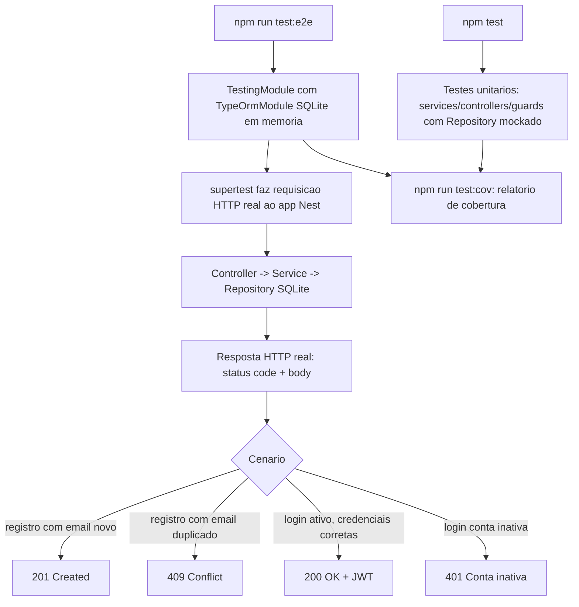

# Spec: Testes Automatizados (Unitários e de Integração)

## Contexto

O `users-service` já tem uma base de testes razoável: unitários (`*.spec.ts` em `src/`) cobrindo `app.controller`, os 3 arquivos de `metrics/`, `health/health.controller`, `users/users.service`, `auth/auth.service`, `auth/guards/jwt-auth.guard` e `auth/strategies/jwt.strategy`; e de integração (`*.e2e-spec.ts` em `test/`) cobrindo `users`, `app`, `metrics`, `health` e `auth`. Faltam, no entanto:

- Teste unitário de `users/users.controller.ts` (hoje só o service é testado).
- Cobertura explícita, unitária e/ou e2e, dos caminhos de erro de negócio de `auth/auth.service.ts`: e-mail já cadastrado no registro (`409`) e conta inativa no login (`401 "Conta inativa"`).
- Cobertura do filtro de `findSellers` (`role=SELLER, status=ACTIVE`) em `users/users.service.ts`.
- Os testes de integração hoje dependem do PostgreSQL real (`src/config/database.config.ts`, container `users-service-db`) para rodar — não há um caminho para rodá-los sem subir o banco.

Este projeto é de curso; a suíte de testes deve ser enxuta e cobrir o que já existe, sem introduzir funcionalidades novas.

## Objetivo

Fechar as lacunas de teste unitário listadas acima e migrar os testes de integração (`test/*.e2e-spec.ts`) para rodar contra um banco SQLite em memória, eliminando a dependência de um PostgreSQL real — mantendo a cobertura de comportamento (status codes, corpos de resposta, regras de negócio) idêntica à atual.

## Requisitos Funcionais

### RF01 — Banco SQLite em memória exclusivo para testes
Adicionar `better-sqlite3` como devDependency e criar um `TypeOrmModule` de teste (SQLite em memória, `synchronize: true`) usado somente pelos `*.e2e-spec.ts`, sem alterar `src/config/database.config.ts` nem o `docker-compose.yaml` de produção/dev.

### RF02 — Teste unitário de `UsersController`
Criar `src/users/users.controller.spec.ts`, mockando `UsersService`, cobrindo os endpoints existentes (`findById`, `findSellers`).

### RF03 — Cobertura dos caminhos de erro de `AuthService`
Estender/verificar `src/auth/auth.service.spec.ts` para cobrir explicitamente: registro com e-mail já cadastrado (`409`) e login com conta `INACTIVE` (`401 "Conta inativa"`), além dos caminhos de sucesso já cobertos.

### RF04 — Cobertura do filtro de `findSellers`
Estender `src/users/users.service.spec.ts` para verificar que `findSellers` só retorna usuários com `role=SELLER` e `status=ACTIVE`.

### RF05 — E2E dos mesmos cenários de erro
Estender `test/auth.e2e-spec.ts` para os mesmos cenários do RF03, agora via requisição HTTP completa contra o SQLite em memória.

## Regras de Negócio

- RN01 — Nenhum teste (unitário ou e2e) depende de um PostgreSQL real em execução; os e2e usam exclusivamente o SQLite em memória do RF01, recriado a cada suíte.
- RN02 — Colunas `enum` da entidade `User` (`role`, `status`) são mapeadas para um tipo compatível com SQLite (`simple-enum` ou equivalente) somente na configuração de teste — a entidade de produção não muda.
- RN03 — Testes unitários de serviços usam `Repository` mockado (`jest.fn()`), nunca uma conexão real de banco.

## Fluxo da Implementação

## Critérios de Aceite

- `npm test`, `npm run test:e2e` e `npm run test:cov` passam sem exigir PostgreSQL, RabbitMQ ou qualquer serviço externo em execução.
- `users.controller.spec.ts` cobre `findById` e `findSellers` com mocks.
- `auth.service.spec.ts`/`auth.e2e-spec.ts` cobrem: registro duplicado (`409`), login com conta inativa (`401`), além dos fluxos de sucesso já existentes.
- `users.service.spec.ts` cobre o filtro de `findSellers`.

## Fora de Escopo

- Qualquer alteração em código de produção (`src/`), exceto se necessária para tornar um componente testável sem mudar seu comportamento.
- Migração real de PostgreSQL para SQLite em dev/produção — o SQLite é exclusivo do ambiente de teste.
- Testes de carga/performance.
- Testes e2e cross-service (que dependam de `api-gateway` ou outros serviços rodando).

## Referências

- `src/config/database.config.ts` — configuração de banco de produção, referência para a config de teste.
- `src/auth/auth.service.ts`, `src/users/users.service.ts` — regras de negócio a cobrir.
- `docs/specs/06-integracao-api-gateway.md` — contrato de autenticação consumido pelo gateway.
